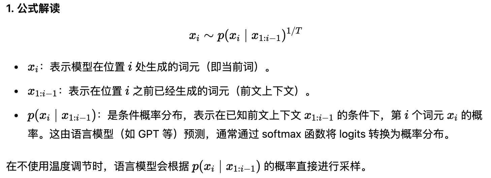
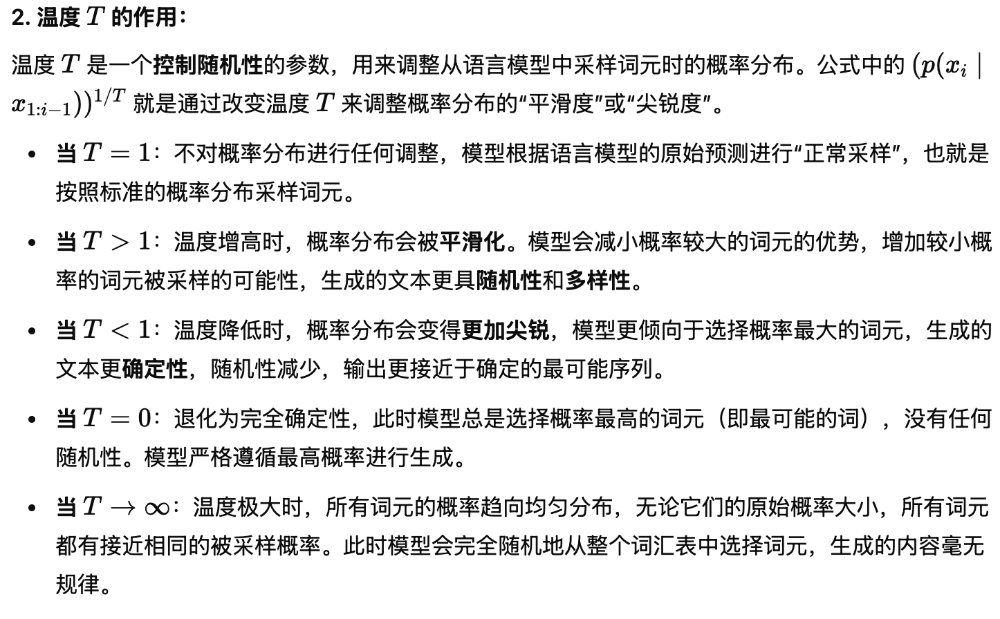
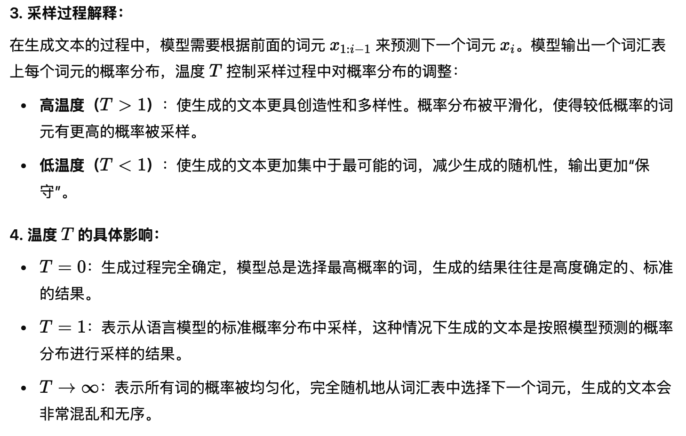

$$
\begin{aligned}
\text { for } i & =1, \ldots, L: \\
x_i & \sim p\left(x_i \mid x_{1: i-1}\right)^{1 / T},
\end{aligned}
$$

其中  $T≥0$  是一个控制我们希望从语言模型中得到多少随机性的温度参数：
- T=0：确定性地在每个位置 i 选择最可能的词元 $x_{i}$
- T=1：从纯语言模型“正常（normally）”采样
- T=∞：从整个词汇表上的均匀分布中采样

这个公式和描述与语言模型的温度调节（temperature scaling）有关，常用于生成任务（如文本生成、语言建模）中，控制模型生成的随机性。它影响从模型的概率分布中采样的方式，使生成的文本更加多样化或更加确定。

