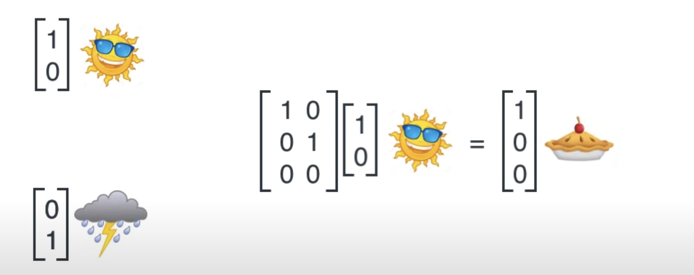
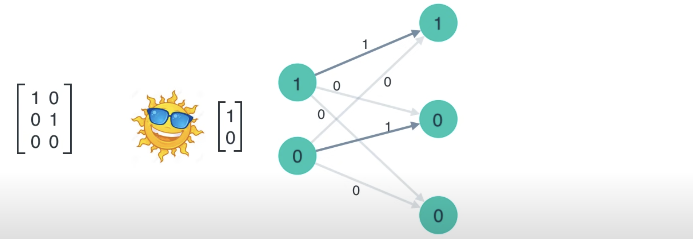

教程地址：[基于transformers的自然语言处理(NLP)入门](https://github.com/datawhalechina/learn-nlp-with-transformers)

## 常见的NLP任务
- 文本分类：对单个、两个或者多段文本进行分类。举例：“这个教程真棒！”这段文本的情感倾向是正向的，“我在学习transformer”和“如何学习transformer”这两段文本是相似的。
- 序列标注：对文本序列中的token、字或者词进行分类。举例：“我在国家图书馆学transformer。”这段文本中的国家图书馆是一个地点，可以被标注出来方便机器对文本的理解。
- 问答任务——抽取式问答和多选问答：1、抽取式问答根据问题从一段给定的文本中找到答案，答案必须是给定文本的一小段文字。举例：问题“小学要读多久?”和一段文本“小学教育一般是六年制。”，则答案是“六年”。2、多选式问答，从多个选项中选出一个正确答案。举例：“以下哪个模型结构在问答中效果最好？“和4个选项”A、MLP，B、cnn，C、lstm，D、transformer“，则答案选项是D。
- 生成任务——语言模型、机器翻译和摘要生成：根据已有的一段文字生成（generate）一个字通常叫做语言模型，根据一大段文字生成一小段总结性文字通常叫做摘要生成，将源语言比如中文句子翻译成目标语言比如英语通常叫做机器翻译。

## seq2seq框架
seq2seq是一种常见的NLP模型结构，全称是：sequence to sequence，翻译为“序列到序列”。顾名思义：从一个文本序列得到一个新的文本序列。典型的任务有：机器翻译任务，文本摘要任务。

seq2seq模型由编码器（Encoder）和解码器（Decoder）组成。绿色的编码器会处理输入序列中的每个元素并获得输入信息，这些信息会被转换成为一个黄色的向量（称为context向量）。当我们处理完整个输入序列后，编码器把 context向量 发送给紫色的解码器，解码器通过context向量中的信息，逐个元素输出新的序列。

我们来看一下黄色的context向量是什么？本质上是一组浮点数。而这个context的数组长度是基于编码器RNN的隐藏层神经元数量的。上图展示了长度为4的context向量，但在实际应用中，context向量的长度是自定义的，比如可能是256，512或者1024。

那么RNN是如何具体地处理输入序列的呢？

1. 假设序列输入是一个句子，这个句子可以由$n$个词表示：$sentence = {w_1, w_2,...,w_n}$。

2. RNN首先将句子中的每一个词映射成为一个向量得到一个向量序列：$X = {x_1, x_2,...,x_n}$，每个单词映射得到的向量通常又叫做：word embedding。

3. 然后在处理第$t \in [1,n]$个时间步的序列输入$x_t$时，RNN网络的输入和输出可以表示为：$h_{t} = RNN(x_t, h_{t-1})$

- 输入：RNN在时间步$t$的输入之一为单词$w_t$经过映射得到的向量$x_t$。
- 输入：RNN另一个输入为上一个时间步$t-1$得到的hidden state向量$h_{t-1}$，同样是一个向量。
- 输出：RNN在时间步$t$的输出为$h_t$ hidden state向量。

## 神经网络矩阵乘法
参考视频：[A friendly introduction to Recurrent Neural Networks](https://www.youtube.com/watch?v=UNmqTiOnRfg)

通过矩阵，将一个输入序列映射到输出序列。

假设可以写为：
$$
A*a=b
$$
那么如何得到矩阵A呢？

当已知向量 $\mathbf{b}$ 和向量 $\mathbf{c}$，并且它们满足线性方程 $A\mathbf{b} = \mathbf{c}$ 时，求解矩阵 $A$ 的问题本质上是一个欠定问题（如果 $\mathbf{b}$ 不是零向量）。这是因为对于给定的 $\mathbf{b}$ 和 $\mathbf{c}$，通常存在无数个不同的矩阵 $A$ 可以使等式成立。为了获得一个唯一的解，我们需要额外的信息或约束条件。

### 使用最小二乘法

如果我们有多个样本对 $(\mathbf{b}_i, \mathbf{c}_i)$，其中 $i = 1, 2, ..., k$，那么可以通过最小化误差平方和来估计 $A$：

$$
\min_{A} \sum_{i=1}^{k} \| A\mathbf{b}_i - \mathbf{c}_i \|^2
$$

这可以通过构建一个更大的系统并求解正规方程来实现。例如，如果我们有 $k$ 对 $(\mathbf{b}_i, \mathbf{c}_i)$，则可以形成如下矩阵方程：

$$
B^T B A = B^T C
$$

这里 $B$ 是由所有 $\mathbf{b}_i$ 组成的大矩阵，每一列对应一个 $\mathbf{b}_i$，而 $C$ 同样是由所有 $\mathbf{c}_i$ 组成的大矩阵。通过解这个方程可以得到一个最佳拟合的 $A$。

**这里的矩阵$A$其实就是我们想要得到的权重矩阵。而$\mathbf{b}$就是输出向量。**

那么问题就转换为如何去求解权重矩阵。参考：[AI-神经网络中的三个基本概念：梯度下降、反向传播、损失函数](https://kelinkong.github.io/2024/12/19/AI-%E7%A5%9E%E7%BB%8F%E7%BD%91%E7%BB%9C%E4%B8%AD%E7%9A%84%E4%B8%89%E4%B8%AA%E5%9F%BA%E6%9C%AC%E6%A6%82%E5%BF%B5%EF%BC%9A%E6%A2%AF%E5%BA%A6%E4%B8%8B%E9%99%8D%E3%80%81%E5%8F%8D%E5%90%91%E4%BC%A0%E6%92%AD%E3%80%81%E6%8D%9F%E5%A4%B1%E5%87%BD%E6%95%B0/)

考虑一个简单的全连接层（fully connected layer），它接收来自前一层的输出作为输入，并将其传递给下一层。假设前一层有 
$n$个神经元，当前层有 
$m$个神经元，那么每个输入特征都会对所有输出神经元产生影响。因此，我们需要定义一组参数来描述这种关系——这就是权重矩阵的作用所在。

所以说来说去，其实是一个东西。