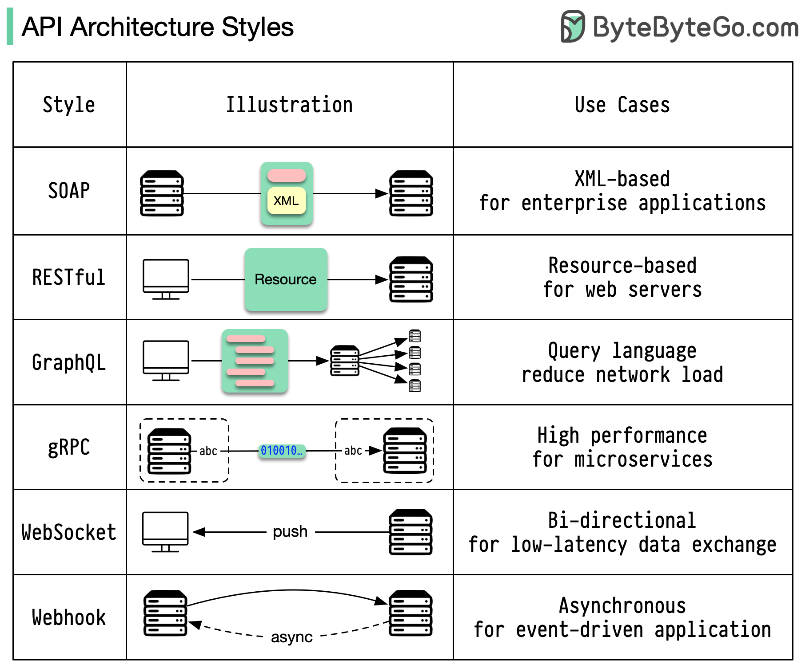

参考视频：[Top 6 Most Popular API Architecture Styles](https://www.youtube.com/watch?v=4vLxWqE94l4)

## API
API（Application Programming Interface）是一组定义了软件应用程序之间如何互相通信的规则的接口。API可以让不同的软件应用程序之间共享数据和功能，从而提高开发效率。

主要是用于不同系统之间的通信，比如前端和后端之间的通信。

如果没有定义API，那么不同的系统之间就无法通信。

### 常用API架构风格

### Highlights
- 📜 SOAP是一种成熟、全面且基于XML的API架构风格，尤其适用于金融服务和支付网关等需要安全性和可靠性的场景。
- 🌐 RESTful APIs是Internet的骨干，易于实现，使用HTTP方法，适用于大多数日常交互的网络服务。
- 📊 GraphQL不仅是一种架构风格，还是一种查询语言，能够高效地提供精确的数据，尤其适用于复杂数据需求的应用程序。
- 💻 gRPC是现代高性能的API架构风格，适用于微服务架构，但在处理浏览器客户端时可能存在一些挑战。
- 🔄 WebSocket是实时、双向且持久连接的API架构风格，适用于实时聊天和实时游戏等场景。
- 🎣 Webhook是基于事件驱动的API架构风格，适用于异步操作，但不适合需要同步通信或立即响应的场景。

### restful API

Github的API设计规范学习：[Github API](https://docs.github.com/en/rest/using-the-rest-api/getting-started-with-the-rest-api?apiVersion=2022-11-28)

#### rest架构特征
- 以资源为基础：资源可以是一个图片、音乐、一个XML格式、HTML格式或者JSON格式等网络上的一个实体，除了一些二进制的资源外普通的文本资源更多以JSON为载体、面向用户的一组数据(通常从数据库中查询而得到)。
- 统一接口：对资源的操作包括获取、创建、修改和删除资源，这些操作分别对应HTTP协议中的GET、POST、PUT、DELETE方法。
- 无状态：每次请求必须包含所有的信息，服务器不会保存客户端的状态。
- url指向资源：一个url对应一个资源，通过url获取资源。

### GraphQL
参考学习：[GraphQL](https://juejin.cn/post/6844903475420069902)

### RPC
RPC（Remote Procedure Call）是一种协议，用于在不同的进程之间传递数据。RPC协议允许一个程序调用另一个程序的子程序，而不需要了解底层网络细节。

**rpc是一种思想，广义的rpc是包含http的。**

