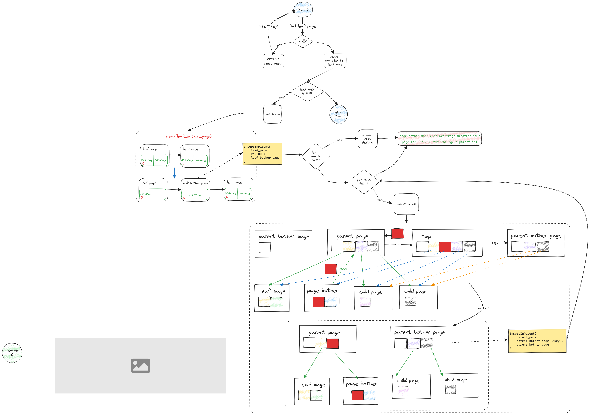
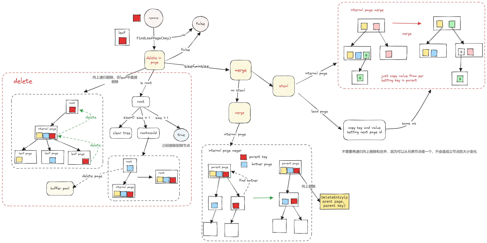
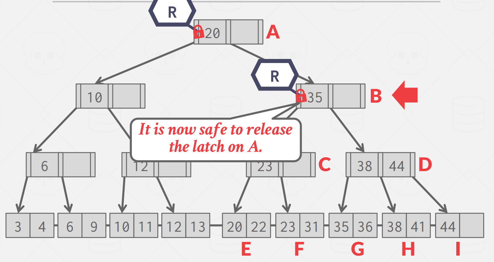

## B+树的介绍（以InnoDB为例）

InnoDB 的数据是按「数据页」为单位来读写的，也就是说，当需要读一条记录的时候，并不是将这个记录本身从磁盘读出来，而是以页为单位，将其整体读入内存。

数据库的 I/O 操作的最小单位是页，InnoDB 数据页的默认大小是 16KB，意味着数据库每次读写都是以 16KB 为单位的，一次最少从磁盘中读取 16K 的内容到内存中，一次最少把内存中的 16K 内容刷新到磁盘中。

B+树只有叶子结点存储数据，内部节点和根结点只存储索引。

另外，索引又可以分成聚簇索引和非聚簇索引（二级索引），它们区别就在于叶子节点存放的是什么数据：

- 聚簇索引的叶子节点存放的是实际数据，所有完整的用户记录都存放在聚簇索引的叶子节点；
- 二级索引的叶子节点存放的是主键值，而不是实际数据。

## bustub
在这这个实验中只需要实现三个接口：查询、插入和删除。

需要使用我们在 Project 1 中实现的 buffer pool manager 来获取 page。

internal page 中，KV 对的 K 是能够比较大小的索引，V 是 page id，用来指向下一层的节点。

leaf page 和 internal page 的内存布局基本一样，只是 leaf page 多了一个成员变量 `next_page_id`，指向下一个 leaf page（用于 range scan）

internal page 中储存 key 和 child page id，那么在拿到 page id 后如何获得对应的 page 指针？用 Project 1 中实现的 buffer pool。

`Page *page = buffer_pool_manager_->FetchPage(page_id);`

新建一个结点/Page, 示例为新建root

```cpp
page_id_t page_id;
Page *page = buffer_pool_manager_->NewPage(&page_id);
auto leaf_node = reinterpret_cast<LeafPage *>(page->GetData());
leaf_node->Init(page_id, INVALID_PAGE_ID, leaf_max_size_);
root_page_id_ = page_id;
buffer_pool_manager_->UnpinPage(page_id, true);
```

### find

找到leaf page，然后二分法找到key，就能够找到对应的record id。

唯一要注意的问题就是我们在拿到 page id 后，调用 buffer pool 的 FetchPage() 函数来获取对应的 page 指针。要注意的是，在使用完 page 之后，需要将 page unpin 掉，否则最终会导致 buffer pool 中的所有 page 都被 pin 住，无法从 disk 读取其他的 page。比较合适的做法是，在本次操作中，找出 page 最后一次被使用的地方，并在最后一次使用后 unpin。

### insert

假设叶子结点插入值之后满了，要考虑break的问题，要向父节点中插入break之后新的索引，假设父节点也满了，也要break（这是一个递归的过程），注意这里内部节点的第一个位置只存放value，而不存放key



### delete
delete的时候，如果当前节点小于最小size（Max size/2），首先考虑从兄弟结点偷一个过来，如果兄弟结点投不了，就考虑merge。因为是一个向上递归删除的过程，所以merge的时候要区分是叶节点还是内部节点。

这里注意是先删除再做merge或者偷一个key



### 锁的问题：
螃蟹式加锁（区分读锁和写锁）

参考课件:https://15445.courses.cs.cmu.edu/fall2022/slides/09-indexconcurrency.pdf

先给父节点加锁，然后给子节点加锁，如果确认子节点安全（不会发生merge或者break），此时解锁父节点



当寻找兄弟结点时，一个指针往前走，假设另一个进程在往后寻找兄弟结点，此时会不会发生死锁？

不会，因为当子节点需要寻找兄弟节点时，说明此时该节点不安全，所以父节点的锁不会释放，也就意味着另一个子进程拿不到父节点的锁，只会等待。

如何确定该page有没有被锁住？使用事务管理。