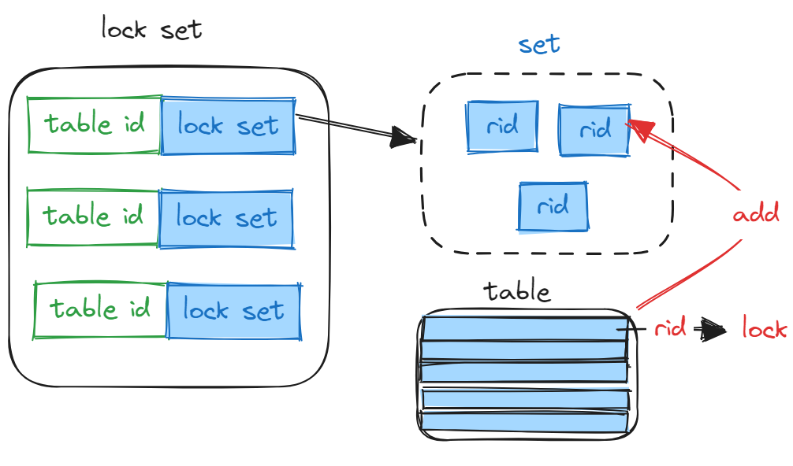

## project4需要实现的内容

[project任务链接](https://15445.courses.cs.cmu.edu/fall2022/project4/)

### Lock Manager：
`src/include/concurrency/lock_manager.h`

`concurrency/lock_manager.cpp`

#### Lock Manager的作用是什么？
Lock Manager 的作用是处理事务发送的锁请。事务在被允许访问某个数据项之前,需要先向锁管理器发出锁请求。锁管理器将向调用事务授予锁,阻塞该事务,或者中止它。

例如有一个 SeqScan 算子需要扫描某张表，其所在事务就需要对这张表加 S 锁。而加读锁这个动作需要由 Lock Manager 来完成。事务先对向 Lock Manager 发起加 S 锁请求，Lock Manager 对请求进行处理。如果发现此时没有其他的锁与这个请求冲突，则授予其 S 锁并返回。如果存在冲突，例如其他事务持有这张表的 X 锁，则 Lock Manager 会阻塞此请求（即阻塞此事务），直到能够授予 S 锁，再授予并返回。

整个系统将具有一个全局的锁管理器(类似于缓冲池管理器)。TableHeap和Executor类将使用你实现的锁管理器在事务想访问或修改一个元组记录时获取行锁(通过记录ID RID)。

这个任务要求实现一个支持三种常见隔离级别的表级锁和行级锁:READ_UNCOMMITTED, READ_COMMITTED和REPEATABLE_READ。锁管理器应该根据事务的隔离级别授予或释放锁。请参考课件复习隔离级别。

在代码库中,提供了一个Transaction上下文处理(transaction.h),其中包含隔离级别属性和它持有的锁的相关信息。锁管理器需要检查事务的隔离级别并公开在锁请求上的正确行为。任何失败的锁操作都应导致事务进入ABORTED状态(隐式中止)并抛出异常。事务管理器(transaction_manager.h)会进一步捕获这个异常并回滚事务执行的写操作。

#### 三种隔离级别的实现

- READ_UNCOMMITED只有在需要时上写锁。
- READ_COMMITTED要解决脏读的问题，解决方案就是读时上读锁，读完解读锁；写时上写锁，但等到commit时才解写锁；读时上读锁，读完解读锁。这样，永远不会读到未commit的数据，因为上面有写锁。
- REPEATABLE_READ进一步打造可重复读。同一事务读两次数据的中途不想被其他事务的写干扰，这就需要用到巧妙的二段封锁协议（2PL）了：事务分为两个阶段（不考虑commit/abort），上锁阶段(GROWING)只上锁，解锁阶段(SHINKING)只解锁。这样，第二次读取时，前一次读取的读锁一定还在，避免了中途被修改。

```
REPEATABLE_READ:
   The transaction is required to take all locks.
   All locks are allowed in the GROWING state
   No locks are allowed in the SHRINKING state
   
READ_COMMITTED:
   The transaction is required to take all locks.
   All locks are allowed in the GROWING state
   Only IS, S locks are allowed in the SHRINKING state
   
READ_UNCOMMITTED:
   The transaction is required to take only IX, X locks.
   X, IX locks are allowed in the GROWING state.
   S, IS, SIX locks are never allowed
```

#### 具体实现

由于对行添加S/X锁时，需要对应的对行所在的表添加IS/IX锁，所以需要记录每一个表里有哪些行被加锁。

这里用一个map来实现对应表id和行集合。

```cpp
  /** LockManager: the set of row locks held by this transaction. */
  std::shared_ptr<std::unordered_map<table_oid_t, std::unordered_set<RID>>> s_row_lock_set_;
  std::shared_ptr<std::unordered_map<table_oid_t, std::unordered_set<RID>>> x_row_lock_set_;
```



**获取表锁**
1. 判断锁请求是否合理(如果当前事务Abort/Commit，或者加锁类型与事务隔离级别不符合，抛异常)
2. 从 `table_lock_map_` 中获取 table 对应的 `lock request queue`。注意需要对 map 加锁，并且为了提高并发性，在获取到 queue 之后立即释放 map 的锁。若 queue 不存在则创建。
3. 判断之前该事务是否对这个表进行加过锁
4. 如果之前加过锁，升级该锁（级别不能比当前的锁的级别要低且不能有另一个事务也在对这个表进行升级），创建一个新的LockRequest，加入到队列尾部
5. 尝试获取锁，如果`GrantLock()`为真，可以获取锁，否则循环等待，这里使用条件变量`queue->cv_.wait(queue->latch_);`, 当这个锁被释放时，会唤醒当前线程，判断是否能获取锁。

**GrantLock()**
1. 判断当前的锁请求是否与所有的`granted`的请求兼容
2. 判断优先级


tips：

使用条件变量去通知请求队列上等待的线程。
```cpp
  class LockRequestQueue {
   public:
    /** List of lock requests for the same resource (table or row) */
    std::list<LockRequest *> request_queue_;
    /** For notifying blocked transactions on this rid */
    std::condition_variable cv_;
    /** txn_id of an upgrading transaction (if any) */
    txn_id_t upgrading_ = INVALID_TXN_ID;
    /** coordination */
    std::mutex latch_;
  };
```

**解表锁：**

1. 判断可以不可以解锁：之前是否加过锁，如果是解锁表锁，要检测该表中有没有行被加过锁
2. 检查在对应隔离级别下是否要进入Shrinking状态
3. 删除锁

行锁与表锁类似，解锁时不需要检查是否有表锁。

### Deadlock Detection：

使用waits-for graph

- node：事务
- edge：Ti to Tj表示Ti在等到Tj释放锁

```cpp
 /** Waits-for graph representation. */
std::unordered_map<txn_id_t, std::vector<txn_id_t>> waits_for_;
```

并不需要时刻维护wait for图，而是在死锁检测线程被唤醒的时候，根据当前请求队列构建的wait for图，再通过这个图去判断是否存在死锁。

- 当检测到有圈时，这里采取的victim策略是找到事务ID最大的返回，因为这个事务是最年轻的。
- 默认的检测时间是50ms

### Concurrent Query Execution

这里需要修改之前的三个算子，顺序扫描、插入和删除。

tips：
- 添加行锁之前需要对相应的表添加意向锁