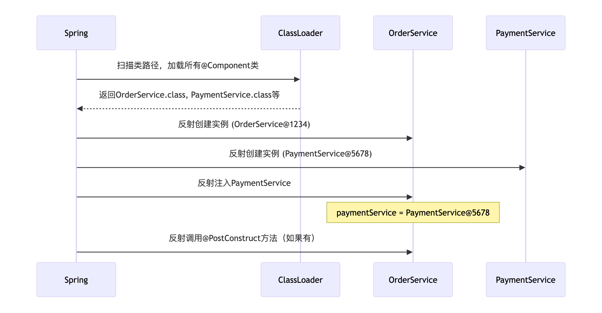

### 基本类型和包装类型的区别？
- **用途**：除了定义一些常量和局部变量之外，我们在其他地方比如方法参数、对象属性中很少会使用基本类型来定义变量。并且，包装类型可用于泛型，而基本类型不可以。
- **存储方式**:基本数据类型的局部变量存放在 Java 虚拟机栈中的局部变量表中，基本数据类型的成员变量（未被 static 修饰 ）存放在 Java 虚拟机的堆中。包装类型属于对象类型，我们知道几乎所有对象实例都存在于堆中
- **占用空间**：相比于包装类型（对象类型）， 基本数据类型占用的空间往往非常小。
- **默认值**：成员变量包装类型不赋值就是 null ，而基本类型有默认值且不是 null。
- **比较方式**：对于基本数据类型来说，== 比较的是值。对于包装数据类型来说，== 比较的是对象的内存地址。所有整型包装类对象之间值的比较，全部使用 equals() 方法。


## Java的垃圾回收（GC算法）、内存模型（堆/栈）、类加载机制和C++的区别

Java和C++在内存管理、内存模型和类加载机制上有显著区别，主要源于Java的自动内存管理（GC）和运行时环境（JVM）的设计。以下是详细对比：

### 1. 垃圾回收（GC） vs. 手动内存管理

| 特性               | Java                                     | C++                                     |
|------------------------|---------------------------------------------|--------------------------------------------|
| 内存管理方式        | 自动垃圾回收（GC）                          | 手动管理（`new`/`delete`或智能指针）        |
| 内存泄漏风险        | 较低（GC自动回收不可达对象）                | 较高（需手动释放，易遗漏或重复删除）        |
| 回收算法            | 分代收集（Young/Old区）、标记-清除、G1等    | 无内置GC，需手动实现或依赖第三方库（如Boehm GC） |
| 性能影响            | GC可能导致STW（Stop-The-World）暂停         | 无GC开销，但手动管理可能引入性能问题        |
| 典型工具            | JVM参数调优（`-Xms`, `-Xmx`）、VisualVM     | Valgrind（检测内存泄漏）、智能指针（`shared_ptr`） |

关键区别：  
• Java的GC自动处理对象生命周期，而C++依赖程序员手动控制（或通过RAII模式）。  

• Java的GC算法针对不同对象生命周期优化（如分代假设），C++无此机制。


### 2. 内存模型（堆/栈）

| 特性               | Java                                     | C++                                     |
|------------------------|---------------------------------------------|--------------------------------------------|
| 对象存储位置        | 所有对象在堆上（栈仅存基本类型和引用）      | 对象可分配在堆（`new`）或栈（局部变量）     |
| 栈分配效率         | 栈仅存基本类型（如`int`）和对象引用          | 栈可存完整对象，访问更快（无堆分配开销）    |
| 堆内存释放          | 由GC自动回收                                | 需手动`delete`或依赖作用域结束（栈对象）    |
| 内存碎片问题        | GC会整理内存（如CMS的压缩阶段）             | 需手动处理（如自定义内存池）               |

示例代码对比：  
```java
// Java：对象只能在堆上
Object obj = new Object(); // obj是引用，存储在栈；Object实例在堆
```
```cpp
// C++：对象可在栈或堆上
Object obj_stack;          // 对象在栈上（自动析构）
Object* obj_heap = new Object(); // 对象在堆上（需手动delete）
```

关键区别：  
• Java强制对象分配在堆上（栈仅存引用），C++允许灵活选择。  

• C++栈对象生命周期与作用域绑定，Java需依赖GC。


### 3. 类加载机制 vs. 编译链接

| 特性               | Java                                     | C++                                     |
|------------------------|---------------------------------------------|--------------------------------------------|
| 代码加载时机        | 运行时动态加载（按需由ClassLoader加载）     | 编译时静态链接（所有符号在编译期解析）      |
| 动态性             | 支持运行时反射、动态代理等                  | 无原生反射，需额外库（如RTTI）              |
| 类初始化顺序        | 严格规范（静态块、父类优先）                | 依赖编译顺序，无明确规范                    |
| 依赖管理            | 通过ClassPath/Jar包隔离                     | 通过头文件（`.h`）和库文件（`.so`/`.dll`） |

Java类加载流程：  
1. 加载：查找字节码（`.class`文件）→ 生成`Class`对象。  
2. 验证：检查字节码安全性。  
3. 准备：分配静态变量内存（默认值）。  
4. 解析：将符号引用转为直接引用。  
5. 初始化：执行静态代码块和赋值。  

C++编译流程：  
1. 预处理 → 编译 → 汇编 → 链接（静态/动态）。  

关键区别：  
• Java的类加载是运行时行为，支持动态特性（如热部署）；C++在编译时完成链接，更静态。  

• Java通过ClassLoader实现隔离（如Tomcat的多Web应用），C++需手动管理符号冲突。


### 4. 其他重要区别

| 特性         | Java                                  | C++                                  |
|------------------|------------------------------------------|------------------------------------------|
| 指针与引用    | 无显式指针，只有引用（安全）             | 支持指针和引用（灵活但危险）              |
| 多继承        | 不支持（通过接口`interface`模拟）        | 支持多继承（菱形继承问题需虚继承解决）    |
| 运行时类型    | 反射API完整（`Class`对象、方法调用等）   | 有限RTTI（`typeid`、`dynamic_cast`）     |


## Java反射的原理

Java的反射（Reflection）和C++的类似功能实现有本质区别，主要源于两者在运行时类型信息（RTTI）和语言设计哲学上的差异。以下是详细对比和原理分析：

---

**一、Java反射的原理**
**1. 核心机制**
• Class对象：每个加载的类在JVM中都有一个唯一的`Class`对象，存储类的元数据（字段、方法、构造器等）。

• 动态访问：通过`Class`对象，可以在运行时获取并操作类的成员，无需在编译时知道具体类结构。

• 关键类库：

  • `Class<T>`：表示类的元数据。

  • `Field`：类的字段（包括私有字段）。

  • `Method`：类的方法。

  • `Constructor`：类的构造器。


**2. 实现原理**
```java
// 示例：通过反射调用String的substring方法
Class<?> clazz = String.class;
Method method = clazz.getMethod("substring", int.class, int.class);
String result = (String) method.invoke("Hello World", 0, 5); // 输出 "Hello"
```
• 步骤解析：

  1. 类加载：JVM的类加载子系统加载目标类（如`String`），生成`Class`对象。 **因为Java的每一个类的类名都是唯一的，所以可以通过类名来获取Class对象。**
  2. 元数据提取：通过`Class`对象的方法（如`getMethod()`）从方法区中查找元数据。
  3. 动态调用：`Method.invoke()`通过JNI（Java Native Interface）或JVM内部方法触发实际调用。

**3. 底层支持**
• 方法区：存储类的元数据（JVM规范中的“类数据”部分）。

• JVM指令：

  • `invokevirtual`：普通方法调用。

  • `invokespecial`：构造器/私有方法调用。

  • `invokeinterface`：接口方法调用。

  • `invokedynamic`：动态语言支持（如Lambda表达式）。


**4. 性能开销**
• 原因：

  • 运行时解析方法/字段（跳过编译期优化）。

  • 安全检查（如私有方法访问权限）。

• 优化手段：

  • 缓存`Class`/`Method`对象。

  • 使用`MethodHandle`（JSR 292，类似C++的函数指针）。

### 举个例子

这里通过一个必须使用反射的典型场景——动态加载并调用未知类的私有方法，结合代码示例详细说明：

---

**场景描述**
假设你正在开发一个插件系统，需要加载第三方开发的插件类（编译时无法获知具体实现），并调用其私有初始化方法 `init()`。  
由于以下限制，必须使用反射：  
1. 插件类名和方法名仅在运行时通过配置文件获取（编译时无法确定）。  
2. 目标方法是`private`的，常规调用无法访问。  

---

**示例代码**
**1. 插件类（第三方提供，编译时未知）**
```java
// 第三方插件（实际开发中可能是动态加载的jar包中的类）
public class SecretPlugin {
    private String status;

    private void init() { // 私有方法，常规方式无法调用
        this.status = "ACTIVE";
        System.out.println("插件已秘密初始化，状态：" + status);
    }
}
```

**2. 主程序（通过反射强制调用私有方法）**
```java
import java.lang.reflect.Method;

public class PluginSystem {
    public static void main(String[] args) throws Exception {
        // 1. 动态获取插件类名（例如从配置文件中读取）
        String pluginClassName = "SecretPlugin";
        
        // 2. 反射加载类（编译时无法知道SecretPlugin的存在）
        Class<?> pluginClass = Class.forName(pluginClassName);
        Object pluginInstance = pluginClass.getDeclaredConstructor().newInstance();

        // 3. 反射获取私有方法
        Method initMethod = pluginClass.getDeclaredMethod("init");

        // 4. 突破私有限制！
        initMethod.setAccessible(true); // 关键操作：关闭访问检查

        // 5. 调用私有方法
        initMethod.invoke(pluginInstance); // 输出：插件已秘密初始化，状态：ACTIVE
    }
}
```

---

**为什么必须用反射？**
| 限制条件               | 常规Java代码                  | 反射的解决方案                |
|---------------------------|----------------------------------|----------------------------------|
| 类名在编译时未知            | 无法直接`new SecretPlugin()`      | `Class.forName()`动态加载         |
| 方法是`private`的          | 无法通过对象调用`plugin.init()`   | `getDeclaredMethod()` + `setAccessible(true)` |
| 方法签名可能变化            | 硬编码调用会导致编译错误           | 通过字符串名称获取方法，灵活适应变化 |

---

**关键反射API解析**
1. `Class.forName(String)`  
   • 动态加载类，完全通过字符串类名操作。  

   • *类似场景*：JDBC驱动加载（如`Class.forName("com.mysql.jdbc.Driver")`）。


2. `getDeclaredMethod(String)`  
   • 获取类声明的任意方法（包括私有方法），而`getMethod()`只能获取公共方法。


3. `setAccessible(true)`  
   • 关闭Java的访问控制检查，突破`private`/`protected`限制。  

   • *警告*：滥用会破坏封装性，应谨慎使用！


4. `Method.invoke(Object)`  
   • 动态调用方法，第一个参数是方法所属对象实例。


---

**实际应用场景**
1. 框架开发  
   • Spring：通过反射注入`@Autowired`依赖，调用`@PostConstruct`方法。  

   • JUnit：发现并运行测试方法（标记`@Test`的方法名在编译时未知）。

   


2. 动态代理  
   • `InvocationHandler`内部用反射调用目标方法。


3. 序列化/反序列化  
   • Jackson/GSON通过反射访问私有字段将JSON转为对象。


## 使用@Autowired注解和手动创建的区别

在Spring框架中，使用`@Autowired`自动注入依赖和手动创建（如`new`关键字）有显著区别，主要体现在对象生命周期管理、代码耦合度和扩展性等方面。以下是详细对比：

---

**1. 核心区别对比**
| 维度         | 使用`@Autowired`                          | 手动创建（`new`）                |
|------------------|---------------------------------------------|------------------------------------|
| 控制权        | Spring容器管理对象的创建、依赖注入和生命周期 | 开发者手动控制                      |
| 耦合度        | 低（依赖接口而非具体实现）                   | 高（直接依赖具体类）                |
| 单例管理      | 默认单例（共享实例）                         | 每次`new`生成独立实例               |
| 依赖注入      | 自动解析并注入嵌套依赖（如A依赖B，B依赖C）    | 需手动逐层创建依赖链                |
| 扩展性        | 轻松替换实现（如通过`@Primary`或`@Qualifier`） | 需修改代码重新编译                  |
| 测试友好性    | 方便Mock依赖（如`@MockBean`）                | 需手动构造测试环境                  |
| AOP支持       | 自动代理（事务、日志等切面生效）              | 手动创建的对象无法被Spring AOP增强   |

---

**2. 代码示例对比**
**场景**：订单服务（`OrderService`）依赖支付服务（`PaymentService`）

**方案1：使用`@Autowired`（推荐）**
```java
@Service
public class OrderService {
    @Autowired  // 由Spring注入
    private PaymentService paymentService;

    public void processOrder() {
        paymentService.charge();
    }
}

@Service
public class PaymentService {
    public void charge() { System.out.println("扣款成功"); }
}
```

**方案2：手动创建（不推荐）**
```java
public class OrderService {
    private PaymentService paymentService;

    public OrderService() {
        // 手动创建依赖（高耦合）
        this.paymentService = new PaymentService();
    }

    public void processOrder() {
        paymentService.charge();
    }
}

public class PaymentService {
    public void charge() { System.out.println("扣款成功"); }
}
```

---

**3. 关键差异解析**
**(1) 对象生命周期管理**
• `@Autowired`：  

  • Spring容器统一管理Bean，默认单例模式（整个应用共享一个`PaymentService`实例）。  

  • 可通过`@Scope("prototype")`改为多例。  

• 手动创建：  

  • 每次`new`都会生成新实例，生命周期由开发者控制，容易导致内存泄漏或资源浪费。


**(2) 依赖解耦**
• `@Autowired`：  

  • `OrderService`仅依赖`PaymentService`的接口（如果提取了接口），后续替换实现（如`AlipayService`替换`PaymentService`）无需修改`OrderService`代码。  

• 手动创建：  

  • `OrderService`直接绑定`PaymentService`的具体实现，变更实现需修改源代码并重新编译。


**(3) 复杂依赖链处理**
假设依赖链：`OrderService → PaymentService → FraudDetectionService`  
• `@Autowired`：  

  Spring自动完成整个依赖链的注入：
```java
@Service
public class PaymentService {
    @Autowired
    private FraudDetectionService fraudDetectionService;
    // ...
}
```
• 手动创建：  

  需手动逐层构造：
```java
public class OrderService {
    private PaymentService paymentService;
    
    public OrderService() {
        this.paymentService = new PaymentService(new FraudDetectionService());
    }
}
```

**(4) AOP与代理支持**
• `@Autowired`：  

  • 若`PaymentService`有`@Transactional`注解，Spring会自动生成代理对象实现事务管理：

```java
@Service
public class PaymentService {
    @Transactional
    public void charge() { /* 事务生效 */ }
}
```
• 手动创建：  

  • `new PaymentService()`的对象不会被代理，事务、日志等AOP功能全部失效。


---

**4. 何时选择手动创建？**
尽管`@Autowired`是推荐做法，但在以下场景可能需要手动创建：  
1. 不可控的第三方类：某些库需要手动实例化（如`new Gson()`）。  
2. 性能敏感代码：避免Spring代理开销（但99%的场景无需考虑）。  
3. 单元测试：测试中可能需要手动构造对象（但Spring也提供`@TestConfiguration`）。  

---

**5. 常见误区**
**误区1：`@Autowired`等于`new`？**
• 错误认知：认为`@Autowired`只是“自动帮你写`new`”。  

• 真相：`@Autowired`是依赖注入（DI），强调控制反转（IoC），容器负责管理对象及其依赖关系。


**误区2：手动创建更简单？**
• 短期看：手动创建似乎更直接。  

• 长期看：随着项目复杂化，手动管理依赖会变成灾难（如修改依赖需全局搜索`new`语句）。


---

**6. 最佳实践**
1. 始终优先使用`@Autowired`：  
   让Spring管理依赖，享受单例、AOP、易于测试等优势。  
2. 面向接口编程：  
```java
@Service
public class OrderService {
    @Autowired
    private PaymentGateway paymentGateway; // 依赖接口而非具体类
}
   ```
3. 必要时配合`@Bean`：  
   在配置类中手动定义Bean（仍由Spring管理）：
```java
@Configuration
public class AppConfig {
    @Bean
    public PaymentService paymentService() {
        return new PaymentService(customConfig());
    }
}
```

### 使用@Autowired注解，默认为单例模式，修改可变字段导致所有Bean实例的更新

是的，如果Bean是单例（默认）且状态可变，修改其字段会影响所有依赖该Bean的地方。这是Spring单例模式的核心特性，需要根据业务场景谨慎设计。以下是详细分析和解决方案：

---

**1. 问题复现：单例Bean的字段共享**
**示例代码**
```java
@Component // 默认单例
public class Human {
    private int age = 20; // 可变字段

    public void setAge(int age) {
        this.age = age;
    }

    public int getAge() {
        return age;
    }
}

@Service
public class PersonServiceA {
    @Autowired
    private Human human; // 注入单例Human
}

@Service
public class PersonServiceB {
    @Autowired
    private Human human; // 注入同一个单例Human
}
```

**操作后的影响**
```java
personServiceA.getHuman().setAge(30); 
System.out.println(personServiceB.getHuman().getAge()); // 输出30！所有注入的地方同步修改
```

---

**2. 解决方案（根据场景选择）**

**方案1：改用原型（Prototype）作用域**
```java
@Scope(ConfigurableBeanFactory.SCOPE_PROTOTYPE) // 每次注入新实例
@Component
public class Human { /* ... */ }
```
效果：  

  • 每次`@Autowired`或`getBean()`时生成新实例，修改字段互不影响。  

缺点：  

  • 内存开销增大（适合轻量级对象）。  

  • 需确保无循环依赖（原型Bean注入单例Bean需额外配置）。


**方案2：使用线程局部变量（ThreadLocal）**
```java
@Component
public class Human {
    private ThreadLocal<Integer> age = ThreadLocal.withInitial(() -> 20);

    public void setAge(int age) {
        this.age.set(age);
    }

    public int getAge() {
        return age.get();
    }
}
```
• 效果：  

  • 每个线程独立修改`age`字段（适合Web应用的请求级隔离）。  

• 注意：  

  • 需在请求结束时调用`age.remove()`防止内存泄漏（可通过拦截器实现）。


**方案3：无状态设计（最佳实践）**
```java
@Component
public class Human {
    // 不存储可变状态，仅提供方法
    public int calculateRetirementAge(int currentAge) {
        return currentAge + 10;
    }
}
```
效果：  

  • 所有方法参数由调用方传入，Bean本身无字段。  

  • 彻底避免线程安全问题，适合工具类。


**方案4：动态获取Bean（手动控制生命周期）**
```java
@Service
public class PersonServiceA {
    @Autowired
    private ApplicationContext context; // 注入Spring上下文

    public void process() {
        Human human = context.getBean(Human.class); // 每次获取新实例（需配合@Scope("prototype")）
        human.setAge(30); // 不影响其他Bean
    }
}
```
适用场景：  

  • 需要精细控制Bean生命周期的特殊逻辑。


**3. 不同场景的推荐策略**
| 场景                     | 推荐方案              | 原因                                                                 |
|-----------------------------|-------------------------|-------------------------------------------------------------------------|
| 配置类（如数据库连接参数）     | 单例 + 不可变字段         | 配置通常全局一致，启动后不应修改                                          |
| 用户会话信息（如购物车）       | 原型作用域或Request作用域 | 每个用户需要独立实例                                                     |
| 工具类（如日期计算）           | 单例 + 无状态            | 无需存储状态，线程安全                                                   |
| 缓存管理                     | 单例 + ConcurrentHashMap | 共享缓存数据，但需线程安全容器                                            |

---

**4. 关键注意事项**
1. 不要滥用单例：  
   • 单例Bean应尽量设计为无状态或只读状态（如`@Service`、`@Repository`）。  

   • 可变状态单例Bean是线程安全的大敌（除非用同步锁或并发容器）。


2. 慎用`@Scope("prototype")`：  
   • 原型Bean注入单例Bean时，需配合`@Lookup`或`ObjectProvider`：

     ```java
     @Component
     public class SingletonBean {
         @Lookup // Spring会动态生成子类覆盖此方法
         public PrototypeBean getPrototypeBean() {
             return null; // 实际由Spring实现
         }
     }
     ```

3. Web应用的作用域：  
   • 使用`@RequestScope`或`@SessionScope`替代手动线程隔离：

     ```java
     @Component
     @RequestScope // 每个HTTP请求独立实例
     public class UserProfile { /* ... */ }
     ```


## @autowired注解和@RequiredArgConstructor的区别

`@Autowired` 和 `@RequiredArgsConstructor` 都是用于依赖注入的注解，但它们的实现方式、使用场景和底层机制有显著区别。以下是详细对比：

---

**1. 核心区别总结**
| 维度         | `@Autowired` (Spring原生)               | `@RequiredArgsConstructor` (Lombok)       |
|------------------|----------------------------------------|------------------------------------------|
| 所属框架      | Spring 原生注解                         | Lombok 生成的代码（编译时生效）             |
| 注入方式      | 反射（运行时通过字段或构造器注入）       | 编译时生成全参构造器（基于final或`@NonNull`字段） |
| 代码可见性    | 显式出现在代码中                        | 编译后生成实际代码（开发时不可见）            |
| 灵活性        | 支持字段、构造器、Setter注入             | 仅支持构造器注入                           |
| 依赖范围      | 必须引入Spring                          | 需引入Lombok（不依赖Spring）               |
| 适用场景      | 需要动态代理或复杂注入逻辑时              | 追求代码简洁、减少样板代码                  |

---

**2. 使用示例对比**
**场景**：一个服务类依赖两个组件

**方案1：`@Autowired`（字段注入）**
```java
@Service
public class OrderService {
    @Autowired  // 字段注入（反射直接赋值）
    private PaymentService paymentService;
    
    @Autowired
    private InventoryService inventoryService;
}
```
• 特点：  

  • 代码简洁，但违反了"不可变对象"原则（字段可被反射修改）。  

  • 依赖Spring容器运行时通过反射注入。


**方案2：`@Autowired`（构造器注入）**
```java
@Service
public class OrderService {
    private final PaymentService paymentService;
    private final InventoryService inventoryService;

    @Autowired  // 构造器注入（Spring推荐方式）
    public OrderService(PaymentService ps, InventoryService is) {
        this.paymentService = ps;
        this.inventoryService = is;
    }
}
```
• 特点：  

  • 明确依赖关系，支持不可变对象（final字段）。  

  • Spring 4.3+ 可省略`@Autowired`（单一构造器时自动注入）。


**方案3：`@RequiredArgsConstructor`（Lombok）**
```java
@Service
@RequiredArgsConstructor  // 自动生成final字段的构造器
public class OrderService {
    private final PaymentService paymentService;
    private final InventoryService inventoryService;
    
    // 编译后等效于方案2的构造器注入
}
```
• 特点：  

  • 代码最简洁，Lombok在编译时生成完整构造器。  

  • 需要字段标记为`final`或添加`@NonNull`注解。  

  • 不依赖Spring（也可用于非Spring项目）。


---

**3. 关键差异解析**
**(1) 实现原理**
• `@Autowired`：  

  • 运行时通过反射或代理注入依赖，Spring容器负责查找并赋值。  

  • 支持三种注入方式：  

```java
// 1. 字段注入（不推荐）
@Autowired private A a;

// 2. Setter注入
@Autowired public void setA(A a) { this.a = a; }

// 3. 构造器注入（推荐）
@Autowired public MyClass(A a) { ... }
```

• `@RequiredArgsConstructor`：  

  • 编译时由Lombok生成包含所有`final`/`@NonNull`字段的构造器。  

  • 生成的代码示例：  

```java
// 编译后实际代码
public OrderService(PaymentService ps, InventoryService is) {
    this.paymentService = ps;
    this.inventoryService = is;
}
```

**(2) 依赖验证**
• `@Autowired`：  

  • 默认要求依赖必须存在（可通过`@Autowired(required=false)`设为可选）。  

  • 启动时如果依赖缺失，抛出`BeanCreationException`。


• `@RequiredArgsConstructor`：  

  • 依赖的校验基于`final`或`@NonNull`：  

    ◦ 如果字段有`@NonNull`且依赖为null，抛出`NullPointerException`。  

    ◦ 非final字段不包含在生成构造器中。


**(3) 与Spring的整合**
| 行为               | `@Autowired`                     | `@RequiredArgsConstructor`       |
|-----------------------|----------------------------------|----------------------------------|
| AOP代理            | 支持（如`@Transactional`生效）    | 支持（生成的构造器能被Spring处理） |
| 循环依赖            | 支持（通过三级缓存）              | 支持（同构造器注入）              |
| Qualifier选择       | 支持（`@Qualifier`指定Bean）      | 需手动在字段添加`@Qualifier`      |

---

**4. 如何选择？**
**优先使用 `@RequiredArgsConstructor` 当：**
• 项目已引入Lombok。  

• 追求代码简洁性，减少样板代码。  

• 需要不可变对象（final字段）。  


**优先使用 `@Autowired` 当：**
• 需要非final字段注入。  

• 需要Setter注入或字段注入（尽管不推荐）。  

• 需要动态条件注入（如`@Autowired(required=false)`）。  


**最佳实践组合**
```java
@Service
@RequiredArgsConstructor
public class OrderService {
    private final PaymentService paymentService;  // 必须的依赖
    
    @Autowired(required = false)  // 可选的依赖
    private DiscountService discountService;
}
```

---

**5. 常见问题**
**Q1: 两者能混用吗？**  
• 可以，但通常没必要。例如：  

  ```java
  @Service
  @RequiredArgsConstructor
  public class OrderService {
      private final PaymentService paymentService;
      
      @Autowired  // 额外注入非final依赖
      private InventoryService inventoryService;
  }
  ```

**Q2: Lombok和Spring谁先执行？**  
• Lombok在编译时生成代码，Spring在运行时处理注解。顺序：  

  Lombok生成代码 → 编译 → Spring扫描注解。

**Q3: 为什么IDEA提示`@Autowired`警告？**  
• 现代IDE推荐构造器注入（明确依赖+不可变），而`@Autowired`字段注入隐藏了依赖关系。使用`@RequiredArgsConstructor`可避免此警告。


---

**总结**
• `@Autowired`：Spring原生的灵活注入方式，适合复杂场景。  

• `@RequiredArgsConstructor`：Lombok的简洁方案，适合追求代码整洁和不可变性。  

• 推荐：在新项目中优先使用`@RequiredArgsConstructor`，保持代码简洁且线程安全。

## Java中的构造器注入和C++中的组合有什么区别？
你提到了一个非常关键的问题！其实在 现代Spring（尤其是Spring 4.3+版本）中，构造器注入的`@Autowired`注解是可以省略的，这正是为了减少代码的冗余，让它更接近“纯Java”的风格（类似C++的组合）。下面分几个层面解释：

---

**1. 为什么早期需要`@Autowired`？**
在Spring 4.3之前，如果类有多个构造器，Spring不知道应该用哪个构造器来注入依赖，必须用`@Autowired`明确标注：
```java
public class OrderService {
    private final PaymentService paymentService;

    @Autowired  // 告诉Spring用这个构造器注入
    public OrderService(PaymentService paymentService) {
        this.paymentService = paymentService;
    }

    public OrderService() { /* Spring不会用这个无参构造器 */ }
}
```

---

**2. 现代Spring的改进（省略`@Autowired`）**
从 Spring 4.3 开始，如果类只有一个构造器，Spring会自动选择它进行依赖注入，无需`@Autowired`：
```java
// Spring 4.3+ 可以省略@Autowired
public class OrderService {
    private final PaymentService paymentService;

    // 自动被Spring用于依赖注入
    public OrderService(PaymentService paymentService) {
        this.paymentService = paymentService;
    }
}
```
此时，代码看起来和C++的组合（Composition）几乎一样：
```cpp
// C++的依赖注入（手动组合）
class OrderService {
private:
    PaymentService paymentService;
public:
    OrderService(PaymentService paymentService) 
        : paymentService(paymentService) {}
};
```

---

**3. 和C++组合的核心区别**
虽然语法相似，但Spring的构造器注入和C++手动组合有本质区别：

| 维度         | Spring构造器注入                     | C++手动组合                     |
|------------------|----------------------------------------|------------------------------------|
| 对象创建权    | Spring容器负责实例化并注入依赖            | 开发者手动`new`依赖对象              |
| 依赖解析      | Spring自动查找匹配的Bean（按类型/名称）    | 需手动构造依赖链（如`new PaymentService()`） |
| 单例管理      | 默认单例（共享实例）                      | 每次`new`生成独立实例                |
| 动态代理      | 支持AOP（如`@Transactional`生效）         | 无原生支持                          |
| 测试友好性    | 可轻松替换为Mock（Spring测试支持）         | 需手动替换依赖                       |

---

**4. 为什么Spring仍然比C++组合强大？**

**(1) 自动依赖解析**
• Spring：  

  若`PaymentService`本身依赖其他Bean（如`@Repository`），Spring会自动递归解决整个依赖树。  
• C++：  

  需手动构造所有嵌套依赖：
  ```cpp
  // 手动管理依赖链
  Database db = new Database();
  Logger logger = new Logger();
  PaymentService ps = new PaymentService(db, logger);
  OrderService os = new OrderService(ps);
  ```

**(2) 动态扩展能力**
• Spring：  

  通过`@Profile`、`@Conditional`等动态选择实现类，无需修改代码：
  ```java
  @Bean
  @Profile("dev") // 仅在开发环境生效
  public PaymentService mockPaymentService() {
      return new MockPaymentService();
  }
  ```
• C++：  

  需通过预编译宏或工厂模式硬编码：
  ```cpp
  #ifdef DEV
    PaymentService ps = new MockPaymentService();
  #else
    PaymentService ps = new RealPaymentService();
  #endif
  ```

**(3) 解耦与测试**
Spring：  

  单元测试时可直接注入Mock对象：
  ```java
  @Test
  void testOrder() {
      PaymentService mockPs = Mockito.mock(PaymentService.class);
      OrderService orderService = new OrderService(mockPs); // 不依赖Spring容器
  }
  ```
C++：  

  需依赖虚接口或模板技巧实现类似效果。

---

**5. 什么情况下该用`@Autowired`？**
虽然构造器注入可以省略`@Autowired`，但在以下场景仍需显式标注：
1. 多个构造器时：指定哪个构造器用于注入。
   ```java
   public class OrderService {
       private final PaymentService paymentService;
       private final Logger logger;

       @Autowired  // 明确告诉Spring用这个构造器
       public OrderService(PaymentService paymentService) {
           this(paymentService, new DefaultLogger());
       }

       public OrderService(PaymentService paymentService, Logger logger) {
           this.paymentService = paymentService;
           this.logger = logger;
       }
   }
   ```
2. 可选依赖：结合`@Autowired(required=false)`。
   ```java
   @Autowired(required = false)  // discountService可选
   public OrderService(PaymentService ps, DiscountService ds) {
       // ...
   }
   ```

---

**6. 终极对比：Spring vs C++**
```java
// Spring构造器注入（现代写法）
@Service
public class OrderService {
    private final PaymentService paymentService;

    public OrderService(PaymentService paymentService) {
        this.paymentService = paymentService;
    }
}
```
```cpp
// C++手动组合
class OrderService {
private:
    PaymentService* paymentService;
public:
    OrderService(PaymentService* ps) : paymentService(ps) {}
    ~OrderService() { delete paymentService; } // 需手动管理内存
};
```
相同点：表面语法相似，都通过构造器传入依赖。  

不同点：  

  • Spring的依赖是容器管理的Bean，C++是原始对象指针。  

  • Spring自动处理依赖链、代理、作用域，C++需手动实现。  
