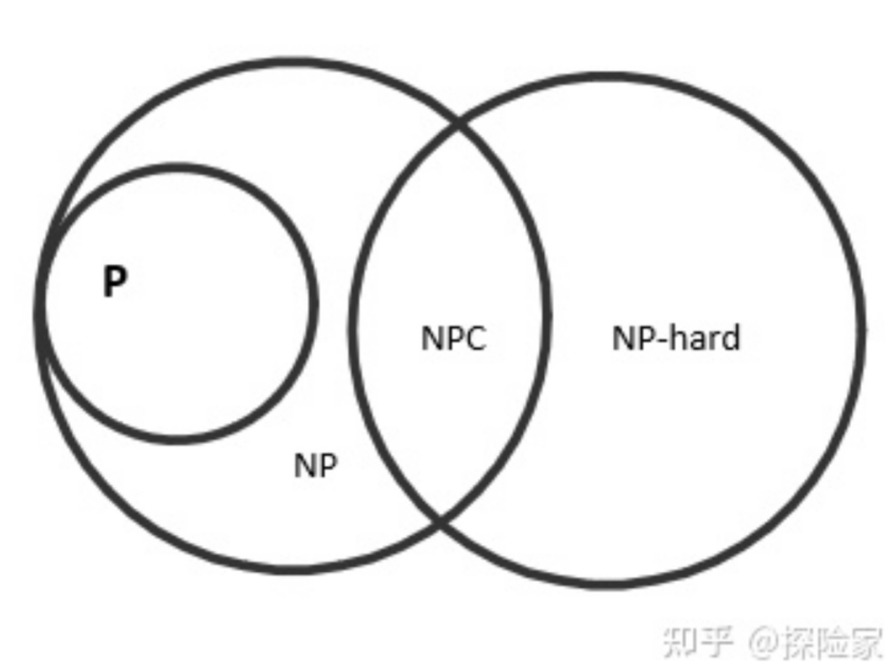
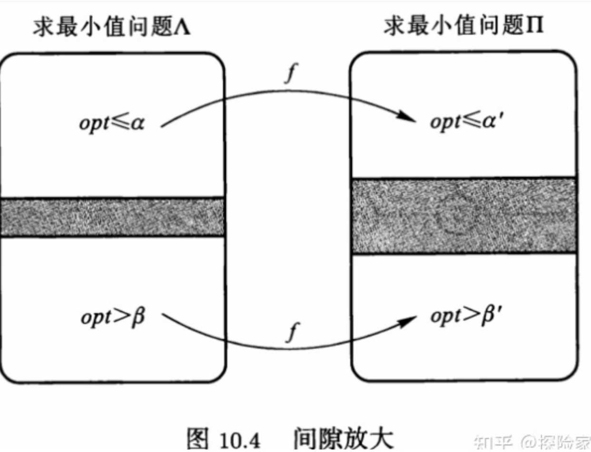

### 图灵机

- 一个图灵机计算所涉及的所有输入、输出和计算过程中产生的数据都存储在有限个存储带上，存储一个字符需要占用一个存储带上的一个单元。

- 一个图灵机是根据它的读写头所在的单元进行操作的，它或者改变单元中的字符，或者移动它的读写头到相邻的一个单元，也就是说，图灵机的复杂性度量是由比特运算决定的。

### 时间复杂度：

**随着问题规模的增大，算法执行时间增长的快慢。它可以用来表示一个算法运行的时间效率。大**$O$用来表示算法执行的最坏时间复杂度。

多项式时间：$O(n^{O(1)})$ 

### 问题分类：

**P（polynominal）**：确定性图灵机在多项式时间内可解决的问题

**NP（Nondeterministic polynominal 非确定多项式）**：多项式时间内可验证

- 非确定算法是可以做非确定运算的算法，在非确定算法的一个步骤中，算法可以不确定地对一个变量赋值0或者1，在这样的赋值以后，算法的计算过程分解成两个分开的计算路径，每一条对应一种可能的赋值。假设非确定性算法进行k次非确定性运算，那么可以产生$2^k$种不同的确定性计算路径。如果存在至少一条导致判定的结论为“是”的计算路径，那么我们称这个非确定算法接受这个输入，如果不存在，那么这个算法就拒绝这个输入。

- 一个非确定性算的时间复杂度是所有导致判定结论为“是”的计算路径种最短运行时间。

**EXP**：指数时间内能解决

**R**：有限时间内解决

- $P \subseteq NP$：存在多项式时间算法问题，总能在多项式时间内验证。

- $NP\subseteq  EXP \subseteq R$

### NP类问题

该类问题不知道存不存在一个多项式时间的算法，但是给出一个解S，我们可以在多项式时间内验证S是否是问题P的一个解。

**NP-hard问题：** 比所有的NP问题都要难的问题。所有的NP问题都可以多项式**归约**到NP-hard问题。如果NP-hard问题存在多项式时间算法，那么所有的NP问题都会存在多项式时间算法。

**NP-complete问题：** 既属于NP又属于NP-hard的问题

<mark>P = NP</mark>   or <mark>P ≠ NP</mark> ？

> **有没有什么问题属于NP-hard，但是不属于NP？**
> 
> 停机问题：给定一个程序和输入，判定运行是否终止，不可判定，所以不属于NP。
> 
> **图同构问题和因数问题，既没有结果表明属于P，也没有结果表明属于NP-完全**

### 规约

**定义：** 语言$L \subseteq \{0,1\}^*$多项式时间卡普归约到语言$L' \subseteq \{0,1\}^*$，记为$L \leq_p L'$，如果存在多项式时间可计算的函数$f:\{0,1\}^* \to \{0,1\}^*  $使得对任意的$x \in \{0,1\}^*$均有$x\in L$当且仅当$f(x)\in L'$。多项式时间卡普规约也可以简称为多项时间规约。

如果$L \leq_p L'$对任意的$L\in NP$成立，则称$L'$是NP-难的，如果$L'$是NP-难的且$L'\in NP$，则称$L'$是NP-完全的。

换句话说，如果A问题是一个NP-hard问题，我们想要得到B问题也是一个NP-hard问题，假设$x$是A问题的一个解，那么我们能在多项式时间内从$x$推出B问题的一个解$f(x)$，反过来，如果我们有B问题的一个解$y$，那么我们能在多项式时间内从$y$推出A问题的一个解$x$。从而有B问题是NP-hard问题。

### 针对NP-hard问题我们有什么解决方法

**判定问题：** 一个问题的解只有“是”或者“否”。

**最优化问题：** 求最优解（最大或者最小）。

同一个问题的判定问题和最优化问题在计算复杂性方面是<mark>等价</mark>的。

因为假设判定问题是多项式可解，那么只需要枚举n次解，即可得到最优化问题的解。
总有某一个解k是可满足的，k+1(最大值问题)是不可满足的，此时k就是解。

#### 精确算法

1. 当一个问题被证实为NP-完全问题，其精确算法多半使用分支界定、动态规划等算法设计，时间复杂度为指数级。
2. 对于每一个问题，可以先假设其有多项式时间算法，并去设计该算法。

#### 参数算法

#### 近似算法

NP-hard问题求最优解比较困难（从算法运行时间角度），所以可以考虑设计近似算法求解。近似算法不花费指数时间寻找优化问题的最优解，而是在多项式时间内求得一个近似最优解。

> **启发式算法和近似算法**
> 
> - 近似算法性能比一般是可以通过严格的理论证明得到或者估计出范围的，而启发式算法不存在这样的理论分析结果，评价启发式算法性能的好换往往是依靠对问题的不同实例输入所进行数值模拟。
> 
> - 近似算法通常是用来求解优化问题，而启发式算法不仅可用于求解优化问题，还可以用于处理判定问题。
> 
> **比如，设计一个可满足性问题近似算法没有意义，相关的启发式算法可以有效处理可满足问题的一大部分实例，但是不能保证可以在多项式时间内处理问题的所有实例。**

**近似性能比：** $r(A)=max\{A(I)/opt(I),opt(I)/A(I)\}$。$A(I),opt(I)$分别表示算法A输出的一个问题P的解，和问题P的最优解。

**不可近似性：** 求解某一个优化问题的任意一个近似算法性能比的下界。

**依据不可近似性，优化问题可以分为：**

- PTAS：近似性能比可以无限逼近于1

- APX：有常数近似性能比

- APX-C：某些问题的近似性能比无法突破一个界

##### 如何求解不可近似性：

- 从NP-完全问题去规约
  
  - 如果优化问题A具有NP-难间隙$[\alpha,\beta],0 \leq \alpha \leq \beta$，那么问题A不存在多项式时间$(\beta/\alpha)$-近似算法，除非$P=NP$。
  

- 间隙放大与保持

##### APX-完全性

对于某些问题，存在求解他们的具有常数性能比的近似算法（APX），去证明他们的某种程度的不可以近似性。

> 顶点覆盖问题不存在一个近似性能比小于2的近似算法，即MVC问题近似性能比下界为2，那么我们为什么要去证明其APX-完全性质呢？上诉说的某种程度往往是限定于度，且度越小越好，从解决问题的角度考虑，在小度图上都无法近似，大度图上一般也是无法近似的。

**L规约的定义**

Let two $NP$ optimization problems $\Lambda$ and $\Pi$ and there are two polynomial-time transformation $h$ and $g$ satisfying the following conditions:

1. $h$ maps an instance $x$ of $\Lambda$ to an instance $h(x)$ of $\Pi$ such that:
   $opt_{\Pi}(h(x)) \leq \alpha \cdot opt_{\Lambda}(x)$

2. $g$ maps solutions of $\Pi$ for instance $h(x)$ to solutions of $\Lambda$ for instance $x$. For every feasible solution $y$ of $h(x)$ with objective value $m_{\Pi}(h(x),y)= c_{2}$, we can find a solution $g(y)$ of $x$ in polynomial time with $m_{\Lambda}(x,g(y))= c_{1}$ such that:
   $|opt_{\Lambda}(x)-c_{1}| \leq \beta \cdot |opt_{\Pi}(h(x)) - c_{2}|$

##### $(\rho ln n)$-不可近似性

有一类组合优化问题，对其中的每一个问题都存在一个正实数$\rho$，使得它没有多项式时间$(\rho ln n)$-近似算法。如，最小集合覆盖问题。

##### $n^c$-不可近似性

图着色问题和最大团问题都不存在$n^c$-近似算法，$c>0$。

**针对近似算法，我们通常是找到近似算法的下界，然后去设计近似算法不断去逼近下界。**

### backgroud
1. Introduction

   Computational complexity theory studies the inherent difficulty of computational problems. It analyzes and classifies problems based on the computational resources required to solve them, such as time and space. Understanding problem complexity helps computer scientists design efficient algorithms and determine theoretical limitations of computation.

2. Time Complexity

   Time complexity refers to the number of computation steps required for an algorithm to solve a problem as a function of input size n. Common time complexity functions include constant O(1), logarithmic O(log n), linear O(n), quadratic O(n^2), and exponential O(2^n).

3. Space Complexity

   Space complexity analyzes the auxiliary memory space needed by an algorithm, in addition to its input. Space complexity is commonly expressed using Big O notation as well.

4. P vs. NP Problem

   P represents complexity class of problems solvable in polynomial time by a deterministic Turing machine. NP consists of problems verifiable in polynomial time given the right solution. The P vs NP problem asks whether P = NP, i.e. are efficiently verifiable problems also efficiently solvable. It is considered one of the most important open problems in computer science and mathematics.

5. NP-complete and NP-hard

   NP-complete problems are the most difficult problems in NP. NP-hard problems are at least as difficult as NP-complete ones. No efficient solutions are known for NP-complete or NP-hard problems.

6. Reductions

   Reduction shows equivalence between computational problems. Polynomial time reductions are often used to prove NP-completeness.

7. Major Complexity Classes

   Some key complexity classes are:
   - P: polynomial time solvable problems
   - NP: verifiable in polynomial time
   - co-NP: complement of NP
   - PSPACE: solvable with polynomial space
