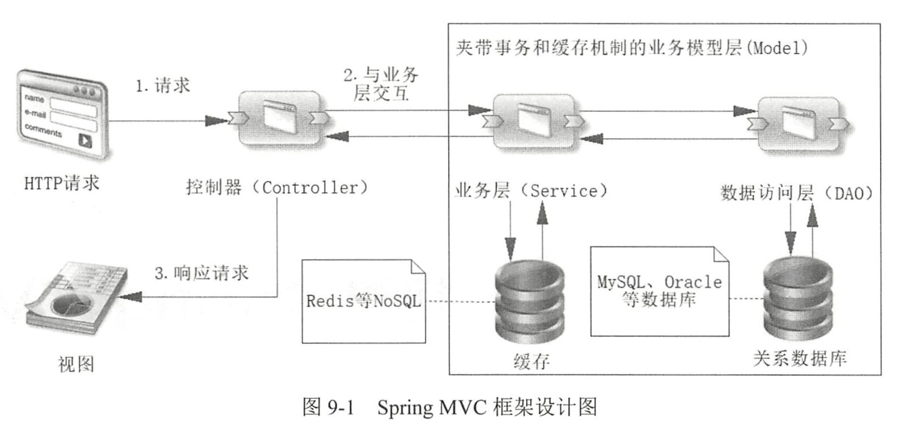
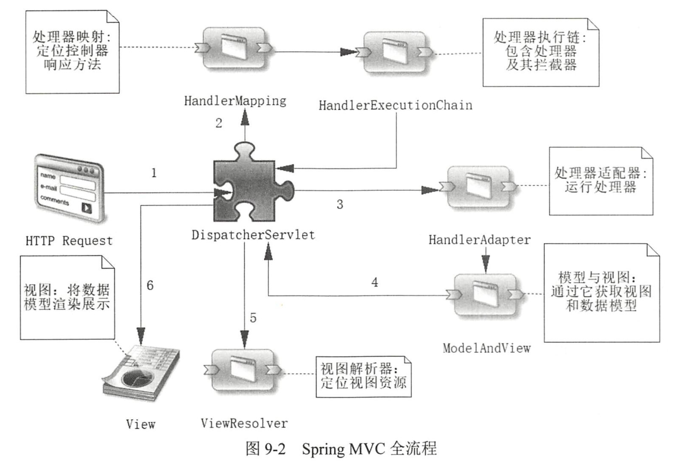

深入浅出Spring Boot第九章，Spring MVC。

## Spring MVC 示意图





如果 Web 工程使用了 Spring MVC ， 那么它在启动阶段就会将注解
`@RequestMapping` 所配置的内容保存到处理器映射（ `HandlerMapping` ）机制中去，然后等待请求的到来 ，通过拦截请求信息与`HandlerMapping`进行匹配，找到对应的处理器（它包含控制器的逻辑），并将处理器及其拦截器保存到 `HandlerExecution Chain` 对象中，返回给 `DispatcherServlet` ，这样`DispatcherServlet` 就可以运行它们了。

## DispatcherServlet
`DispatcherServlet` 是 Spring MVC 的核心组件，负责将客户端的请求分发给相应的处理器（Controller），并协调请求处理过程。它的主要职责是接收 HTTP 请求，委托给合适的处理组件，并将结果返回给客户端。`DispatcherServlet` 是前后端分离架构和传统 MVC 架构中的重要部分。

### `DispatcherServlet` 的工作原理

1. **客户端请求到达 DispatcherServlet**：
   - 当用户通过浏览器发送 HTTP 请求时，请求首先到达 `DispatcherServlet`。`DispatcherServlet` 是一个前端控制器（Front Controller），负责接收所有的请求。

2. **HandlerMapping 映射请求**：
   - `DispatcherServlet` 接收到请求后，开始通过 **HandlerMapping** 查找对应的处理器（Controller）。它根据请求的 URL 路径去匹配合适的处理器，这一步决定了应该调用哪个控制器来处理这个请求。

3. **调用 HandlerAdapter**：
   - 找到处理器后，`DispatcherServlet` 会通过 **HandlerAdapter** 调用实际的控制器方法。`HandlerAdapter` 的职责是适配处理器方法，使得它们能够被调用。不同类型的控制器方法（如注解方式的、简单映射方式的）可能需要不同的适配器。

4. **Controller 处理请求**：
   - 处理器（Controller）接收请求并处理业务逻辑，可能需要调用服务层、数据库等操作，最终返回一个 `ModelAndView` 对象或直接返回数据（如 JSON）。

5. **视图解析器 (ViewResolver)**：
   - 如果处理器返回的是一个视图名，`DispatcherServlet` 会通过 **ViewResolver** 解析视图的名称，将其转换为具体的视图对象（如 JSP、Thymeleaf 等）。视图解析器负责确定返回页面的位置。

6. **返回响应给客户端**：
   - 最终，`DispatcherServlet` 将处理的结果（视图页面或数据）响应给客户端。如果返回的是视图，`DispatcherServlet` 将把数据填充到视图中，并将生成的 HTML 返回给客户端；如果是 JSON 数据，则直接响应 JSON。

### `DispatcherServlet` 的处理流程图

```
Client Request --> DispatcherServlet --> HandlerMapping --> Handler (Controller)
                  --> HandlerAdapter --> ModelAndView --> ViewResolver --> Response (HTML/JSON)
```

### 详细的步骤

1. **初始化 DispatcherServlet**：
   - 当 Spring 容器启动时，`DispatcherServlet` 作为前端控制器被初始化，它会加载配置文件，并初始化一些关键的组件，比如 `HandlerMapping` 和 `HandlerAdapter`。

2. **处理请求**：
   - 用户发出 HTTP 请求时，`DispatcherServlet` 会接管请求的控制权。
   
3. **查找处理器**：
   - `DispatcherServlet` 根据 `HandlerMapping` 的配置，确定哪个控制器将会处理这个请求。

4. **调用控制器**：
   - `DispatcherServlet` 通过 `HandlerAdapter` 来调用处理器的具体方法，处理业务逻辑。

5. **返回视图或数据**：
   - 控制器执行完业务逻辑后，返回视图名或数据，`DispatcherServlet` 会通过 `ViewResolver` 来解析视图，或直接返回 JSON 数据。

6. **生成响应**：
   - 最后，`DispatcherServlet` 将视图或数据返回给客户端。

### 示例代码

```java
@Controller
public class UserController {

    @GetMapping("/users/{id}")
    public String getUserById(@PathVariable int id, Model model) {
        // 模拟从数据库获取用户数据
        User user = new User(id, "John Doe");
        model.addAttribute("user", user);
        return "userDetail";  // 返回视图名
    }
}
```

在这个例子中，`DispatcherServlet` 会：
1. 接收到对 `/users/{id}` 的请求。
2. 通过 `HandlerMapping` 映射到 `UserController` 的 `getUserById` 方法。
3. 返回视图名 `userDetail`，然后通过 `ViewResolver` 找到实际的视图并渲染。


## 在前后端分离的项目中，Spring MVC 是如何工作的

在前后端分离的项目中，Spring MVC 主要用作 **后端 API** 服务，专注于处理业务逻辑、数据库交互，并通过 RESTful API 接口向前端提供数据。前端和后端通过 HTTP 请求（如 `GET`、`POST` 等）进行通信，前端不再依赖于服务器渲染 HTML 页面，而是通过调用 API 获取 JSON 数据。

### Spring MVC 在前后端分离中的工作流程

1. **前端发送请求**：用户在前端应用（如基于 React、Vue、Angular 的应用）中进行操作，前端应用通过 HTTP 向后端发送请求。
2. **后端控制器接收请求**：Spring MVC 的控制器接收前端请求，并调用业务逻辑或数据库，处理请求。
3. **返回 JSON 数据**：后端处理完请求后，返回 JSON 格式的数据响应给前端。
4. **前端显示数据**：前端应用根据后端返回的数据更新页面内容。

### 使用 Spring Boot 和 Spring MVC 构建一个 RESTful API 的示例

#### 1. **Maven 依赖**

首先，确保 `pom.xml` 中包含以下依赖：

```xml
<dependencies>
    <!-- Spring Web Starter -->
    <dependency>
        <groupId>org.springframework.boot</groupId>
        <artifactId>spring-boot-starter-web</artifactId>
    </dependency>

    <!-- Spring Boot DevTools -->
    <dependency>
        <groupId>org.springframework.boot</groupId>
        <artifactId>spring-boot-devtools</artifactId>
        <scope>runtime</scope>
    </dependency>

    <!-- JSON 处理 -->
    <dependency>
        <groupId>com.fasterxml.jackson.core</groupId>
        <artifactId>jackson-databind</artifactId>
    </dependency>
</dependencies>
```

#### 2. **控制器类**

在前后端分离的项目中，控制器负责接收前端的 API 请求，处理业务逻辑，并返回 JSON 响应。

```java
@RestController
@RequestMapping("/api/users")
public class UserController {

    @GetMapping("/{id}")
    public ResponseEntity<User> getUser(@PathVariable int id) {
        // 假设从数据库获取用户
        User user = new User(id, "John Doe", 30);
        return ResponseEntity.ok(user);
    }

    @PostMapping
    public ResponseEntity<User> createUser(@RequestBody User user) {
        // 模拟创建用户的逻辑，通常会调用服务层
        user.setId(1);  // 模拟数据库生成的用户ID
        return ResponseEntity.status(HttpStatus.CREATED).body(user);
    }

    @PutMapping("/{id}")
    public ResponseEntity<User> updateUser(@PathVariable int id, @RequestBody User user) {
        // 模拟更新用户信息
        user.setId(id);
        return ResponseEntity.ok(user);
    }

    @DeleteMapping("/{id}")
    public ResponseEntity<Void> deleteUser(@PathVariable int id) {
        // 模拟删除用户的逻辑
        return ResponseEntity.noContent().build();
    }
}
```

#### 3. **模型类**

模型类用于定义实体，例如 `User` 类：

```java
@Data
public class User {
    private int id;
    private String name;
    private int age;

    // 构造函数
    public User(int id, String name, int age) {
        this.id = id;
        this.name = name;
        this.age = age;
    }
}
```

#### 4. **跨域配置（CORS）**

前后端分离时，通常前端和后端不在同一个域名下，因此需要处理跨域请求。我们可以通过配置 `CorsConfiguration` 来允许跨域请求。

```java
@Configuration
public class WebConfig implements WebMvcConfigurer {

    @Override
    public void addCorsMappings(CorsRegistry registry) {
        registry.addMapping("/api/**")
                .allowedOrigins("http://localhost:3000")  // 允许前端地址
                .allowedMethods("GET", "POST", "PUT", "DELETE")
                .allowCredentials(true);
    }
}
```

#### 5. **前端调用示例**

假设前端使用了 Vue.js，前端可以通过 `axios` 调用 Spring MVC 提供的 RESTful API。

```js
<template>
  <div>
    <h1>User Info</h1>
    <div v-if="user">
      <p>ID: {{ user.id }}</p>
      <p>Name: {{ user.name }}</p>
      <p>Age: {{ user.age }}</p>
    </div>
    <button @click="fetchUser">Fetch User</button>
  </div>
</template>

<script>
import axios from 'axios';

export default {
  data() {
    return {
      user: null,
    };
  },
  methods: {
    fetchUser() {
      axios.get('http://localhost:8080/api/users/1')
        .then(response => {
          this.user = response.data;
        })
        .catch(error => {
          console.error("There was an error!", error);
        });
    },
  },
};
</script>
```

#### 6. **启动后端服务**

在 Spring Boot 中，后端项目运行后将会监听 `http://localhost:8080`，可以通过调用后端的 API 接口获取用户信息，如 `http://localhost:8080/api/users/1`。

#### 7. **前端调用后端接口**

前端（例如 `localhost:3000`）向后端发起 `GET` 请求，Spring MVC 接收到请求并调用相应的控制器方法，返回 JSON 数据，前端根据这些数据进行页面更新。
