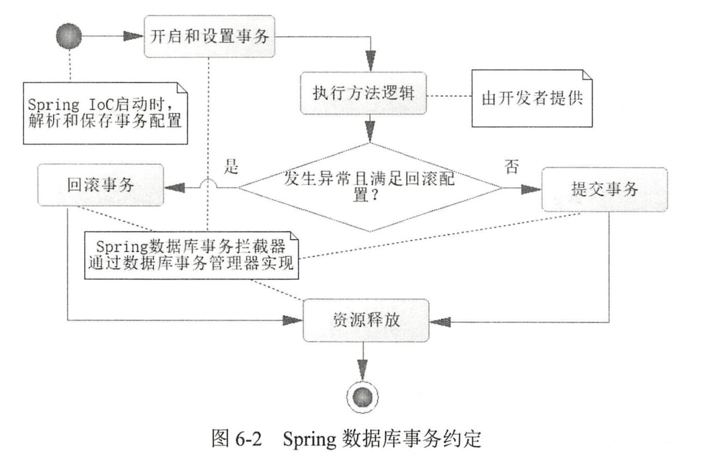
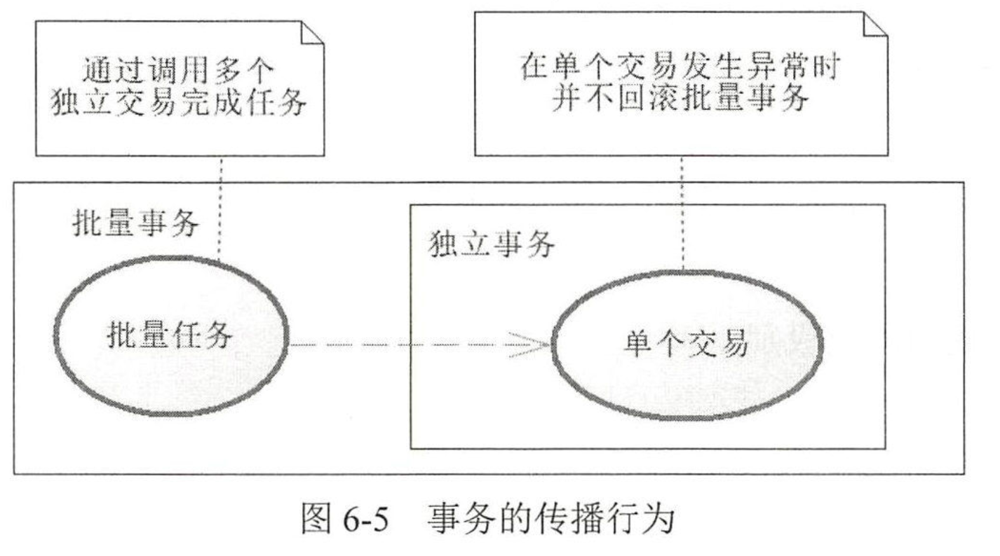

使用`@Transactional`注解，Spring就会知道在哪里启动事务。其约定流程如图：


@Transactional注解的一些配置：

```java
import org.springframework.transaction.annotation.Transactional;

@Service
public class UserService {
    @Transactional(
        readOnly = true,                          // 是否只读
        timeout = 30,                             // 超时时间
        isolation = Isolation.READ_COMMITTED,      // 隔离级别
        propagation = Propagation.REQUIRED,        // 传播行为
        rollbackFor = {SQLException.class},        // 指定回滚异常
        noRollbackFor = {IllegalStateException.class}  // 指定不回滚异常
    )
    public void doSomething() {
        // ...
    }
}
```

这里先引入事务的隔离级别：

## 事务的隔离级别

事务的隔离级别（Transaction Isolation Level）用于定义并发事务之间的相互影响，避免因并发执行而引发数据不一致的问题。数据库中的隔离级别定义了一个事务在执行时可以看到其他事务的修改情况，常见的隔离级别有以下四种，按隔离强度从低到高排列：

### 1. **READ UNCOMMITTED（读未提交）**
   - **描述**：在此隔离级别下，事务可以读取到其他事务尚未提交的数据（脏数据）。
   - **问题**：
     - **脏读**（Dirty Read）：一个事务可以读到其他事务尚未提交的数据。如果这个事务回滚了，那么读到的数据就是无效的。
     - **不可重复读**（Non-repeatable Read）：同一事务在不同时间读取相同数据时，可能得到不同结果。
     - **幻读**（Phantom Read）：一个事务多次查询时可能会发现新的数据插入。
   - **适用场景**：对数据一致性要求极低的场景（很少使用）。

### 2. **READ COMMITTED（读已提交）**
   - **描述**：一个事务只能读取到其他事务已经提交的数据，避免脏读。
   - **问题**：
     - **不可重复读**：同一事务在不同时间读取相同数据时，可能得到不同的结果。如果另一个事务在两次读取之间修改了数据，就会出现这种现象。
     - **幻读**：如果一个事务在读取时，另一个事务插入了新的行，第一次查询时看不到这些行，下一次查询时就看到了。
   - **适用场景**：多数数据库（如 SQL Server 和 Oracle）默认的隔离级别，适用于读一致性要求不高但需要避免脏读的场景。

### 3. **REPEATABLE READ（可重复读）**
   - **描述**：在整个事务期间，无论其他事务是否提交，当前事务的所有读操作都能保证是相同的数据。避免了脏读和不可重复读的问题。
   - **问题**：
     - **幻读**：在同一事务中，如果另一个事务插入了新行，这些行可能会在事务的后续查询中出现。
   - **适用场景**：MySQL 默认的隔离级别，适合需要确保数据在一个事务中多次读取一致性的场景。

### 4. **SERIALIZABLE（可串行化）**
   - **描述**：最高的隔离级别，强制事务串行化执行，即一个事务必须等其他事务完成后才能执行，避免了所有并发问题，包括脏读、不可重复读和幻读。
   - **问题**：
     - 并发性能最差，多个事务几乎不能并发执行，适合数据一致性要求极高但并发量较低的场景。
   - **适用场景**：极端情况下使用，适合金融交易等需要绝对数据一致性的场景。

### 事务隔离级别总结：
- **脏读（Dirty Read）**：读取到了其他未提交事务修改的数据。
- **不可重复读（Non-repeatable Read）**：同一事务中，前后两次读取相同数据得到不同的结果，通常是由于其他事务更新了数据。
- **幻读（Phantom Read）**：在同一事务中，如果其他事务插入了新行，这些行在事务后续查询中可能会出现。

### 四种隔离级别对问题的防护表：

| 隔离级别               | 脏读 | 不可重复读 | 幻读 |
|-----------------------|------|----------|------|
| **READ UNCOMMITTED**  | 是   | 是        | 是   |
| **READ COMMITTED**    | 否   | 是        | 是   |
| **REPEATABLE READ**   | 否   | 否        | 是   |
| **SERIALIZABLE**      | 否   | 否        | 否   |

**注意**：隔离级别越高，事务之间的并发性越差，但数据一致性更强。选择合适的隔离级别需要权衡并发性能和数据一致性。

## 事务的传播行为
假设有批量任务在处理时，如果其中一个任务出现异常，是否需要回滚整个批量任务？这就需要用到事务的传播行为。
通常我们只希望回滚出现异常的错误任务，而不是回滚整个批量任务。


事务的传播行为（Transaction Propagation Behavior）决定了当一个事务方法调用另一个事务方法时，如何处理新旧事务之间的关系。Spring 提供了多种事务传播机制，允许开发人员根据业务需求选择适当的事务行为。主要的传播行为有以下几种：

### 1. **REQUIRED**
   - **描述**：如果当前已经存在事务，则加入到这个事务中。如果当前没有事务，则新建一个事务。
   - **场景**：默认的传播行为，适合大部分业务场景。
   - **示例**：

     ```java
     @Transactional(propagation = Propagation.REQUIRED)
     public void methodA() {
         // 方法A业务逻辑
     }

     @Transactional(propagation = Propagation.REQUIRED)
     public void methodB() {
         // 方法B业务逻辑
         methodA();  // 调用methodA，将在同一个事务中执行
     }
     ```

   **解释**：`methodB()`调用`methodA()`时，它们共享同一个事务。如果事务成功，则一起提交；如果抛出异常，则一起回滚。

### 2. **REQUIRES_NEW**
   - **描述**：总是新建一个事务。如果当前有事务，先挂起当前事务，等新事务执行完再恢复。
   - **场景**：适用于需要在事务中执行独立的操作，无论外部事务的状态如何，该事务都要独立提交或回滚。
   - **示例**：

     ```java
     @Transactional(propagation = Propagation.REQUIRES_NEW)
     public void methodA() {
         // 方法A业务逻辑
     }

     @Transactional(propagation = Propagation.REQUIRED)
     public void methodB() {
         // 方法B业务逻辑
         methodA();  // methodA将开启新事务，不依赖methodB的事务
     }
     ```

   **解释**：`methodA()`将启动一个新的事务，与`methodB()`的事务独立。如果`methodB()`回滚，`methodA()`的事务依然可以成功提交。

### 3. **SUPPORTS**
   - **描述**：支持当前事务。如果当前有事务，则加入该事务；如果当前没有事务，则以非事务方式执行。
   - **场景**：适用于需要根据调用者上下文决定是否在事务中执行的操作。
   - **示例**：

     ```java
     @Transactional(propagation = Propagation.SUPPORTS)
     public void methodA() {
         // 方法A业务逻辑
     }

     @Transactional(propagation = Propagation.REQUIRED)
     public void methodB() {
         // 方法B业务逻辑
         methodA();  // methodA将在methodB的事务中执行
     }
     ```

   **解释**：如果`methodA()`被`methodB()`调用时，存在事务，它将加入事务；否则，它将以非事务方式执行。

### 4. **NOT_SUPPORTED**
   - **描述**：总是以非事务方式执行。如果当前有事务，则将其挂起。
   - **场景**：适用于某些操作不需要事务，甚至不能在事务中执行。
   - **示例**：

     ```java
     @Transactional(propagation = Propagation.NOT_SUPPORTED)
     public void methodA() {
         // 方法A业务逻辑
     }

     @Transactional(propagation = Propagation.REQUIRED)
     public void methodB() {
         // 方法B业务逻辑
         methodA();  // methodA将以非事务方式执行
     }
     ```

   **解释**：`methodA()`会以非事务方式执行，且不受`methodB()`事务的影响。

### 5. **MANDATORY**
   - **描述**：强制要求当前存在事务。如果没有事务，则抛出异常。
   - **场景**：适用于必须在事务中执行的操作。
   - **示例**：

     ```java
     @Transactional(propagation = Propagation.MANDATORY)
     public void methodA() {
         // 方法A业务逻辑
     }

     @Transactional(propagation = Propagation.REQUIRED)
     public void methodB() {
         // 方法B业务逻辑
         methodA();  // 必须在methodB的事务中执行
     }
     ```

   **解释**：`methodA()`只能在已有事务的上下文中执行。如果直接调用`methodA()`时没有事务，会抛出异常。

### 6. **NEVER**
   - **描述**：强制不允许存在事务。如果有事务，则抛出异常。
   - **场景**：适用于不允许事务存在的操作。
   - **示例**：

     ```java
     @Transactional(propagation = Propagation.NEVER)
     public void methodA() {
         // 方法A业务逻辑
     }

     @Transactional(propagation = Propagation.REQUIRED)
     public void methodB() {
         // 方法B业务逻辑
         methodA();  // 将抛出异常，因为methodB有事务
     }
     ```

   **解释**：如果`methodA()`在事务中执行，则会抛出异常。

### 7. **NESTED**
   - **描述**：如果当前有事务，则在当前事务中嵌套一个子事务；如果当前没有事务，则新建一个事务。嵌套事务可以单独回滚，而不影响外部事务。
   - **场景**：适用于希望在主事务中有嵌套事务，子事务可以单独提交或回滚。
   - **示例**：

     ```java
     @Transactional(propagation = Propagation.NESTED)
     public void methodA() {
         // 方法A业务逻辑
     }

     @Transactional(propagation = Propagation.REQUIRED)
     public void methodB() {
         // 方法B业务逻辑
         methodA();  // methodA将作为methodB的嵌套事务执行
     }
     ```

   **解释**：`methodA()`作为`methodB()`的嵌套事务执行，可以独立回滚，但如果`methodB()`回滚，`methodA()`也会回滚。

### 总结：

| 传播行为         | 描述 |
|------------------|------|
| **REQUIRED**      | 当前有事务则加入，没有则创建新事务（默认）。 |
| **REQUIRES_NEW**  | 总是新建一个事务，挂起当前事务。 |
| **SUPPORTS**      | 当前有事务则加入，没有事务则以非事务方式执行。 |
| **NOT_SUPPORTED** | 总是以非事务方式执行，挂起当前事务。 |
| **MANDATORY**     | 当前有事务则加入，没有则抛出异常。 |
| **NEVER**         | 总是以非事务方式执行，当前有事务则抛出异常。 |
| **NESTED**        | 嵌套事务，允许回滚子事务但不影响父事务。 |

### 示例项目中使用 `@Transactional`：
```java
@Service
public class OrderService {
    @Transactional(propagation = Propagation.REQUIRED)
    public void createOrder() {
        // 创建订单的逻辑
        paymentService.processPayment(); // 调用另一个事务方法
    }
}

@Service
public class PaymentService {
    @Transactional(propagation = Propagation.REQUIRES_NEW)
    public void processPayment() {
        // 处理支付逻辑
    }
}
```
在这个示例中，`createOrder()`使用`REQUIRED`传播行为，而`processPayment()`使用`REQUIRES_NEW`，即`processPayment()`将运行在一个独立的事务中。

## 一些疑问

### 在Spring@ boot中Transactional(readOnly = true)和@Transactional有什么区别？

在 Spring Boot 中，`@Transactional` 注解用于管理事务边界，而 `@Transactional(readOnly = true)` 和 `@Transactional` 之间的主要区别在于**事务的读写属性**，从而影响数据库的操作方式和性能优化。具体来说：

 **`@Transactional(readOnly = true)`**：
   - **只读事务**：指定该事务仅用于查询操作，即不会涉及对数据库的更新、插入或删除操作。
   - **性能优化**：Spring 在只读事务中可能对底层数据库连接进行优化，例如关闭脏数据检测等，提高查询性能。
   - **数据库支持**：某些数据库可以通过只读事务进行额外的性能优化，但要确保该事务中不包含写操作（更新、插入、删除），否则会抛出异常。
   - **应用场景**：适用于不需要更改数据的服务层方法，比如获取用户列表、查看订单信息等操作。

**`@Transactional` (默认 `readOnly = false`)**：
   - **读写事务**：支持所有数据库操作，包括查询、插入、更新、删除。
   - **数据一致性**：该事务在执行过程中会进行数据一致性检查，确保数据库在事务中所有操作要么全部成功，要么在出现异常时全部回滚。
   - **性能考虑**：因为存在数据修改操作，事务提交时会涉及更多一致性检查和资源锁定，性能开销通常高于只读事务。
   - **应用场景**：适用于需要更改数据的操作，比如更新用户信息、添加新订单等。

**在 Spring 中，@Transactional(readOnly = true) 默认不会改变事务的隔离级别。它只指定了当前事务是“只读”的，主要目的是在执行查询操作时，利用数据库的优化机制提升性能。**

在mysql中事务的隔离级别默认是`REPEATABLE READ`，事务的默认传播行为是`REQUIRED`。