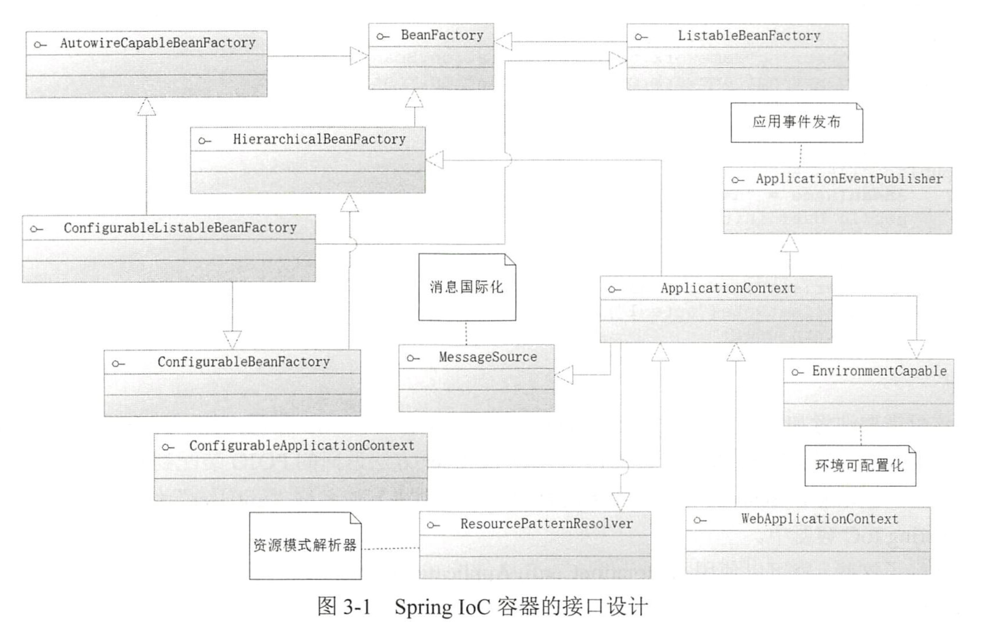
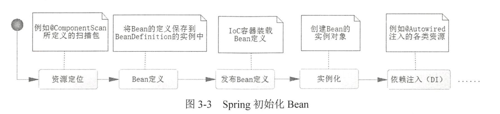
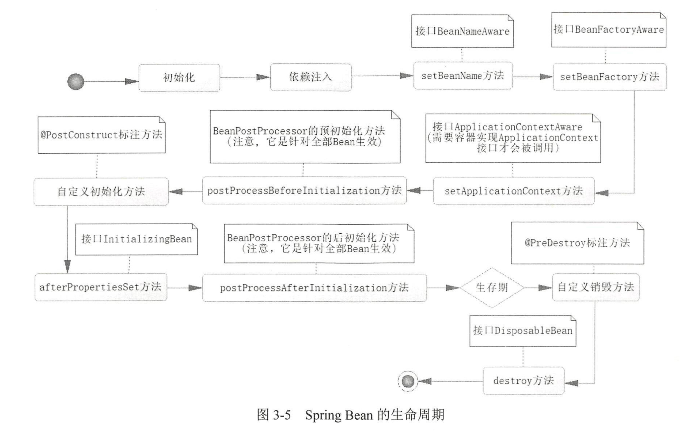

深入浅出Spring Boot 2.x学习笔记，第三章，Spring Boot：全注解下的loc。

Spring 中把每一个
需要管理的对象称为 Spring Bean （简称 Bean ），而 Spring 管理这些 Bean 的 容器，被我们称为 Spring IoC 容器（或者简称 IoC 容器） 。 IoC 容器需要具备两个基本的功能：
- 通过描述管理 Bean，包括发布和获取 Bean;
- 通过描述完成 Bean 之间的依赖关系

## BeanFactory
要求所有的 IoC 容器都需要实现接口 BeanFactory，其中定义了获取 Bean 的基本方法。

BeanFactory源码：
```java
public interface BeanFactory {
    String FACTORY_BEAN_PREFIX = "&";

    Object getBean(String name) throws BeansException;
    <T> T getBean(String name, Class<T> required
    Type) throws BeansException;

    Boolean containsBean(String name);
    // 默认情况下，Spring IoC 容器是单例的，每次返回都是同一个对象
    Boolean isSingleton(String name);
    // 原型模式，每次返回都是一个新的对象
    Boolean isPrototype(String name);
    Boolean isTypeMatch(String name, ResolvableType typeToMatch) throws NoSuchBeanDefinitionException;
    Class<?> getType(String name) throws NoSuchBeanDefinitionException;
    String[] getAliases(String name);
}
```

在BeanFactory中，有多个`getBean`方法，其中最常用的是：
- `getBean(String name)`：根据 Bean 的名称获取 Bean 对象
- `getBean(Class<T> requiredType)`：根据 Bean 的类型获取 Bean 对象

Spring 提供了一个更高级的 IoC 容器接口 ApplicationContext，它是 BeanFactory 的子接口，提供了更多的功能。

## ApplicationContext



ApplicationContext 接口通过实现多个接口，提供了更多的功能，如国际化、事件传播、资源加载等。

 Spring Boot 当中我们主要是通过注解来装配 Bean 到 Spring IoC 容器中。

### 使用AnnotationConfigApplicationContext
AnnotationConfigApplicationContext 是一个 IoC 容器，它可以通过注解来装配 Bean 到 Spring IoC 容器中。
```java
public class IoCTest {
    public static void main(String[] args) {
        /**
         * 创建了一个基于注解的Spring IoC容器AnnotationConfigApplicationContext，并将AppConfig类作为配置类传递给它。
         * AppConfig.class是一个包含Spring配置的类，使用了@Configurable注解，表明这是一个配置类。
         * 通过这种方式，Spring会扫描AppConfig类中的@Bean注解，并将这些方法返回的对象注册为Spring容器中的Bean。
         */
        ApplicationContext ctx = new AnnotationConfigApplicationContext(AppConfig.class);
        /**
         * 从Spring容器中获取一个类型为User的Bean对象。
         * ctx.getBean(User.class)方法会根据类型查找并返回一个User类型的Bean实例。
         * 这个User实例是由AppConfig类中的initUser方法创建并注册到Spring容器中的。
         */
        User user = ctx.getBean(User.class);
        log.info(user.toString());
    }
}
```

## 在配置类中使用注解装配Bean和在Bean类上使用注解装配Bean的区别
在 Spring 中，`@Bean` 注解通常用于定义和注册 Bean 到 IoC 容器中，而它可以出现在不同的地方。主要有两种常见的方式：

1. **在配置类中使用 `@Bean` 注解**（如在你的 `AppConfig` 类中）  
2. **在实体类（如 `User` 类）上使用 `@Component` 或其他派生注解**，例如 `@Service`, `@Repository`, `@Controller` 等。

这两种方式的不同点主要体现在 **Bean 定义和管理的灵活性、配置的集中化以及依赖管理的差异**：

### 1. **在配置类中使用 `@Bean` 注解**

使用 `@Bean` 注解在一个配置类中（如 `AppConfig`）定义 Bean 具有以下特点：

- **集中配置**：你可以在一个地方（配置类）集中管理所有的 Bean 定义。这可以使得配置代码更加清晰和集中，尤其是在需要配置复杂依赖的场景中。
  
- **灵活性**：配置类中的 `@Bean` 方法可以让你灵活地定义 Bean，比如在 Bean 创建时通过方法参数注入依赖，或根据某些条件决定返回的对象。这种方式更加灵活，可以使用逻辑控制返回哪个 Bean 实例。

- **可定制性**：通过 `@Bean`，你可以完全控制对象的创建过程，甚至可以在创建时执行一些逻辑，或者根据应用的某些条件配置不同的 Bean 实例。

- **多实例管理**：你可以在配置类中通过不同的方法名或 `@Bean` 注解的 `name` 属性来为同一个类型注册多个不同的 Bean。

- **明确的生命周期控制**：在配置类中，你还可以使用 `@PostConstruct`, `@PreDestroy` 等注解来明确控制 Bean 的生命周期。

#### 示例：
```java
@Configuration
public class AppConfig {

    @Bean
    public User initUser() {
        User user = new User();
        user.setName("kelin");
        user.setAge(25);
        user.setGender((byte) 1);
        return user;
    }
}
```

### 2. **在 `User` 类中使用 `@Component` 或其他注解**

如果你直接在实体类（如 `User` 类）上使用 `@Component`（或 `@Service`, `@Controller` 等注解），Spring 会自动扫描并将这个类注册为 Bean。特点如下：

- **自动扫描与装配**：`@Component` 是一个基于类的注解，意味着只要这个类被 Spring 的组件扫描路径扫描到，它就会自动注册为 Bean。你不需要手动在配置类中定义它。

- **简单且自动化**：适合简单的类，只需要标记类为组件即可，通常用于那些不需要复杂配置或初始化逻辑的 Bean。

- **依赖注入**：当使用 `@Component` 时，通常配合 `@Autowired` 注解实现自动依赖注入。虽然 `@Bean` 也可以做到类似的依赖注入，但是 `@Component` 配合自动扫描更适合规模较大的项目。

- **更少控制权**：与 `@Bean` 相比，`@Component` 提供的控制力更少。例如，你无法在定义 Bean 时动态决定返回什么实例，因为 `@Component` 只是简单地注册类到 IoC 容器中。

#### 示例：
```java
@Component
public class User {
    private String name;
    private int age;
    private byte gender;
}
```

### 3. **主要区别**

| 特点 | `@Bean` 在配置类中使用 | `@Component` 在类中使用 |
|---------------------------------|----------------------------------------|------------------------------------|
| **注册方式**                   | 手动在配置类中定义并注册 Bean           | 自动通过类扫描注册为 Bean          |
| **灵活性**                     | 高，方法中可以有逻辑控制 Bean 的创建     | 低，只能通过注解标记类为 Bean       |
| **依赖注入**                   | 可以通过方法参数手动注入依赖             | 使用 `@Autowired` 自动注入依赖      |
| **配置复杂度**                 | 适合复杂或条件性 Bean 定义               | 适合简单 Bean 自动化管理            |
| **Bean 名称控制**               | 可以通过 `@Bean(name = "xxx")` 自定义    | 默认 Bean 名称为类名，首字母小写    |
| **生命周期控制**               | 可以通过 `@PostConstruct`, `@PreDestroy` | 需要配合额外注解管理生命周期         |

### 总结

- **`@Bean` 适用于更复杂、需要灵活控制的 Bean 配置**。例如，需要根据某些条件创建 Bean 或者配置依赖的场景。
- **`@Component` 更适合那些不需要复杂配置、依赖自动装配的类**。它的作用类似于自动注册类作为 Spring 管理的组件，适合小型组件或服务类。

两者都可以实现依赖注入，但适用场景不同，使用时需要根据具体需求选择。

## ComponentScan
`@ComponentScan` 注解是 Spring 提供的一个用于自动扫描和注册 Bean 的注解。它可以指定一个包路径，Spring 会自动扫描这个包路径下的所有类，并将标记了 `@Component` 及其派生注解的类注册为 Bean。

`@ComponentScan` 注解通常与 `@Configuration` 注解一起使用，用于配置 Spring IoC 容器的自动扫描路径。

可以排除特定的 Bean 类型，如下所示：

```java
@ComponentScan(basePackages = {"com.springboot.chapter3" } ,
excludeFilters = {@Filter(classes = Service.class) ))
```
以上大致是将Bean注入到Spring IoC容器中的方法。

## 依赖注入（Dependency Injection）

一个简单的示例：
```java
@Component
public class Engine {
    public void start() {
        System.out.println("Engine started!");
    }
}

@Component
public class Car {
    private Engine engine;

    @Autowired // 根据属性的类型找到对应的Bean进行注入
    public Car(Engine engine) {
        this.engine = engine;
    }

    public void drive() {
        engine.start();
        System.out.println("Car is driving!");
    }
}
```

### @Autowired注解

`@Autowired`的注入机制最基本的一条是通过类型进行注入。在IoC容器的顶级接口`Factory`中，有一个`getBean`方法，这个方法是通过类型来获取`Bean`的。

但是在Spring中，有时候我们会有多个实现类，这时候就需要通过`@Qualifier`注解来指定具体的实现类。

```java
@Component
public class Car {
    private Engine engine;

    @Autowired
    @Qualifier("v8Engine")
    public Car(Engine engine) {
        this.engine = engine;
    }

    public void drive() {
        engine.start();
        System.out.println("Car is driving!");
    }
}
```

如果被注入的Bean带有参数的构造函数，如何把参数传入呢？
使用@Value注解，如下所示：
    
```java
@Component
public class Engine {
    private String type;

    // 使用 @Value 注解注入参数
    @Autowired
    public Engine(@Value("${engine.type}") String type) {
        this.type = type;
    }

    public String getType() {
        return type;
    }
}

@Component
public class Car {
    private Engine engine;

    // 自动注入 Engine Bean
    @Autowired
    public Car(Engine engine) {
        this.engine = engine;
    }

    public void drive() {
        System.out.println("Car is driving with engine type: " + engine.getType());
    }
}
```

## Bean的生命周期

### 初始化流程


```java
@ComponentScan(basePackages = "kelin.com.springnotes.chapter3", lazyInit = true)
```

使用lazyInit = true，可以延迟初始化Bean，即在第一次使用Bean时才初始化。

### 生命周期


## 使用@Profile
`@Profile`注解可以根据不同的环境来选择不同的Bean。

```java
@Profile("dev")
@Component
public class DevDataSourceConfig implements DataSourceConfig {
    @Override
    public void setup() {
        System.out.println("Setting up data source for DEV environment. ");
    }
}

@Profile("prod")
@Component
public class ProdDataSourceConfig implements DataSourceConfig {
    @Override
    public void setup() {
        System.out.println("Setting up data source for PROD environment. ");
    }
}
```
