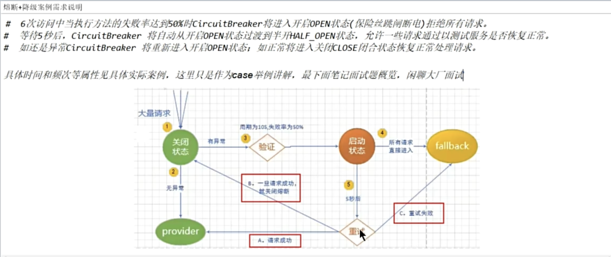

## 简介
### 断路器（Circuit Breaker）简介

**断路器**是一种用于防止分布式系统中的故障扩散的机制。它借鉴了电路中的断路器原理，当某个服务出现故障或响应异常时，断路器会主动中断请求链路，避免故障传播到整个系统，保护系统的可用性和稳定性。

断路器通常在微服务架构中使用，结合服务治理框架（如 Spring Cloud Hystrix、Resilience4j 等）实现。

---

### 断路器的核心概念

断路器有三种状态：**关闭（Closed）**、**打开（Open）** 和 **半开（Half-Open）**。

1. **关闭状态（Closed）**：
   - 默认状态，服务正常时断路器处于关闭状态。
   - 请求直接转发到目标服务。
   - 如果在一定时间内连续发生错误（如超时、异常等）超过预设阈值，断路器会进入**打开状态**。

2. **打开状态（Open）**：
   - 当断路器打开时，请求不再转发到目标服务，而是直接失败或返回预设的降级结果。
   - 断路器会在打开状态维持一段时间（冷却时间），然后进入**半开状态**。

3. **半开状态（Half-Open）**：
   - 冷却时间结束后，断路器会允许少量请求通过，测试目标服务是否恢复。
   - 如果测试请求成功率达到预期，断路器会切换回关闭状态。
   - 如果测试请求仍然失败，则断路器重新进入打开状态。

---

### 断路器的作用

1. **避免级联故障**：
   当某个服务发生故障时，断路器能够切断请求，防止故障扩散到其他服务，保护系统的整体稳定性。

2. **快速失败**：
   在目标服务不可用时，断路器立即返回失败结果或降级响应，避免用户长时间等待，提高用户体验。

3. **系统保护**：
   减少对故障服务的访问压力，避免因请求积压导致服务雪崩。

---

### 断路器的关键指标

1. **失败率**：
   一段时间内的失败请求占比。如果失败率超过阈值，断路器进入打开状态。

2. **请求数量**：
   设置触发断路器的最小请求数，确保断路器在足够的请求量下判断服务是否故障。

3. **熔断时间（冷却时间）**：
   指断路器打开后保持不再发送请求的时间，熔断时间过后进入半开状态。

4. **恢复检测**：
   在半开状态下，通过少量请求测试服务是否恢复，避免因误判直接恢复全部流量。

---

### 常见断路器框架

1. **Hystrix（已停止维护）**：
   - Netflix 开发，支持熔断器、线程隔离、请求缓存、请求合并等功能。
   - 使用广泛，但因功能复杂导致性能损耗高，现已被 Resilience4j 替代。

2. **Resilience4j**：
   - 轻量级 Java 熔断器库，支持断路器、限流、重试、超时等功能。
   - 性能优于 Hystrix，更适合现代微服务架构。

3. **Spring Cloud Circuit Breaker**：
   - Spring 官方的断路器抽象层，支持多种断路器实现，如 Resilience4j 和 Sentinel。

---

### 使用场景

1. **微服务调用失败**：
   处理服务超时、响应错误等异常情况，防止用户请求被无限制地转发到失败服务。

2. **高并发场景**：
   在流量激增时对服务降级，保护系统核心功能。

3. **依赖外部资源**：
   调用第三方接口或外部服务时，避免对其过度依赖导致自身系统故障。

---

### 断路器的优缺点

**优点**：
- 防止服务雪崩。
- 提升系统稳定性。
- 提高用户体验，避免长时间等待。

**缺点**：
- 增加系统复杂度。
- 需要合理设置阈值，否则可能引发误判。
- 引入额外的延迟（如熔断检测）。

---

### 实现示例（使用 Resilience4j）

```java
import io.github.resilience4j.circuitbreaker.annotation.CircuitBreaker;
import org.springframework.stereotype.Service;

@Service
public class PaymentService {

    @CircuitBreaker(name = "paymentService", fallbackMethod = "paymentFallback")
    public String processPayment() {
        // 调用目标服务
        return restTemplate.getForObject("http://payment-service/pay", String.class);
    }

    // 降级方法
    public String paymentFallback(Throwable throwable) {
        return "Payment service is currently unavailable. Please try again later.";
    }
}
```

通过 @CircuitBreaker 注解指定断路器名称和降级方法，当目标服务出现异常时返回降级响应。

---

通过断路器，分布式系统可以更好地处理服务故障和性能问题，确保高可用性和用户体验。

参考文档：[Resilience4j](https://github.com/lmhmhl/Resilience4j-Guides-Chinese/blob/main/index.md)

## 案例实战


配置断路器

```yml
circuitbreaker: # 降级熔断
    configs:
    default:
        failure-rate-threshold: 50 # 调用失败达到50%后打开断路器
        sliding-window-type: count_based # 滑动窗口类型
        sliding-window-size: 6 # 滑动窗口大小 count_based6个请求 time_base6秒
        minimum-number-of-calls: 6 # 每个滑动窗口的周期
        automatic-transition-from-open-to-half-open-enabled: true # 开始过度到半开状态
        wait-duration-in-open-state: 5s # 从开启到半开启需要5s
        permitted-number-of-calls-in-half-open-state: 2 #半开状态允许通过的最大请求数
        record-exceptions:
        - java.lang.Exception
    instances:
    cloud-payment-service:
        base-config: default
```