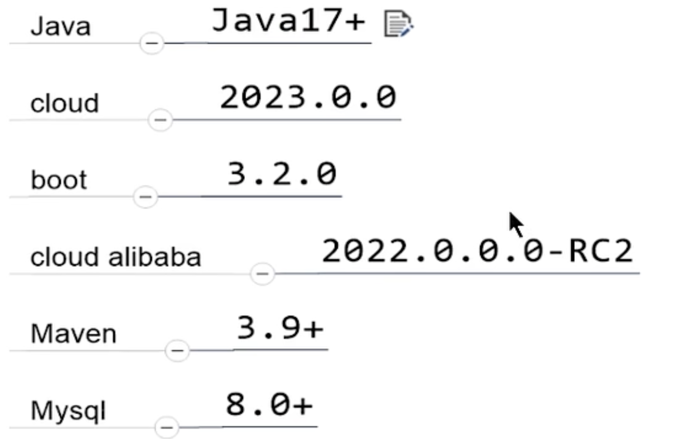

## 开发前准备

使用Idea做为编译器，创建一个新的Spring Cloud项目。

版本选择：



### 启动mysql
```bash
brew services start mysql
```
**查看mysql版本**
```mysql
mysql> select VERSION();
+-----------+
| VERSION() |
+-----------+
| 9.0.1     |
+-----------+
1 row in set (0.00 sec)
```

**创建数据库**
```mysql
mysql> create database db2024;
```

**创建表**
```mysql
CREATE TABLE t_pay
(
    id          INT UNSIGNED AUTO_INCREMENT PRIMARY KEY,
    pay_no      VARCHAR(50) NOT NULL COMMENT '支付流水号',
    order_no    VARCHAR(50) NOT NULL COMMENT '订单流水号',
    user_id     INT DEFAULT 1 NULL COMMENT '用户账号ID',
    amount      DECIMAL(8, 2) DEFAULT 9.90 NOT NULL COMMENT '交易金额',
    deleted     TINYINT UNSIGNED DEFAULT '0' NOT NULL COMMENT '删除标志, 默认0不删除,1删除',
    create_time TIMESTAMP DEFAULT CURRENT_TIMESTAMP NOT NULL COMMENT '创建时间',
    update_time TIMESTAMP DEFAULT CURRENT_TIMESTAMP NOT NULL ON UPDATE CURRENT_TIMESTAMP COMMENT '更新时间'
)
COMMENT '支付交易表';

```

## 自动生成mapper和实体类

创建一个mybatis-generator模块，自动生成mapper和实体类。

使用`mybatis-generator-maven-plugin`插件。

```xml
<plugin>
    <groupId>org.mybatis.generator</groupId>
    <artifactId>mybatis-generator-maven-plugin</artifactId>
    <version>1.4.0</version>
    <configuration>
        <configurationFile>src/main/resources/generator/generatorConfig.xml</configurationFile>
        <overwrite>true</overwrite>
        <verbose>true</verbose>
    </configuration>
</plugin>
```

在maven中，双击`mybatis-generator:generate`即可生成。

配置文件在`src/main/resources/generator/generatorConfig.xml`。

## 新建一个微服务流程

1. 新建一个模块，例如：pay-service。
2. 更改pom.xml文件，添加依赖。
3. 写yml配置文件。
4. 编写启动类。
5. 编写业务代码。

## Swager3

Swager是一个API文档生成工具，可以通过注解生成API文档。

常用注解：

- `@Tag`：用在类上，说明该类的作用。
- `@Operation`：用在方法上，说明方法的作用。
- `@Parameter`：用在方法参数上，说明参数的作用。
- `Schema`：用在实体类上，说明实体类的作用。

```java
@RestController()
@RequestMapping("/pay")
@Tag(name = "支付微服务模块", description = "支付crud操作") 
public class PayController {

    @Resource
    private PayService payService;

    @PostMapping("/add")
    @Operation(summary = "新增", description = "新增支付流水, 参数是JSON字符串")
    public String add(@RequestBody PayDTO payDTO){
        return payService.add(payDTO);
    }
```

写配置类，配置Swagger3。

进入地址：http://localhost:8080/swagger-ui/index.html

在网页上可以看到生成的API文档。点击try it out可以测试接口。

## 时间格式问题

### 使用`@JsonFormat`注解

在实体类中添加注解，指定时间格式。
```java
@JsonFormat(pattern = "yyyy-MM-dd HH:mm:ss", timezone = "GMT+8")
private Date createTime;
```

### 在application.yml中配置
    
```yaml
spring:
    jackson:
        date-format: yyyy-MM-dd HH:mm:ss
        time-zone: GMT+8
```
    
## 统一返回值

现在主流的返回值需要包括：
- code：状态码
- data：数据
- message：消息
- timestamp：时间戳（调用接口的时间）

状态码一般是枚举类型。

| 状态码 | 说明 |
| --- | --- |
| 1** | 信息，服务器收到请求，需要请求者继续执行操作 |
| 2** | 成功，操作被成功接收并处理 |
| 3** | 重定向，需要进一步的操作以完成请求 |
| 4** | 客户端错误，请求包含语法错误或无法完成请求 |
| 5** | 服务器错误，服务器在处理请求的过程中发生了错误 |

编写枚举类的技巧：举值-构造-遍历。

## 全局异常处理和返回

定义一个全局异常处理类，继承`ResponseEntityExceptionHandler`。

```java
@RestControllerAdvice
public class GlobalExceptionHandler extends ResponseEntityExceptionHandler {
    @ExceptionHandler(Exception.class)
    public ResponseEntity<Object> handleException(Exception e) {
        log.error("全局异常处理：", e);
        return ResponseEntity.status(HttpStatus.INTERNAL_SERVER_ERROR).body("服务器内部错误");
    }
}
```
当发生异常时，会调用`handleException`方法。