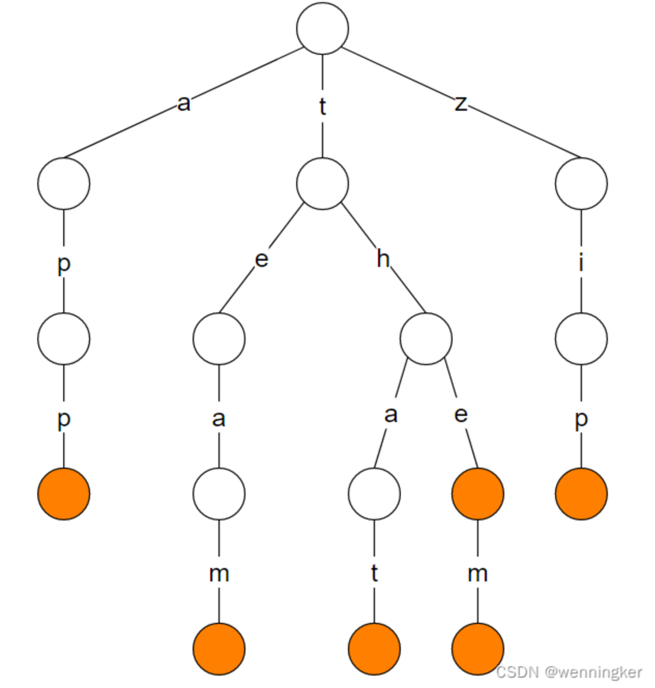

---
title: Trie树
date: 2022-09-10 07:33:02
categories: Algorithm
tags: [CPP]
---

> Trie树，即字典树，又称单词查找树或键树，是一种树形结构，是一种哈希树的变种。典型应用是用于统计和排序大量的字符串（但不仅限于字符串），所以经常被搜索引擎系统用于文本词频统计。它的优点是：利用字符串的公共前缀来减少查询时间，最大限度地减少无谓的字符串比较。

**前缀树的3个基本性质：**
 - 根节点不包含字符，除根节点外每一个节点都只包含一个字符。 
 - 从根节点到某一节点，路径上经过的字符连接起来，为该节点对应的字符串。
 - 每个节点的所有子节点包含的字符都不相同。

**时间复杂度：** $O(L)$, $L$是字符串的长度
**空间复杂度：**$O(n^2)$,最差情况下每个字符串都不相同。

[leetcode208 实现前缀树](https://leetcode.cn/problems/implement-trie-prefix-tree/solution/by-lfool-k6hb/)



**如何去实现一个前缀树？**
- 每个结点包含的东西：该节点是否是最后一个、该节点的子节点有哪些。
```cpp
struct Node{
    Node():isEnd(false){
        child.resize(26);//小写字母最多有26个
    };
    ~Node(){
    	for(auto ch : child){
    		if(ch)delete ch;
    	}
    }
    //标记当前结点是否是字符串最后一位
    bool isEnd;
    //有哪些孩子节点
    vector<Node*> child;
};
```
**这里为什么不用存储当前结点代表的字符呢？**
因为当查到到当前节点时，说明查找的这个一个字符已经存在。换句话说，该节点的字符存储在父节点中。

**实现初始化、查找某一个字符串是否在该树中、查找某一个前缀是否在该树中、插入一个字符串。**

```cpp
class Trie {
public:
    Trie() {
        root = new Node;
    }
    ~Trie(){
    	delete root;
    }
    //插入字符串
    void insert(string word) {
        Node* p = root;
        for(auto c : word){
            if(!p->child[c - 'a'])
                p->child[c - 'a'] = new Node;
            p = p->child[c - 'a'];
        }
        p->isEnd = true;
    }
    //查找某一个字符串是否在该树中
    bool search(string word) {
        Node* p = root;
        for(auto c : word){
            if(!p->child[c - 'a'])return false;
            p = p->child[c - 'a'];
        }
        return p->isEnd;
    }
    //查找某一个前缀是否在该树中
    bool startsWith(string prefix) {
        Node* p = root;
        for(auto c : prefix){
            if(!p->child[c - 'a'])return false;
            p = p->child[c - 'a'];
        }
        return true;
    }
private:
    Node* root;
};
```
**注意内存泄漏问题**
- 在构造函数里构造新的结点，在析构函数中释放
- 孩子结点每一个都要释放

`vector<Node*> child`，也可以用哈希表替代，`unordered_set<Node*>  child`
