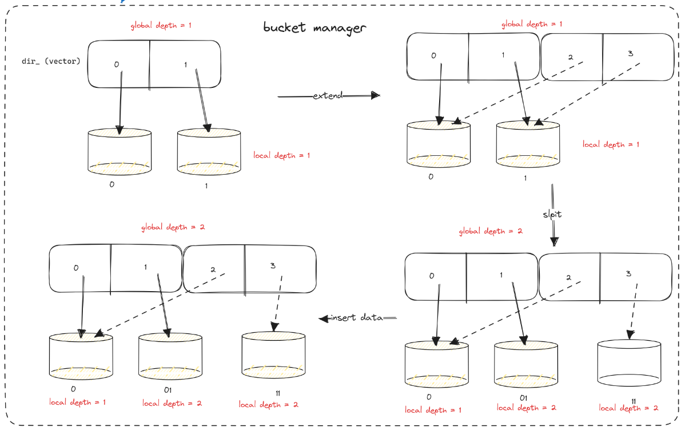
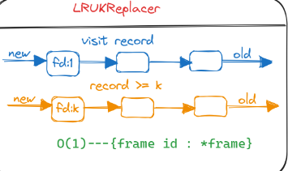
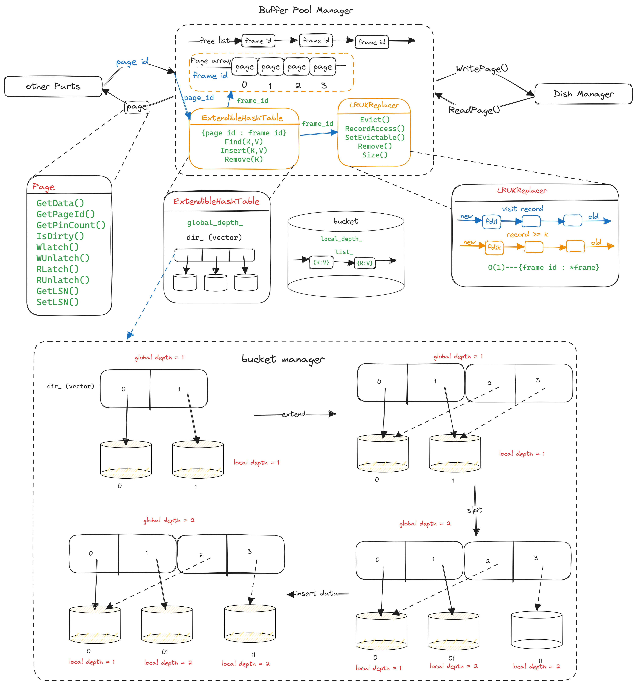

### 数据库中为什么需要buffer pool？

数据是存储在磁盘里的，但是也不能每次都从磁盘里面读取数据，这样性能是极差的。

要想提升查询性能，添加缓存。所以，当数据从磁盘中取出后，缓存内存中，下次查询同样的数据的时候，直接从内存中读取。

通常存储的数据划分为若干个「页」，以页作为磁盘和内存交互的基本单位，一个页的默认大小为 16KB。因此，Buffer Pool 同样需要按「页」来划分。

在MySQL中，InnoDB 会为 Buffer Pool 申请一片连续的内存空间，然后按照默认的16KB的大小划分出一个个的页(`frame`)， Buffer Pool 中的页就叫做缓存页。此时这些缓存页都是空闲(`free list`)的，之后随着程序的运行，才会有磁盘上的页被缓存到 Buffer Pool 中。

### Buffer Pool Manager 需要实现的功能：

`auto NewPgImp(page_id_t *page_id) -> Page * override`
返回一个`Page`（首先检查free list中有没有空闲的Page，如果有从free list返回，如果没有使用LRU_K算法replace一个页面之后返回, 注意这里的`page_id`是一个传入参数）

`auto FetchPgImp(page_id_t page_id) -> Page * override;`
在buffer pool中可能存在这个page_id, 标记为visit之后返回，不存在就和创建新的Page一样操作

```cpp
auto UnpinPgImp(page_id_t page_id, bool is_dirty) -> bool override;
auto FlushPgImp(page_id_t page_id) -> bool override;
void FlushAllPgsImp() override;
auto DeletePgImp(page_id_t page_id) -> bool override;
```
### Extendible Hash Table

#### 为什么这里需要一个hash表？

外部使用的参数为`page_id` , 内部转换为`frame_id`, 每一个frame对应着一个page。从`page_id`转换为`frame_id`通过hash表实现。

**重点在于如何去管理桶，当桶满了再插入时应该如何操作。**

每个桶（bucket）都有一个本地深度（local depth）和一个全局深度（global depth）

本地深度是指每个桶中存储的键值对的哈希值的前缀长度。例如，如果本地深度为2，则桶中存储的键值对的哈希值的前两位必须相同。

全局深度是指哈希表中所有桶的本地深度的最大值。它表示哈希表的索引空间的大小。

如果插入时全局深度等于本地深度，哈希目录扩展为两倍（左移一位）
此时针对桶的处理最简单的办法是也新建一倍的桶，每一个桶对应着每个索引，但是这样很浪费空间，当有数据插入的时候再考虑新建桶。
扩展目录为double，更新index，将桶中的数据重新插入到新的桶中。



### LRU_K算法

和传统的LRU不一样的地方在于，传统的LRU是淘汰最近未使用的，而LRU_K多维护了一个record链表，用于记录访问次数大于等于K的Page，当淘汰时优先淘汰访问次数小于K次的，若所有的Page访问次数都大于K次才从record链表中去淘汰。



### 具体实现


### tips

- 是否是dirty，是在Page内部用变量标识的，在buffer pool中没有使用额外的list管理脏页。

- 在buffer pool中的Page array的作用：`pages_`用来管理已经在bufferp pool中的Page
```cpp
if (page_table_->Find(page_id, frame_id)) {
    replacer_->RecordAccess(frame_id);
    replacer_->SetEvictable(frame_id, false);
    pages_[frame_id].pin_count_++;
    return &pages_[frame_id];
  }
```
