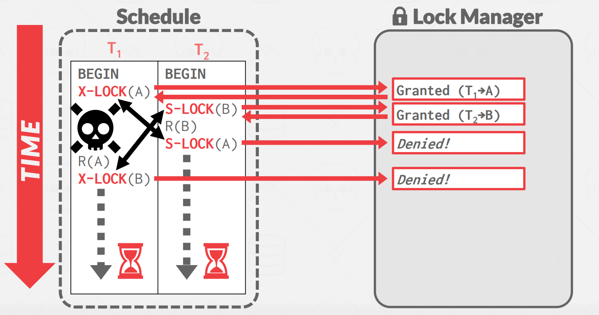

在做project4之前，最好是先学习课件内容。
[课件地址](https://15445.courses.cs.cmu.edu/fall2022/slides/15-concurrencycontrol.pdf)

Concurrency Control：avoid losting updates

Recovery： Durability

## 概念

### 事务

A transaction is the execution of a sequence of  one or more operations (e.g., SQL queries) on a database to perform some higher-level function.

Move $100 from Andy's bank account to his bookie's account.

Transaction:
- Check whether Andy has $100.
- Deduct $100 from his account.
- Add $100 to his bookie's account 

一个事务包含了许多操作，如果是并发执行事务时，就可能会导致很多问题。

#### 事务状态

A new txn starts with the `BEGIN` command.

The txn stops with either `COMMIT` or `ABORT`
- If commit, the DBMS either saves all the txn's changes
or aborts it.
- If abort, all changes are undone so that it's like as if the 
txn never executed at all.

### 事务的特性
- 原子性：所有操作要么全部完成，要么全部不完成。undo log(回滚日志)
- 隔离性：多个事务并发修改，不会互相干扰。MVCC（多版本并发机制）
- 持久性：事务处理结束后，对事务的修改是永久的。redo log（重做日志）
- 一致性：事务操作前和操作后，数据库保持一致性

### 事务隔离级别
- 脏读：读取到未提交的
- 不可重复读：在一个事务内多次读取同一个数据，前后读取的数据不一致
- 幻读：在一个事务内多次查询某个符合查询条件的「记录数量」，前后读取的记录数量不一致

**隔离级别：**
- 读未提交（read uncommitted），指一个事务还没提交时，它做的变更就能被其他事务看到；
- 读提交（read committed），指一个事务提交之后，它做的变更才能被其他事务看到；--- 解决脏读问题
- 可重复读（repeatable read），指一个事务执行过程中看到的数据，一直跟这个事务启动时看到的数据是一致的，MySQL InnoDB 引擎的默认隔离级别； --- 解决不可重复读问题
- 串行化（serializable ）；会对记录加上读写锁，在多个事务对这条记录进行读写操作时，如果发生了读写冲突的时候，后访问的事务必须等前一个事务执行完成，才能继续执行； --- 解决幻读问题

**五种锁：**
- 意向共享锁(IS):表示事务想要获得共享锁,与其他意向锁兼容,与排它锁冲突。用共享锁锁了里面的某些记录
- 意向排它锁(IX):表示事务想要获得排它锁,与其他所有锁模式冲突。用排他锁锁了表里的某些记录
- 共享锁(S):允许多个事务同时持有同一资源的共享锁,相互兼容。
- 排它锁(X):只允许一个事务持有排它锁,与所有其他锁冲突。
- 共享意向排他锁(SIX):表示持有共享锁的同时,想要获得排它锁,与排它锁冲突。用共享锁锁了整个表，用排他锁锁了里面的某些记录

### 锁管理器

管理锁的请求

**过程：**
1. Transactions request locks (or upgrades).
2. Lock manager grants or blocks requests.
3. Transactions release locks.
4. Lock manager updates its internal lock-table.
    It keeps track of what transactions hold what locks and what transactions are waiting to acquire any locks.

### 两阶段锁 2PL

#### Growing
只能加锁

#### Shrinking
只能解锁

示意图：

但是无法避免接连回滚问题：这里事务一进入Shrinking阶段后，并没有提交，而是ABORT，最终回滚，由于事务二用的是事务一修改后的数据，也需要跟着回滚。

粗暴的解决方法：所有的锁都在commit的时候解锁，能解决脏读问题。

**但是可能出现死锁：**

### 死锁检测

使用waits-for graph
- node：事务
- edge：Ti to Tj表示Ti在等到Tj释放锁

如果图种产生了环，需要解开环。

解开环：选择一个事务victim(abort or restart)
- 根据执行时间选择（执行时间短的）
- 执行的SQL语句的多少
- 已经加了多少把锁
- 被回滚过多少次

**回滚策略：** victim完全回滚 or 回滚某些语句

### 死锁预防

#### 死锁产生条件

- 独占资源
- 不可剥夺
- 占用并等待
- 循环引用

#### 破坏其中的某一条

Assign priorities based on timestamps:
- Older Timestamp = Higher Priority (e.g., T1 > T2)

两个事务不会互相等待。

为了避免饥饿，新的被kill掉之后，时间戳沿用以前的。

### 锁的粒度
行锁？表锁？间隙锁？
- 更少的锁的数量？粒度大，加锁的开销
- 更好的并发？粒度小

### 意向锁
并不是真的锁，只是一个意向。比如表A种某一个tuple被加了锁，此时需要对表A加意向锁，表示比表A粒度更细的内容被加了所，不能再对表A加表锁。

例如：要对Tuple1加S锁，需要先对Table R加IS锁

 

两阶段锁是悲观锁。

## 乐观锁

[课件地址](https://15445.courses.cs.cmu.edu/fall2022/slides/17-timestampordering.pdf)

根据时间戳排序，如果A的时间戳小与B的时间戳，那么最后执行的效果等于A先执行完B再去执行。

时间戳来源：
- 系统时钟（可能不准确）
- 逻辑计数器，比如从1递增，分布式校准难
- Hybrid：结合

每一个记录X都需要有两个时间戳：
- `W-TS(x)` - 上一次被写的时间戳
- `R-TS(x)` - 上一次被读的时间戳

基准：**不能操作来自未来的数据**

读数据：

写数据：数据的任何操作都应该发生在过去

### THOMAS WRITE RULE

如果我们当前要修改的数据A已经被未来的事务所修改，那么我们忽视写这个操作，因为现在写了一定会被未来写的数据所覆盖掉。

- 乐观锁不存在死锁，因为没有锁也没有等待
- 长事务可能会饥饿，因为有可能碰到的所有数据都被未来的事务所修改
- 必须要保证所有的修改都是在已经提交的基础上

可能会读取到别人未提交的。

### 乐观的并发

每一个事务都有一个workspace，所有的修改都在当前这个workspace进行，当事务提交时，DBMS对比workspace写集合，查看是否与其他事务冲突，没有冲突就写入原始数据库。

