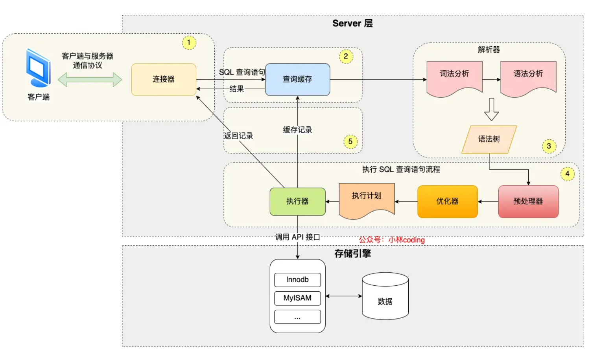
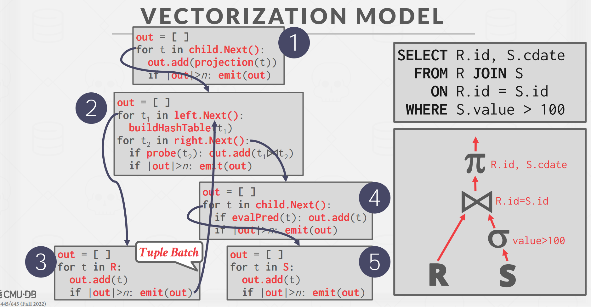
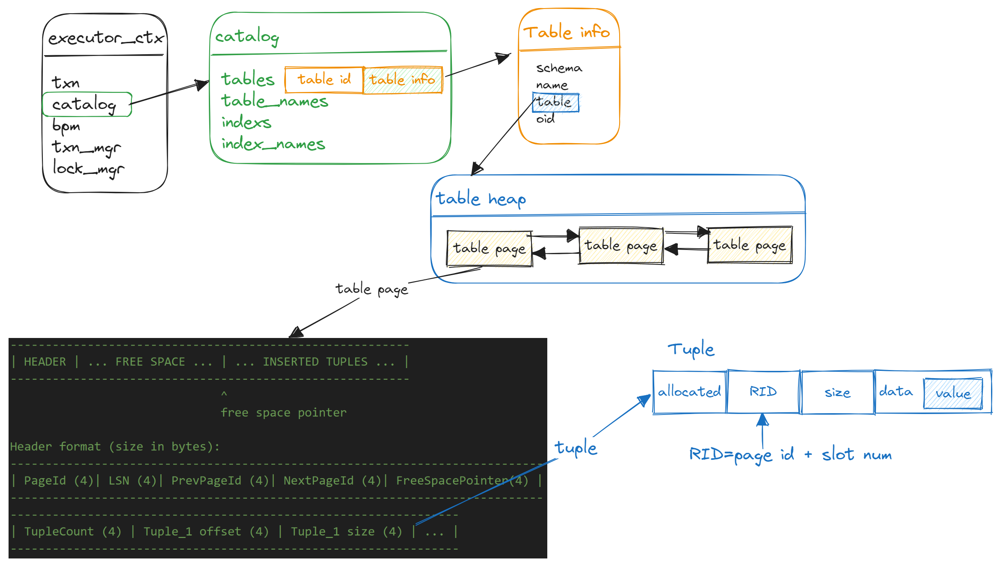
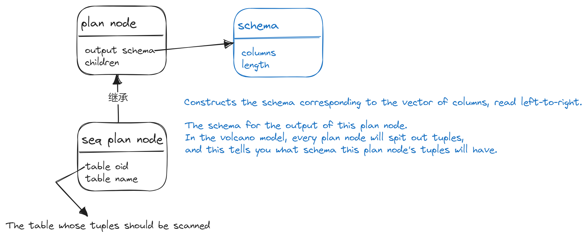

## 执行引擎介绍

**一条SQL语句进入到数据库中后是如何被执行的？**



前两个project实现的buffer pool和index都是存储引擎的一部分。

执行计划可以看作一个有向无环图，由source开始到sink结束，中间是一个又一个的算子。这一个project实现的就是这些算子。

课件地址：https://15445.courses.cs.cmu.edu/fall2022/slides/10-sorting.pdf

## processing model

A DBMS's processing model defines how the system executes a query plan.

→ Different trade-offs for different workloads.

### Iterator Model
每个运算符实现一个iterator接口,产生一行输出就调用下个运算符,逐行传递数据。或 Pipeline Model，或火山模型。每个算子都有 `Init()` 和 `Next()` 两个方法。`Init()` 对算子进行初始化工作。`Next()` 则是向下层算子请求下一条数据。当 `Next()` 返回 false 时，则代表下层算子已经没有剩余数据，迭代结束。

即时输出查询结果,不需要存储和载入大量中间状态。
易于实现,类似拉模式,但执行效率低。
### Materialization Model
每个运算符将中间结果完全 Materialize 产生,存储在临时表中。
下个运算符从临时表中读取输入数据。
效率高,可最大化利用批处理,但需要更多存储空间。
### Vectorized/Batch Model
运算符以批(向量)为单位处理数据,减少解释器调度开销。
输入数据存放在列式存储中,易于向量化操作。
并行计算批数据,可利用现代CPU指令集。
兼具Iterator和Materialization方法的优点。现在大部分OLAP数据库使用这种方法。

在bustub中使用的是Iterator Model。

比如这个join的例子，查询时数据自下而上流动，通过父节点调用子节点的`Next()`方法。在根节点处得到最终值。



## 具体实现

对于每一个算子，我们需要补充构造函数、`Init()`函数和`Next()`函数，注意`Next()`函数如果返回值，这里只返回一条，通过传出参数实现，返回`Tuple`和`rid`。

**这些信息是如何得到的？**

在顺序扫描算子中，构造函数提供了两个参数：
```cpp
SeqScanExecutor::SeqScanExecutor(ExecutorContext *exec_ctx, const SeqScanPlanNode *plan) : AbstractExecutor(exec_ctx) {}
```
ExecutorContext和SeqScanPlanNode，首先要搞明白执行上下文都包括什么东西？



最终的原始数据都在`Tuple`中，也代表着OLTP数据库中的一行数据。

**SeqScanPlanNode**，执行计划的一个结点应该包含哪些东西？

output_schema是用来表示执行计划结点的输出模式。输出元组包含哪些列, 每列的类型和名称是什么。这为下游运算符解析和处理数据提供信息。



bustub提供了一个迭代器`TableIterator`，用来遍历`TableHeap`。根据上面的ctx包含的内容和plan包含的内容可以一层层拆解。

```cpp
table_id = plan_->GetTableOid();
table_info = ctx->GetCatalog()->GetTable(table_id);
table_heap = table_info->table_.get();
table_iter_ = table_heap_->Begin(ctx->GetTransaction());
*table_iter_=tuple;
rid=tuple->GetRid();
```

## task1:

#### 顺序扫描 `src/execution/seq_scan_executor.cpp`

在有了前面的铺垫后，顺序扫描的`Next()`实现就非常简单，只需要返回迭代器指向的`Tuple`即可。

### 插入 `src/execution/insert_executor.cpp`

insert和delete是唯二的写算子。
插入这里多了一个参数`child_executor`, 右值传入。插入直接将tuple插入到table尾部，然后更新index。

```cpp
InsertExecutor::InsertExecutor(ExecutorContext *exec_ctx, const InsertPlanNode *plan,
                               std::unique_ptr<AbstractExecutor> &&child_executor)
    : AbstractExecutor(exec_ctx) {}
```

因为要更新index，可以通过`Catelog->GetTableIndexes()`来获取所有包含这个table的index，这里使用`std::vector<IndexInfo *> indexes_;` 遍历indexes数组，将每一个index插入B+树即可。
`bpIndex = ... index_.get()`
```cpp
bpIndex = reinterpret_cast<BPlusTreeIndex<GenericKey<8>, RID, GenericComparator<8>> (index->index_.get());
bpIndex->InsertEntry(tuple->KeyFromTuple(tinf->schema_, index->key_schema_, index->index_->GetKeyAttrs()), *rid, txn); // insert into B+tree
```

然后从子计划获取kv, 插入表中 TableHeap, 调用TableHeap中的插入方法即可。

```cpp
table_heap_->InsertTuple(*tuple, rid, txn);
```

### 删除 `src/execution/insert_executor.cpp`

删除几乎和插入一样，唯一不同的是把写记录换成删除记录，调用TableHeap中的删除方法。

```cpp
txn->AppendIndexWriteRecord(delete_record);
bpIndex->DeleteEntry(tuple->KeyFromTuple(tinf->schema_, index->key_schema_, index->index_->GetKeyAttrs()),*rid, txn);
```

### 索引扫描 `src/execution/index_scan_executor.cpp`

同样的，bustub封装了`IndexIterator`指针，用来遍历B+树。指向一个`std::pair<KeyType, ValueType>`类型。这里的value也就是rid，再通过rid获取tuple。

```cpp
BPlusTreeIndexForOneIntegerColumn *tree_;
BPlusTreeIndexIteratorForOneIntegerColumn index_iter_;
```

## Task2 aggr and join

### 聚合 `src/execution/aggregation_executor.cpp`

在`AggregationPlanNode`中多了这些参数：
```cpp
* Construct a new AggregationPlanNode.
   * @param output_schema The output format of this plan node
   * @param child The child plan to aggregate data over
   * @param group_bys The group by clause of the aggregation
   * @param aggregates The expressions that we are aggregating
   * @param agg_types The types that we are aggregating

/// 在聚合执行器中有以下参数
  /** The aggregation plan node */
  const AggregationPlanNode *plan_;
  /** The child executor that produces tuples over which the aggregation is computed */
  std::unique_ptr<AbstractExecutor> child_;
  /** Simple aggregation hash table */
  SimpleAggregationHashTable aht_;
  /** Simple aggregation hash table iterator */
  SimpleAggregationHashTable::Iterator aht_iterator_;

/// 构造函数需要改为

AggregationExecutor::AggregationExecutor(ExecutorContext *exec_ctx, const AggregationPlanNode *plan,
                                         std::unique_ptr<AbstractExecutor> &&child)
    : AbstractExecutor(exec_ctx),
      plan_(plan),
      child_(std::move(child)),
      aht_(plan->GetAggregates(), plan->GetAggregateTypes()),
      aht_iterator_(aht_.Begin()){}
```


聚合需要根据`group by`分组的结果来计算吗，所以这里需要建立一个哈希表用来存储中间结果。和之前每一次只吐一条数据不一样的是，这里必须要在`Init()`函数中把所有结果计算出来，再在` Next()` 中一条一条地 emit。所以实际上计算过程是在`Init()`函数中，通过：

```cpp
while(child_->Next(&tuple, &rid)){
   aht_.InsertCombine(MakeAggregateKey(&tuple), MakeAggregateValue(&tuple));
}
```
最后注意在`Next()`函数中，一个tuple可能要返回多个聚集的值，例如查询"SELECT SUM(A), MAX(B), COUNT(C) FROM table"就需要返回一个包含三个聚合结果的元组。所以内部是一个`vector`。没有返回rid是因为聚集之后产生了新结果，而不是原有的记录。


### inner join & left join `src/execution/nested_loop_join_executor.cpp`

`join`的时候也是需要建立hash表的，这里是根据join的key来建立哈希表，至于是左表建表还是右表建表，需要看数据库的具体实现。

#### 概念解释：

嵌套循环连接是连接算法的一种,它的基本原理是:

- 外表和内表,其中外表是驱动表,内表是被驱动表。
- 通过外表循环遍历每一行。
- 对于外表的每一行,遍历内表找到匹配的行。
- 将匹配的外表行和内表行组合,产生连接结果。
- 外表的循环嵌套内表的循环,逐行进行连接处理。

相比其他连接算法如哈希连接和排序合并连接,嵌套循环连接简单直接,但是当表大小不均衡时性能较差。
它适用于外表很小而内表较大的情况,或者当连接条件非常复杂时。

提示： Note for 2022 Fall: You ONLY need to implement left join and inner join.

- left join：左表全匹配（没匹配上右表时右表用null填充），右表只匹配join上的

- inner join： 左表和右表均只匹配能匹配上的

#### 具体实现

添加成员变量：
```cpp
  /** The NestedLoopJoin plan node to be executed. */
  const NestedLoopJoinPlanNode *plan_;
  /** The child executor that produces tuple for the left side of join. */
  std::unique_ptr<AbstractExecutor> left_executor_;
  /** The child executor that produces tuple for the right side of join. */
  std::unique_ptr<AbstractExecutor> right_executor_;
  /** The output tuple schema. */
  Schema left_schema_;
  Schema right_schema_;
  bool is_inner_join_;
  std::vector<Value> right_tuples_;
```
**这里为什么需要把右表的值先全部拿出来呢？**
假设我们的join逻辑是这样的：
```cpp
for outer_tuple in outer_table:
    for inner_tuple in inner_table:
        if inner_tuple matched outer_tuple:
            emit
```
右表的值会在左表的第一个值做匹配时就完全被消耗掉了。

**left join**
右值填充空值可以使用 `ValueFactory::GetNullValueByType(right_schema_.GetColumn(i).GetType())`

比较右表和左表的tuple是否相等可以使用`EvaluateJoin(&left_tuple_, &left_schema_, &right_tuple_, &right_schema_);`

### index join `src/execution/nested_index_join_executor.cpp`

索引连接(Index Join)是连接算法的一种优化技术,其主要思想是:

对于多个表的连接查询,通过在一个表上使用索引来加速连接处理。

例如对于一个多表连接查询:
```sql
SELECT * 
FROM A JOIN B ON A.id = B.id JOIN C ON B.id = C.id
```
如果在表B的id列上存在索引,可以进行索引连接优化:

通过扫描表A,获取连接需要的id值。
对于表A的每一行,使用表B上的索引直接查找id值,得到B中的匹配行。
再扫描表C找到匹配B的行。
最终组合A,B,C的匹配行。
这样可以利用B表上的索引,避免对B进行全表扫描,从而加速连接查询。

具体实现和 NestedLoopJoin 差不多，只是在尝试匹配右表 tuple 时，会拿 join key 去 B+Tree Index 里进行查询。如果查询到结果，就拿着查到的 RID 去右表获取 tuple 然后装配成结果输出。

在构造函数中只有一个child_executor，不在是左右孩子的执行器，tuple来源：
- left tuple 来自 child_executor
- right tuple 来自 table
- index scan key 获取 rid, 用rid 获取right tuple

## Task3  Sort + Limit Executors and Top-N Optimization

### src/execution/sort_executor.cpp

Sort 也是 pipeline breaker。在 Init() 中读取所有下层算子的 tuple，并按 ORDER BY 的字段升序或降序排序。

next 函数每次用迭代器返回一个值。

```cpp
  const SortPlanNode *plan_;
  std::unique_ptr<AbstractExecutor> child_executor_;
  std::vector<std::pair<Tuple, RID>> tuples_; // 存储所有的值用来排序
  std::vector<std::pair<Tuple, RID>>::iterator it_;
```
根据order by的值来进行升序或者降序排序，这里使用匿名函数自定义排序。然后返回迭代器指向的tuple。
### src/execution/limit_executor.cpp

使用一个成员变量 `limit_`来统计输出多少数据即可。

```cpp
limit_ = plan_->GetLimit();
/// after emit 
limit_--
```

### src/execution/topn_execution.cpp

top_n函数：返回最大或者最小的n个tuple

也是 pipeline breaker，需要在`Init()`时，使用优先队列。最后每一次调用`Next()`就从栈中弹出一个。

```cpp
while(child_executor_->Next(&tuple, &rid)){
   pq.push(tuple);
   if(pq.size() > plan_->GetN()){
      pq.pop();
   }
}
while(!pq.empty()){
   stack_.push(pq.top());
   pq.pop();
}
```