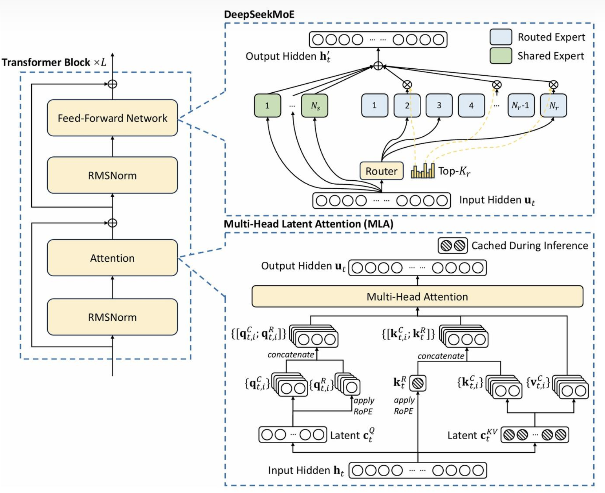
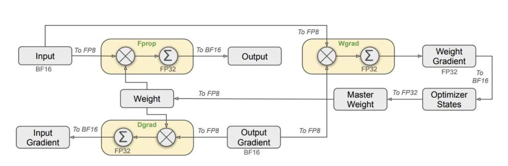
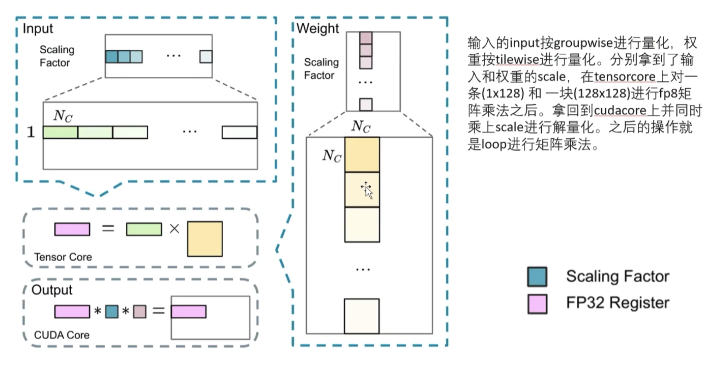
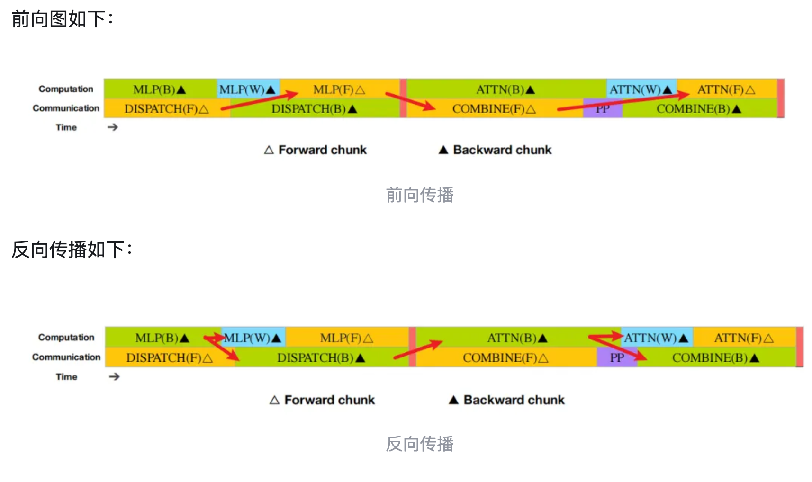
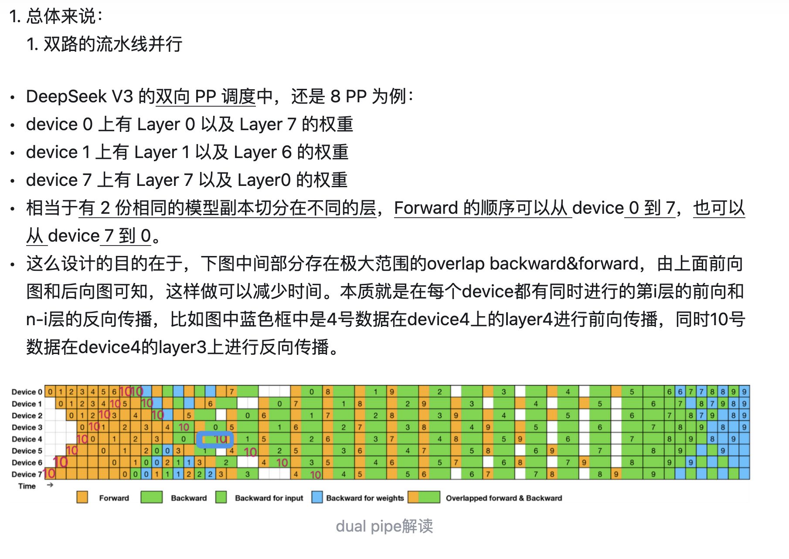

## 模型架构层

DeepSeekMoE架构相对于传统的Transformer架构，做了以下几项主要改进：

**Mixture of Experts (MoE)**：
- DeepSeekMoE引入了路由专家（routed experts）和共享专家（shared experts）。与传统的Transformer不同，DeepSeekMoE可以根据输入动态选择不同的专家，从而使得模型能够根据任务需求利用不同的专门知识，而不是对所有输入使用相同的参数。
- 路由机制和Top-K路由机制确保每层只使用部分专家进行计算，从而提高了计算效率，避免了传统Transformer中对所有专家都进行计算的冗余。
  
**多头潜在注意力（MLA）：**

- DeepSeekMoE的注意力机制进行了增强，使用了潜在Q和潜在K表示，区别于传统的查询（Q）、键（K）和值（V）表示。这样可以在注意力机制中提供更丰富的表示，从而改进了模型捕捉序列中依赖关系的能力。
- 通过RoPE（旋转位置编码）进一步增强了位置编码，帮助模型捕捉序列中的复杂模式。
- 引入了推理过程中的缓存机制，部分计算可以在推理时预计算或缓存，从而加速推理过程。
  
**共享专家层：**
- DeepSeekMoE使用共享专家层，这意味着多个输入可以共享同一层的计算资源，而不是每个输入都使用完全独立的层。这样可以减少冗余计算，提升计算效率。
  
**前馈网络和注意力机制的改进：**
- DeepSeekMoE采用了RMSNorm归一化机制，它是对层归一化（LayerNorm）的一种变体，能够在不依赖大批量训练的情况下稳定训练过程。
- 尽管保留了传统Transformer的前馈网络和多头注意力层，但通过MoE和潜在注意力的增强，使得模型能够处理更复杂的数据表示和更高效的计算。

### MLA

当我们谈到DeepSeekMoE在注意力机制和其他方面的改进时，实际上这些改进是为了提升模型的表达能力、捕捉更复杂的依赖关系并加速推理过程。以下是对每个改进的更具体的解释：

#### **潜在Q和潜在K表示 (Latent Q & Latent K)**
   - **传统注意力机制：** 在标准的Transformer架构中，查询（Q）、键（K）和值（V）是直接从输入中计算出来的。这些向量通过标准的点积操作来计算注意力权重，最终决定了每个输入对其他输入的影响。
   - **潜在Q和潜在K表示：** 在DeepSeekMoE中，注意力机制引入了**潜在Q**（latent query）和**潜在K**（latent key）表示。与传统方法不同，这些潜在表示并不是直接从输入数据中提取的，而是通过学习到的潜在空间生成的。这允许模型捕捉更复杂的关系和特征。
     - **潜在Q**和**潜在K**通过生成更丰富的表示，使得模型能够处理更高阶的依赖关系，不仅限于传统的直接输入映射。
     - 这种方法能够提升模型的表达能力，尤其是在需要捕捉长期依赖或者更复杂的输入特征时，潜在表示比传统的直接映射方式更加灵活和高效。

#### **RoPE（旋转位置编码）**
   - **传统位置编码：** 在经典的Transformer模型中，位置编码（通常是正弦和余弦函数的组合）被加入到输入的词向量中，以便模型能够理解单词在序列中的相对位置。这些位置编码是固定的，对不同的输入序列进行相同的编码。
   - **RoPE（旋转位置编码）：** DeepSeekMoE采用了**RoPE**，即旋转位置编码，这是一种改进的相对位置编码方法。RoPE通过对位置编码进行旋转，能够使得位置编码不仅与输入的绝对位置相关，还与输入之间的相对位置（距离）相关。
     - 这使得模型能够更好地处理长序列，并且更加灵活地理解序列中不同位置之间的相对关系。
     - RoPE编码的旋转性质使得模型能够在处理长距离依赖时表现得更好，尤其是在处理具有复杂结构的序列时。

#### **推理过程中的缓存机制**
   - **传统推理过程：** 在传统的Transformer模型中，每次推理都会从头开始计算所有的输入，无论这些输入是否已经在之前的推理过程中计算过。这个过程可能会导致较慢的推理速度，特别是在处理长序列时。
   - **缓存机制：** 在DeepSeekMoE中，推理过程引入了缓存机制。通过缓存中间计算结果，模型可以避免重复计算，特别是当处理重复或相似的输入时，缓存机制可以显著加速推理过程。
     - 在推理时，部分计算（例如中间的表示）可以提前计算并缓存起来，这样在处理后续输入时，模型可以直接使用缓存的结果，而无需重新计算。
     - 这种机制提高了推理效率，尤其在推理时需要多次处理相似输入的情况下，可以大大减少计算的开销。

这些改进使得DeepSeekMoE不仅能够处理更加复杂的输入，还能够提高推理效率：
- **潜在Q和潜在K**的引入使得模型能够捕捉更高阶的依赖关系，提升了注意力机制的表现。
- **RoPE**提供了一种更加灵活的相对位置编码方式，帮助模型更好地理解序列中的相对位置，尤其是在长序列中表现更优。
- **缓存机制**则通过减少重复计算加速了推理过程，提高了效率，特别是在处理大量或相似的输入时。

### MOE
在DeepSeekMoE架构中，**专家**（Experts）是指一组参数化的子模型，它们可以针对特定的任务或输入做出不同的响应。这些专家是网络中的子模型或计算单元，每个专家通常具备独特的知识或处理能力，因此它们能够在不同的任务或输入下展现出不同的特性。

#### 什么是专家？
专家可以理解为一类具有特定参数的子模型或计算单元，每个专家在模型中负责处理输入的某些特定部分或任务。这些专家可以是类似于普通神经网络层的结构，或者更复杂的模块，它们在训练过程中会学习到针对某些类型输入的特殊模式。

#### 如何使用专家？
DeepSeekMoE中的专家使用方式依赖于**路由机制**。在每次前向传播过程中，输入数据首先会通过一个**路由器**（Router）来选择哪些专家将被激活进行计算。路由器根据输入的特征决定哪些专家最适合处理当前输入。专家选择的过程通常有以下几个关键步骤：

1. **输入数据进入路由器：** 输入首先通过路由器，它根据输入的特征计算出每个专家的权重或得分。
   
2. **Top-K路由：** 路由器根据计算结果选择得分最高的前K个专家进行处理（例如Top-K），这意味着并不是所有专家都会被激活，只有最相关的专家才会被使用。

3. **专家的激活：** 被选中的专家进行计算并生成相应的输出。每个专家的计算结果可能会不同，因为它们专注于不同的特征或任务。

4. **输出合成：** 激活的专家的输出将被合成并传递给后续的网络层。通常，会对多个专家的输出进行加权合成，以得到最终的输出。

5. **共享专家：** 在一些情况下，也可以有**共享专家**，即多个输入共享相同的专家进行计算，这样可以进一步节省计算资源。

#### 如何判断选择哪些专家？

在DeepSeekMoE架构中，激活哪些专家是通过**路由机制**来判断的。具体来说，路由机制根据输入的特征来动态选择需要激活的专家。这一过程包含了Share专家和Router专家的激活策略，具体如下：

**Share 专家**
   - **一直激活：** Share专家是始终参与计算的，它们不依赖于输入的特征，而是对所有的输入都会进行计算。换句话说，Share专家不经过路由选择，而是直接计算每个输入的输出。

**Router 专家**
   - **计算亲和度：** Router专家的激活过程通过计算输入与各个专家之间的亲和度（相似性）来选择合适的专家。具体来说，这个过程通过以下步骤进行：
     - 首先，输入经过一个线性变换（通常是一个线性层），得到一个新的表示（亲和度评分），这个表示可以用来衡量输入与每个专家之间的相关性。
     - 接着，这些评分会被用来选择Top-K个专家，即选择与输入亲和度最高的专家进行计算。
   
   - **分组选择与Top-K策略：**
     - 在实际实现中，Router专家的选择会更加复杂。首先，会将所有的专家分成若干个组（n_groups）。每个组内包含多个专家。
     - 然后，对于每个组，选择**Top-2**个专家，通过加总每组内Top-2专家的亲和度评分来确定哪个组的亲和度最高。
     - 最后，在亲和度最高的这些组中，选择**Top-K**个专家，这样就可以确定最终需要激活的K个专家。

**加权输出：**
   - 最终，Router专家和Share专家的输出会通过亲和度加权融合在一起。具体来说，对于每个输入，Router专家和Share专家都会计算其输出，之后根据计算出的亲和度（即输入与每个专家之间的相关性），将这两个部分的输出进行加权求和，得到MoE层的最终输出。

## 训练方法创新

### FP8高低混合精度训练

首先，为提高模型训练速度，大部分核心计算操作（尤其是 GEMM 运算），均采用 FP8 精度实现。这些 GEMM 运算接收 FP8 格式的张量输入，输出 BF16 或 FP32 格式的结果。如图6所示，线性运算相关的三个 GEMM 操作，包括 Fprop（前向传播）、Dgrad（激活值反向传播）和 Wgrad（权重反向传播），均采用 FP8 执行。这种设计策略理论上将计算速度提升至原有 BF16 方法的两倍。同时，FP8 格式的 Wgrad GEMM 使得激活值能够以 FP8 格式存储用于反向传播，显著降低了内存使用量。

虽然 FP8 格式在效率方面具有优势，但某些运算由于对计算精度较为敏感，仍需要更高精度的支持。另外，部分计算开销较小的运算可以采用更高精度而不会显著影响整体训练效率。

因此，经过详细评估，系统对以下模块保持原有精度（BF16 或 FP32）：向量层、输出层、MoE 门控模块、标准化运算和注意力运算模块。这种针对性的高精度保留策略确保了 DeepSeek-V3 训练过程的动态稳定性。为进一步保障数值计算的稳定性，主要权重参数、权重梯度和优化器状态均采用更高精度存储。虽然这些高精度组件会带来一定的内存开销，但通过在分布式训练系统中跨多个 DP 层级进行高效数据分割，这些额外开销得到了有效控制。

**激活值反向传播（Dgrad）：** 当神经网络进行前向传播时，每一层会计算其激活值（通常是通过激活函数的输出）。反向传播过程中，我们会通过计算每个层的误差，并通过梯度来更新网络的参数。激活值反向传播的核心目的是计算损失函数相对于每一层的输入（即激活值）的梯度。

**权重反向传播（Wgrad）**： 在神经网络中，权重是模型的可学习参数。每次计算梯度时，目标是计算损失函数相对于权重的梯度，即计算权重在模型输出错误中的贡献。通过这些梯度信息，网络的权重会被调整，从而使得网络能够更好地拟合训练数据。

- 激活值反向传播：计算的是每个层的激活值相对于损失函数的梯度，作用是提供层与层之间的误差传递，帮助调整每一层的输入（激活值）。
- 权重反向传播：则是计算每一层的权重相对于损失函数的梯度。它的目的是通过更新每一层的权重来降低模型的误差，最终优化网络性能。

BF16、FP32 向 FP8 转换采用分组量化。

### DualPipe 框架

分布式训练的目的其实就一个：节省更多的资源，资源包括计算时间、显存、机器数量。总的来说应该是节省总的GPUhours。

模型训练中主要计算量来源于ATTENTION-O(L2)，MLP-O(H2)。
由于分布式训练，导致前向后向计算均需要通信，通信包括dispatch（将输入分到各个weight、expert）、combine（将各个weight、expert的输出结果聚合）两部分。

由于在同一个batch中，通信和计算是交替进行的，这将导致效率低下。为此deepseek v3 提出双管路的方法，使得通信与计算能够并行。

