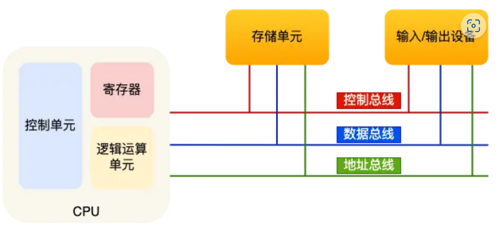
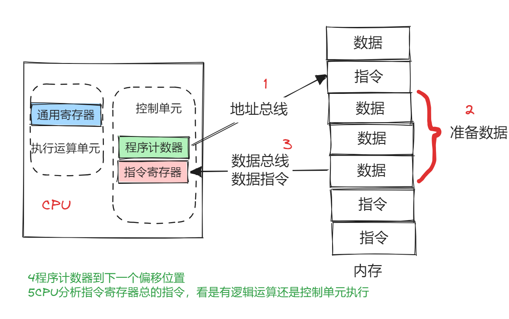

## 冯诺依曼模型

- 运算器
- 控制器
- 存储器
- 输入设备
- 输出设备



### 内存

程序和数据都是存储在内存中，存储的区域是线性的。存储数据的基本单位是**字节（byte）**，一字节等于8位（bit），每一个字节对应着一个内存地址。

### 中央处理器CPU

32位和64位CPU最主要区别在于一次能计算多少字节的数据

- 32位一次能计算4个字节，虚拟内存空间大小为$2^{32}$，4G
- 64位一次能计算8个字节

#### 寄存器
- 通用寄存器：用来存放需要进行运算的数据(执行单元)
- 程序计数器：用来存储CPU要执行下一条指令所在的内存地址（此时指令仍然在内存中）（控制单元）
- 指令寄存器：用来存放正在执行的指令（控制单元）

### 存储器接口(Memory Interface)
与内存交互,读写数据。
#### 控制单元
提取指令、解析指令、产生控制信号。
#### 执行单元(Execution Unit)
包含算术逻辑单元ALU和通用寄存器组,执行各种运算和数据处理。

### 总线

- 地址总线：用于指定CPU将要操作的内存地址
- 数据总线：用于读写内存的数据
- 控制总线：用于发送和接收信号

通过地址总线来指定内存内存的地址-->通过控制总线控制是读或写命令-->通过数据总线传输数据。

## 程序是如何执行的？



指令：一串二进制数字的机器码，不同的CPU有不同的指令集

**指令是存放在虚拟内存里还是物理内存中？**

虚拟内存为每个进程提供一片连续的虚拟地址空间，各进程的虚拟地址空间是独立的，指令与数据位于不同进程的虚拟地址空间中，因此多个进程共同执行时，他们的指令集不会交叉。

**那么程序计数器加1的时候，是加的虚拟内存还是实际内存？CPU直接操作的是实际内存还是虚拟内存？**

程序计数器加1时,它加的都是虚拟地址。CPU在执行程序时,直接操作和访问的也都是虚拟地址,而不是实际物理地址。

1. CPU送出的下一条指令虚拟地址到MMU
2. MMU根据页表查找虚拟地址到物理地址的映射
3. 若对应页不在物理内存，则触发缺页中断，os将其从磁盘换入
4. MMU最终将虚拟地址翻译为物理地址，从物理地址中读取指令后，将指令发送至CPU
5. CPU执行该指令
5. 程序计数器中的虚拟地址+1

### 对于一个C++程序而言，是如何把代码变成指令集的？

#### 预处理(Preprocessing)
预编译器处理头文件包含、宏定义展开等预处理工作,生成扩展后的源代码。`#define`

#### 编译(Compilation)
编译器将预处理后的C++源代码编译成汇编语言。这个过程包括词法分析、语法分析、语义分析、中间代码生成、目标代码生成等步骤。内联函数会被直接插入到每一个调用点，省去了函数调用的过程。

#### 汇编(Assembly)
汇编程序将汇编语言转换成机器语言,生成目标文件。

#### 链接(Linking)
链接器将多个目标文件和系统库链接生成完整的可执行程序。

在这个过程中,C++源代码经过编译器的编译和汇编程序的汇编,最终被转换成机器指令,这些指令保存在可执行文件的代码段,可以直接被CPU执行。

### 编译前和编译后代码是存放在哪里？

#### 编译前:
源代码以文本文件的形式存储在文件系统中,使用高级语言编写,对人更友好。

源代码包含了数据结构定义、算法流程、程序逻辑等信息。但不能直接被计算机执行。

#### 编译后：
经过编译器编译后,会生成机器代码,存放在可执行文件的代码段中。

机器代码使用机器指令组成,可以直接被CPU执行。

举个例子：当我调用`new`关键字去为一个对象分配内存时，在编译前这仅仅是一个抽象的概念，**内存分配是在运行时发生的**。

### 在编译的时候，编译顺序是怎么样的？

以下面的代码为例：

```cpp
#include<iostream> // 预处理阶段

class Node{
public:
    Node(int val):val(val){} // 构造函数和析构函数机器码
    ~Node(){} // 
    void func();
    void static sFunc(); // 没有this指针，所以只能调用静态成员变量
private:
    int val;
    const int c_val = 1;
    static int s_val = 1; // 所有实例共享，不属于类
}

int main(){
    Node node(1);
    Node * node_ptr = new Node(1);
    node.func();
    node_ptr.func();
    delete node_ptr;
}

```

### main函数执行之前，需要做什么？
1. 设置栈指针
2. 初始化静态static变量和global变量。静态类的构造函数在这里被调用
3. 初始化全局变量，全局对象的构造函数也在main之前被调用
4. 将main函数所需参数传递给main函数

### 在main函数之后，需要执行什么？

1. 全局对象的析构函数
2. 可以使用`atexit`注册一个函数，会在main之后执行

### 静态成员函数也是放在代码区的吗？

是的。编译器会为静态成员函数生成对应的机器代码，不需要实例化类就可以调用，机器代码独立生成，不依赖任何实例。

### 函数调用时是如何传递参数的？

1. 把参数的值从寄存器或内存加载到CPU的通用寄存器中。
2. 调用指令将程序控制流跳转到函数代码地址。
3. 在跳转前,调用指令会将返回地址等寄存器信息压入调用栈,用于保留调用环境。
4. 跳转执行函数代码,函数中的局部变量也可能在栈上分配。
5. 在函数执行前,根据调用约定从寄存器或栈空间中读取参数值。
6. 函数执行完后,使用返回指令跳回调用点。
7. 返回前依照调用约定将返回值写入寄存器或内存。
8. 返回后,调用栈恢复,继续执行调用代码。