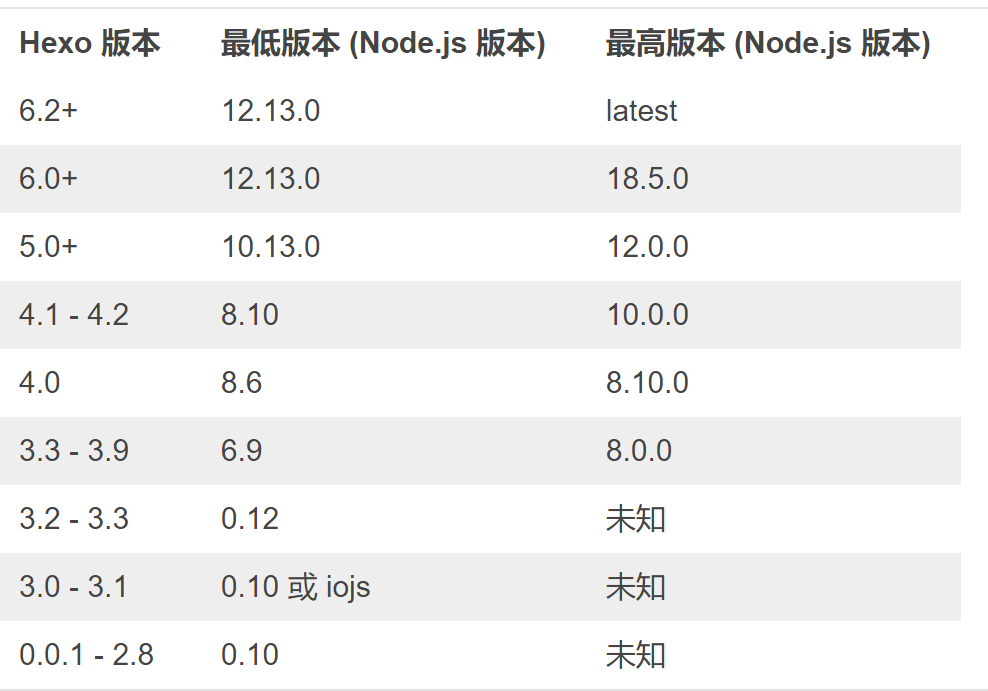

**问题：**

在hexo搭建博客的过程中，出现Cannot GET/xxx的错误。

### 查看是否缺少组件

1. 到public目录下找到xxx文件是否存在，我的错误是`Cannot GET/`，所以去找`index.html`是否存在。

2. 不存在，执行`hexo clean && hexo g`重新生成

3. 还是不存在，执行`npm audit fix`或者是`npm ls --depth 0`，查看是否缺少组件。通过`npm install hexo-xxx-xxx`安装

4. 执行完毕后发现我并不缺少组件。尝试其他解决办法。

### 路径问题

`config–>index.js`中的 `assetsPublicPath: '/'`改成`assetsPublicPath: ‘./’`

### 没有文件

在路径`\source\_posts\`中至少需要存放一篇文档，否则会出现`Cannot GET/`错误。

### nodejs等级太高
官方文档参考链接：https://hexo.io/zh-cn/docs/index.html

### 文件名问题

将所有markdown文件的名称替换为英文