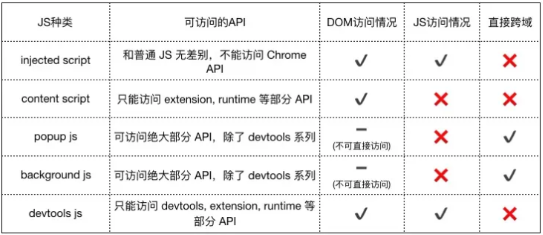

**本人是前端小白，写这个教程只是为了回顾用，可能会有错误的理解，请勿完全信任。**
### 目的
在检索内容时，很多时候需要检索英文内容，但是现有的翻译插件都需要先复制中文翻译后再复制回搜索框，要么就是将输入框翻译作为付费项目，于是就想自己开发一款插件来解决这个问题。

同时在浏览网页时难免会遇到不认识的单词，所以想融入一个划词翻译的功能，就不需要再额外安装插件。

### 功能

- 在输入框中输入检索内容后，加上尾缀可自动翻译为对应语言，目前支持`/en /zh /fr /de`
	- 如`测试/en ---> test`
- 划词翻译（开发中，暂不支持）

### 开发教程

#### 基于MV3的项目结构

```css
my-extension/
│
├── manifest.json  // 配置文件
│
├── icons/
│   └── icon16.png
│
├── scripts/
│   ├── content.js // 内容脚本，向访问的网页注入js代码的一种方式
│   ├── background.js // 后台脚本，可以访问浏览器的所有API
│   └── popup.js
│
├── pages/
└── └── popup.html // 弹出窗口样式
```

##### manifest.json

```json
{
	"manifest_version": 3,  // 这是manifest文件的版本，当前版本是3。
	"name": "Input Translation",
	"version": "1.0",
	"description": "Translate text input and selected words.",
	"permissions": [  //这里配置一些相关权限，如该脚本在那些网站上可以运行
		"*://*/*",
	],
	"action": { // 定义了扩展的浏览器动作，包括默认的弹出窗口和默认的图标。
		"default_popup": "popup/popup.html",
		"default_icon": "images/icon-16.png"
	},
	"icons": {
		"16": "images/icon-16.png"
	},
	"background": {  // 定义了扩展的后台页面，这里使用了一个服务工作线程。
		"service_worker": "background.js"
	},
	"content_scripts": [  // 定义了扩展的内容脚本，包括要注入的JS文件和匹配的网页URL。
		{
			"js": [   // 如果content.js脚本要引用其他脚本，可以写在这里
				"scripts/content.js"
			],
			"matches": [
				"<all_urls>"
			]
		}
	]
}
```

**各个脚本的权限：**



在调用百度翻译的API时，由于content脚本不支持直接跨域，所以要先将输入框的信息发送到background脚本，再由background脚本发送，所以这里涉及到两个脚本的通信。

脚本通信的教程参考：

[background、content、popup的通信 - 掘金 (juejin.cn)](https://juejin.cn/post/6844903985711677453)

#### popup
popup就是点击扩展图标弹出来的框，输入框翻译这个功能并不需要这个，所以留到下篇再写。

#### content.js
这个脚本的功能是：
- 监测用户输入框，判断用户是否输入了相关后缀，如果检测到用户输入相关后缀，就将输入的内容和后缀发送至background脚本。
- 接收到信息后，替换原本输入框中的内容

```js
var match = text.match(/(.*)(\/en|\/zh|\/fr|\/de)$/);

if (match) { 
	console.log("start to translate");
	var textToTranslate = match[1]; // 匹配到的文本，不包括语言代码	
	var languageCode = match[2].slice(1); // 匹配到的语言代码
	chrome.runtime.sendMessage({ text: textToTranslate, lang: languageCode }, function (response) { 
	if (chrome.runtime.lastError) {
		console.error(chrome.runtime.lastError);
		return;
	}
	console.log(response.data);
	event.target.value = response.data.trans_result[0].dst;
	});
}
```

这里使用的是`chrome.runtime.sendMessage`通信方式，将输入的文本和语言发送至background脚本。

另外，单独检测用户输入框，会导致用户正在输入`/en`时，就会被翻译，此时再按anter键，就会导致翻译后的文本多一个`/en`，如
`测试/en  ----> test/en`
这很不优雅，所以这里的监听事件设置为`keyup`，且设置了1s的延迟。
`document.addEventListener('keyup', function (event)`

#### background.js

这个脚本的功能是：接受content脚本发来的信息，调用百度翻译API，将翻译完成的信息发送给content脚本。

因为百度翻译API接受的内容需要使用md5算法加密，所以这里要引入md5算法。

**但是在mv3版本中，不支持直接在配置文件中引入脚本，所以这里要使用import的方式。**

```js
try {
	importScripts('scripts/lib/md5.js');
} catch (e) {
	console.error(e);
}
```

这里发送信息回content脚本有一个问题要注意，因为background脚本可能同时会和很多脚本通信，所以要使用tab的方式进行通信。

```js
chrome.runtime.onMessage.addListener((request, sender, sendResponse) => {
	console.log('Message received in content script:', request);
	translateText(request.text, request.lang, data => {
		chrome.tabs.query({ active: true, currentWindow: true }, function (tabs) {
			chrome.tabs.sendMessage(tabs[0].id, { data: data });
	});
		sendResponse({ data: data });
	});
	return true;
});
```

### 项目地址
[kelinkong/input-translate (github.com)](https://github.com/kelinkong/input-translate)
