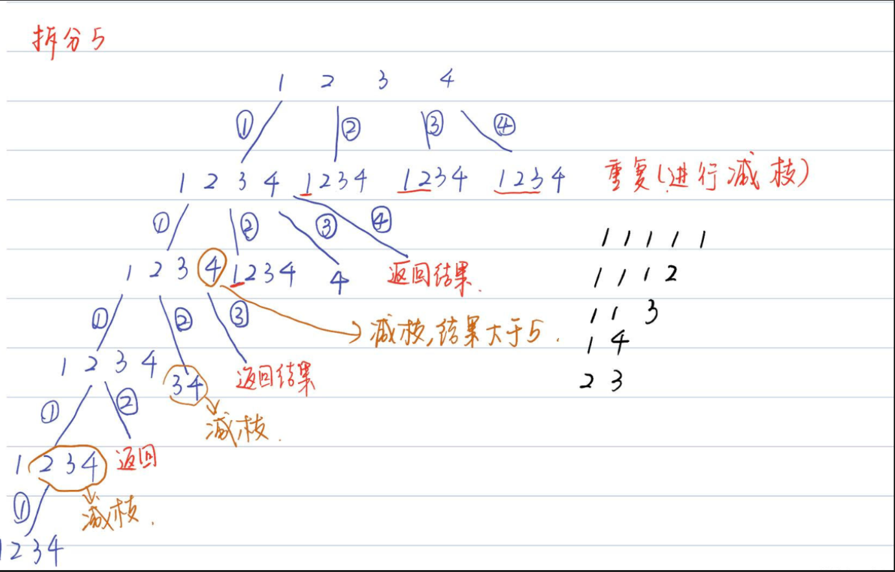
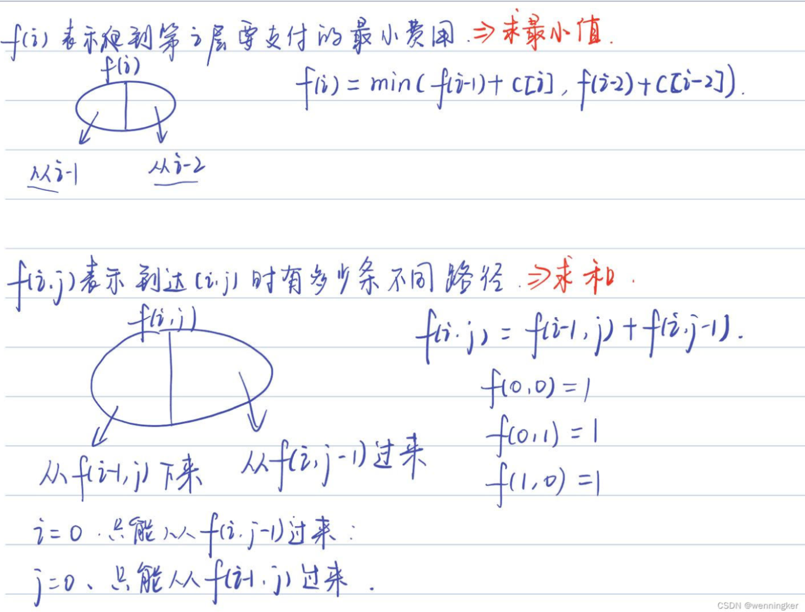

---
title: leetcode题解合集
categories: algorithm
date: 2022-10-15 07:33:02
mathjax: true
---


### DFS/回溯
**以整数拆分为例：**


**剪枝条件**
- 当和为n时，保存结果
- 当和大于n时，进行剪枝

在DFS中，同一排的结点是在同一个函数调用中进行处理，如上图中的第一排，1、2、3、4、这4个结点是在第一次函数调用中进行处理。

**因此使用一个for循环来处理同一排的结点。**
因为元素可以重复取用，本来for循环的起始位置应该都为1，但是为了避免重复，我们可以假设for循环的起始位置为其父节点的值，这里用变量`index`表示

```cpp
vector<int> res;
//n表示要拆分的数 index表示当前函数从哪个数开始拆 sum表示当前的和
void split(int n,int index,int sum) {
    if (sum == n) {//保存结果
        myPrint(res);
        return;
    }
    if (sum > n) return;//剪枝
    for (int i = index; i < n; ++i) {
        res.push_back(i);
        //元素可以重复使用，下一次还是从i开始拆分，拆到n为止
        split(n, i, sum + i);
        res.pop_back();
    }
}
```
[77 组合](https://leetcode.cn/problems/combinations/)
[216. 组合总和 III](https://leetcode.cn/problems/combination-sum-iii/solution/by-sdy-r-mava/)
[39. 组合总和](https://leetcode.cn/problems/combination-sum-iii/solution/by-sdy-r-mava/)
[17. 电话号码的字母组合](https://leetcode.cn/problems/letter-combinations-of-a-phone-number/solution/c-hui-su-suan-fa-by-sdy-r-6soj/)
[40. 组合总和 II](https://leetcode.cn/problems/combination-sum-ii/solution/by-sdy-r-vecj/)
[90. 子集 II](https://leetcode.cn/problems/subsets-ii/solution/by-sdy-r-nehc/)
[47. 全排列 II](https://leetcode.cn/problems/permutations-ii/solution/by-sdy-r-fiul/)
[679. 24点游戏](https://blog.csdn.net/wenningker/article/details/124399435?spm=1001.2014.3001.5502)
[687. 最长同值路径](https://leetcode.cn/problems/longest-univalue-path/solution/by-sdy-r-0cz4/)
### 动态规划
[一个超级实用的视频](https://www.bilibili.com/video/BV1X741127ZM/?spm_id_from=333.337.search-card.all.click&vd_source=59139a795dc5f3ee3da07683650b7b16)
**状态表示：** 
f 函数代表什么状态？
写出状态表示之后我们会有一个f函数的集合，代表递推到f(i)时，有多少种可能的状态。

**动态转移方程**
把集合中的每一种可能表示出来，对应要求的结果（求最大、最小、求和等）写出动态转移方程。

- 状态表示
- 状态集，从状态集求出当前状态

**思考当前状态对比前一个状态会有什么变化：**
- 从前一步加1？
- 等于前一步？

**如下图所示**


[路径和有关的题目](https://blog.csdn.net/wenningker/article/details/124410311?spm=1001.2014.3001.5502)

[714. 买卖股票的最佳时机含手续费](https://leetcode.cn/problems/best-time-to-buy-and-sell-stock-with-transaction-fee/solution/by-sdy-r-6p9s/)

[139. 单词拆分](https://leetcode.cn/problems/word-break/solution/by-sdy-r-cj3h/)

[343. 整数拆分](https://leetcode.cn/problems/integer-break/solution/by-sdy-r-q33e/)

[337. 打家劫舍 III](https://leetcode.cn/problems/house-robber-iii/solution/by-sdy-r-9rnk/)

[300. 最长递增子序列](https://leetcode.cn/problems/longest-increasing-subsequence/solution/by-sdy-r-hrxf/)

[940. 不同的子序列 II](https://leetcode.cn/problems/distinct-subsequences-ii/solution/by-sdy-r-atvj/)

[2400. 恰好移动 k 步到达某一位置的方法数目](https://leetcode.cn/problems/number-of-ways-to-reach-a-position-after-exactly-k-steps/solution/by-sdy-r-dytx/)

[646. 最长数对链](https://leetcode.cn/problems/maximum-length-of-pair-chain/solution/by-sdy-r-g02s/)

[120. 三角形最小路径和](https://leetcode.cn/problems/triangle/solution/by-sdy-r-fuap/)

[907. 子数组的最小值之和](https://leetcode.cn/problems/sum-of-subarray-minimums/solution/by-sdy-r-563t/)

[44. 通配符匹配](https://leetcode.cn/problems/wildcard-matching/solution/by-sdy-r-pm4u/)

[72. 编辑距离](https://leetcode.cn/problems/edit-distance/solution/by-sdy-r-boss/)

### 贪心
**每次选取局部最优解，得到最终的最优解。**
[2406. 将区间分为最少组数](https://leetcode.cn/problems/divide-intervals-into-minimum-number-of-groups/solution/by-sdy-r-umuh/)
[406. 根据身高重建队列](https://leetcode.cn/problems/queue-reconstruction-by-height/solution/by-sdy-r-3ec9/)
[452. 用最少数量的箭引爆气球](https://leetcode.cn/problems/minimum-number-of-arrows-to-burst-balloons/solution/by-sdy-r-17wh/)
### 数据结构
#### 优先队列

```cpp
//升序队列 小顶堆
priority_queue <int,vector<int>,greater<int>> q;
//降序队列  大顶堆 默认情况
priority_queue <int,vector<int>,less<int>> q;
```

[2406. 将区间分为最少组数](https://leetcode.cn/problems/divide-intervals-into-minimum-number-of-groups/solution/by-sdy-r-umuh/)

[239. 滑动窗口最大值](https://leetcode.cn/problems/sliding-window-maximum/solution/by-sdy-r-tu81/)

[2402. 会议室 III](https://leetcode.cn/problems/meeting-rooms-iii/solution/by-sdy-r-xle0/)

[23. 合并k个有序链表](https://blog.csdn.net/wenningker/article/details/124468136?spm=1001.2014.3001.5501)

#### 数组/链表/哈希
**数组：** 查找效率高，插入和删除效率低
**链表：** 插入删除效率高，查找效率低

**哈希：** 
- 思想：通过哈希函数得到的键值，使其能够高效查找
- 当键值重复时，处理哈希冲突
- 在C++中unordered_set 和unordered_map的底层实现时哈希表

[454. 四数相加 II](https://leetcode.cn/problems/4sum-ii/solution/by-sdy-r-jlw2/)
[2405. 子字符串的最优划分](https://leetcode.cn/problems/optimal-partition-of-string/solution/by-sdy-r-uq9h/)
[6221. 最流行的视频创作者](https://leetcode.cn/problems/most-popular-video-creator/solution/by-sdy-r-tknt/)

#### 栈/队列
[907. 子数组的最小值之和](https://leetcode.cn/problems/sum-of-subarray-minimums/solution/by-sdy-r-563t/)
[1106. 解析布尔表达式](https://leetcode.cn/problems/parsing-a-boolean-expression/solution/c-by-sdy-r-nxof/)

##### 单调栈
通常是一维数组，要寻找任一个元素的右边或者左边第一个比自己大或者小的元素的位置，此时我们就要想到可以用单调栈了。
[739. 每日温度](https://leetcode.cn/problems/daily-temperatures/solution/by-sdy-r-7za8/)
[503. 下一个更大元素 II](https://leetcode.cn/problems/next-greater-element-ii/solution/by-sdy-r-t3b7/)
#### 前缀树
[前缀树](https://blog.csdn.net/wenningker/article/details/126799292?spm=1001.2014.3001.5502)
#### 并查集
**并查集由两个部分构成：**
- `find()`函数，发现x的根
- `Union()`函数，合并

```cpp
// 初始化，最初每个元素的根都是自己
void init(vector<int> &parent, int n){
    for(int i = 0;i < n; ++i){
        parent.push_back(i);
    }
}
//发现x的根
int myfind(vector<int> &parent, int x) {
    if(parent[x] != x) {
        parent[x] = myfind(parent,parent[x]);
    }
    return parent[x];
}
//将y的根给x的根，将x和y合并为一堆
void myunion(vector<int> &parent,int x,int y) {
    parent[myfind(parent,x)] = myfind(parent,y);
}
```

[并查集](https://blog.csdn.net/wenningker/article/details/124127763?ops_request_misc=%257B%2522request%255Fid%2522%253A%2522166597671316800186587518%2522%252C%2522scm%2522%253A%252220140713.130102334.pc%255Fblog.%2522%257D&request_id=166597671316800186587518&biz_id=0&utm_medium=distribute.pc_search_result.none-task-blog-2~blog~first_rank_ecpm_v1~rank_v31_ecpm-2-124127763-null-null.nonecase&utm_term=%E5%B9%B6%E6%9F%A5%E9%9B%86&spm=1018.2226.3001.4450)

[886. 可能的二分法](https://leetcode.cn/problems/possible-bipartition/)

[934. 最短的桥](https://leetcode.cn/problems/shortest-bridge/solution/by-sdy-r-ao55/) BFS+DFS

[684. 冗余连接](https://leetcode.cn/problems/redundant-connection/solutions/2401010/c-bing-cha-ji-tuo-bu-pai-xu-by-sdy-r-48sg/) 并查集+拓扑排序

#### 线段树
### 双指针/滑动窗口
**主要是考虑左指针往右走的条件。**
[209. 长度最小的子数组](https://leetcode.cn/problems/minimum-size-subarray-sum/solution/by-sdy-r-yayj/)

[76. 最小覆盖子串](https://leetcode.cn/problems/minimum-window-substring/solution/by-sdy-r-zwx8/)

[90. 水果成蓝](https://blog.csdn.net/wenningker/article/details/124530777?spm=1001.2014.3001.5502)

[239. 滑动窗口最大值](https://leetcode.cn/problems/sliding-window-maximum/solution/by-sdy-r-tu81/)

[2401. 最长优雅子数组](https://leetcode.cn/problems/longest-nice-subarray/solution/by-sdy-r-glyh/)

[915. 分割数组](https://leetcode.cn/problems/partition-array-into-disjoint-intervals/solution/by-sdy-r-sm3x/)

[75. 颜色分类](https://leetcode.cn/problems/sort-colors/solution/by-sdy-r-tg7s/)

[19. 删除链表的倒数第 N 个结点](https://leetcode.cn/problems/remove-nth-node-from-end-of-list/solution/kuai-man-zhi-zhen-yi-bian-sao-miao-by-sd-pwps/)

### 树
对于二叉树来书，考虑遍历方式：
- 前序遍历：先处理父节点，再处理孩子节点
- 中序遍历：先处理左孩子，再处理父节点，最后处理右孩子
- 后序遍历：先处理孩子结点，再处理父节点

**大部分题目都是使用的后序遍历来求解：因为处理父节点时往往需要用到子节点的结果**

[106. 从中序与后序遍历序列构造二叉树](https://leetcode.cn/problems/construct-binary-tree-from-inorder-and-postorder-traversal/solution/by-sdy-r-307g/)

[98. 验证二叉搜索树](https://leetcode.cn/problems/validate-binary-search-tree/solution/by-sdy-r-6m2z/)

[236. 二叉树的最近公共祖先](https://leetcode.cn/problems/lowest-common-ancestor-of-a-binary-tree/solution/by-sdy-r-n5e3/)

[701. 二叉搜索树中的插入操作](https://leetcode.cn/problems/insert-into-a-binary-search-tree/solution/by-sdy-r-vovn/)

[998. 最大二叉树 II](https://leetcode.cn/problems/maximum-binary-tree-ii/solution/by-sdy-r-96ic/)

[538. 把二叉搜索树转换为累加树](https://leetcode.cn/problems/convert-bst-to-greater-tree/solution/by-sdy-r-x7yd/)

[6242. 二叉搜索树最近节点查询](https://leetcode.cn/problems/closest-nodes-queries-in-a-binary-search-tree/solution/c-by-sdy-r-osdi/) 
序列化二叉搜索树
### 位运算
|操作|结果  |特性|
|--|--|--|
| ~ | 取反，0变为1，1变为0 |
|a&b|且，ab同时为1时才取1|a & b <= min(a,b)，交换律、结合律，越取越小
|a 或 b| a和b其中有一个为1，最终结果就是1|越取越大
|a ^ b|a和b相同时为1，不同为0| 
| << 和 >>|左移一位，相当于*2，右移一位，相当于/2

[2419. 按位与最大的最长子数组](https://leetcode.cn/problems/longest-subarray-with-maximum-bitwise-and/solution/by-sdy-r-6vt8/)
### 模拟
**根据题意模拟，主要是代码细节要注意。**

[59. 螺旋矩阵 II](https://leetcode.cn/problems/spiral-matrix-ii/solution/by-sdy-r-g20f/)

[LCP 63. 弹珠游戏](https://leetcode.cn/problems/EXvqDp/solution/by-sdy-r-wlw0/)

[1441. 用栈操作构建数组](https://leetcode.cn/problems/build-an-array-with-stack-operations/solution/by-sdy-r-yemm/)

[779. 第K个语法符号](https://leetcode.cn/problems/k-th-symbol-in-grammar/solution/by-sdy-r-alxj/)

[6222. 美丽整数的最小增量](https://leetcode.cn/problems/minimum-addition-to-make-integer-beautiful/solution/by-sdy-r-a32l/)

[1620. 网络信号最好的坐标](https://leetcode.cn/problems/coordinate-with-maximum-network-quality/solution/by-sdy-r-lrwi/)

[775. 全局倒置与局部倒置](https://leetcode.cn/problems/global-and-local-inversions/solution/c-by-sdy-r-8gqu/)

### 数学
主要多考虑组合数学

**从起点到终点的所有路径：给定一个$n$和一个$k，n$代表要走的步数，$k$代表终点，从0出发，每次可以选择往左走或者往右走，走到$k$，有多少种路径？**
1. 假设$a$等于往右走的步数，往左走的步数为$k-a$,走到$n$时的步数为$a-(k-a)=a$，$a=(k+n)/2$
2. 当且仅当$(k+n)$为偶数时有解
3. 等价于从$k$步里面选$a$步往右走，所以结果是$C^{(k+n)/2}_k$

[2400. 恰好移动 k 步到达某一位置的方法数目](https://leetcode.cn/problems/number-of-ways-to-reach-a-position-after-exactly-k-steps/solution/by-sdy-r-dytx/)

**C++如何计算组合数？**

从`n`个里面选`m`个，当前这个选，就变为从`n-1`个里面选`m-1`个，当前不选，就变成从`n-1`个里面选`m`个。

根据公式:：$C_n^m=C^m_{n-1}+C_{n-1}^{m-1}$

```cpp
#include<iostream>
using namespace std;

long long res[67][67]={0};
long long C(long long n,long long m){
    if(m==0 || m==n) return 1;
    if(res[n][m] != 0)return res[n][m];//保存状态
    return res[n][m] = C(n-1,m)+ C(n-1,m-1);//赋值给res[n][m]并返回
}
int main()
{
    printf("%ld",C(6,3));
    return 0;
}
```
**排序不等式：**
$a_1 \leq a_2 \leq ... \leq a_n$
$b_1 \leq b_2 \leq ... \leq b_n$

最大值= $a_1b_1+a_2b_2+...+a_nb_n$
最小值= $a_1b_n+a_2b_{n-1}+...+a_nb_1$

**求解最大公约数和最小公倍数**
- 最大公约数：数组中所有数都能整除的最大数
- 最小公倍数：数组中所有数的最小倍数

$a和b的最小公倍数=a*b/(a和b的最大公约数)$
求解最大公约数使用`gcd(a,b)`函数	

[902. 最大为 N 的数字组合](https://leetcode.cn/problems/numbers-at-most-n-given-digit-set/solution/-by-sdy-r-z1sc/)

[6234. 最小公倍数为 K 的子数组数目](https://leetcode.cn/problems/number-of-subarrays-with-lcm-equal-to-k/)

[2447. 最大公因数等于 K 的子数组数目](https://leetcode.cn/problems/number-of-subarrays-with-gcd-equal-to-k/)
