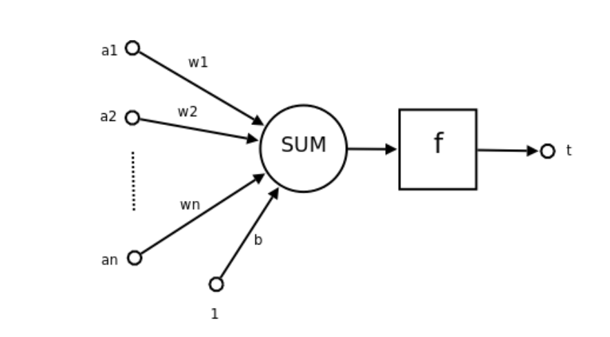
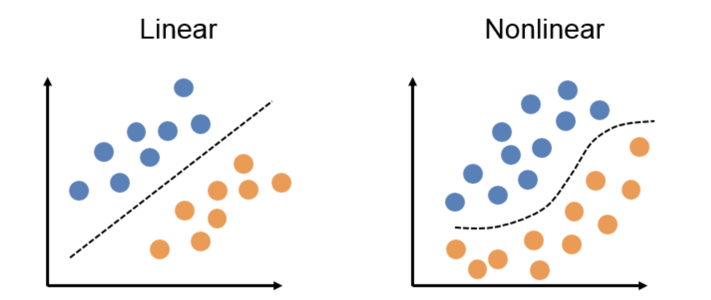

## 前言
最近在学习大模型相关的知识，很多教程都会提到人工神经网络。读研时总是听到训练神经网络之类的词，那这个训练，到底是训练什么呢？

我们现在假设要训练的模型是一个函数，首先考虑，这个函数的作用是什么？这个函数的输入是什么？输出是什么？

人工神经网络可以用来做分类、预测、生成等任务，现在假设我们的函数是一个分类函数，那么输入就是一个数据，输出就是这个数据属于哪个类别。

所以，训练神经网络，就是训练这个函数，让这个函数能够准确地对数据进行分类。

所谓训练，有点太拟人化了，听起来比较抽象，其实就是调整函数的参数，使得函数的输出尽可能接近真实值。

参数又是什么？这里先介绍一下神经网络的基本结构。

## 人工神经网络的基本结构

人工神经网络是一种模拟人脑神经元网络的计算模型，它由多个神经元（Neuron）组成，每个神经元接收多个输入，经过加权和激活函数处理后，输出一个值。

### 神经元（Neuron）

一个神经元的结构可以分为三个主要部分：**输入**、**处理单元**、**输出**。如果用前文的函数来描述，每一个神经元就是一个函数，这个函数的输入就是一个特征向量和一个权重向量，这个向量经过某种计算后，输出一个值（一个神经元的输出通常是一个标量）。

经过了什么处理呢？

对于单个神经元，其数学表达可以写为：
   $$
   y = \text{activation}(w_1 \cdot x_1 + w_2 \cdot x_2 + \dots + w_n \cdot x_n + b)
   $$

具体来看：

#### 1. **输入层（Input Layer）**：
   - 神经元的输入来自前一层的神经元，或者在网络的第一层，输入是来自外部的数据。
   - 输入信号（即特征）通过**权重(Weights)**传递到神经元。每个输入信号都有一个权重值，权重表示输入的重要性。

   **示例**：
   如果我们有三个输入特征 $( a_1, a_2, a_3 )$，每个输入都有一个对应的权重 $( w_1, w_2, w_3 )$。
   $$
   z = w_1 \cdot a_1 + w_2 \cdot a_2 + w_3 \cdot a_3 + b
   $$
   其中，$b$ 是偏置项。

#### 2. **加权求和（Weighted Sum）**：
   - 输入通过权重后，神经元会将这些加权输入进行加和，再加上一个**偏置（Bias）**项。
   - 偏置用于调整激活函数的输出，让神经元的输出更加灵活，帮助网络更好地拟合数据。

   **数学表示**：
   $$
   z = \sum (w_i \cdot x_i) + b
   $$

   其中，$z$ 是加权求和的结果，$w_i$ 是权重，$x_i$ 是输入，$b$是偏置。

#### 3. **激活函数（Activation Function）**：
   - 加权求和后的结果$z$ 会通过一个**激活函数**，以增加神经元的非线性能力。
   - 激活函数的目的是引入非线性，以便神经网络能够学习复杂的模式。常见的激活函数有 Sigmoid、ReLU、Tanh 等。

#### 4. **输出（Output）**：
   - 经过激活函数处理后的输出 $t$ 是神经元的最终结果，这个结果可以作为下一层神经元的输入，或者作为最终输出（例如分类结果或回归值）。
   - 在输出层，输出值可以是一个分类标签（如Softmax输出的类别）或一个回归值（如预测的数值）。

我们现在已经知道单个神经元（函数）做了什么工作，那么，为什么要经过加权求和、偏置又是什么、为什么要有激活函数？

### 加权求和和偏置

#### 1. **加权求和**：
   - 加权求和是为了给不同的输入信号赋予不同的重要性。
   - 通过调整权重，神经元可以学习到不同特征的重要性，从而更好地拟合数据。

比如说，判断一个人是男人还是女人，我们可以用身高、体重、声音等特征。但是，不同的特征对性别的判断重要性是不同的，比如身高可能比声音更重要，所以我们需要通过权重来调整这些特征的重要性。

#### 2. **偏置**：
偏置的作用是让神经网络的输出有更多的灵活性，即使输入的值为零，偏置也能确保神经元的激活函数能产生非零的输出。这有助于模型更好地拟合数据。

为什么要有偏置：如果没有偏置，神经网络的输出完全依赖于输入数据。如果输入为零，输出会总是零，这样模型的表达能力受到限制。通过加入偏置，神经网络可以更好地学习复杂的模式和关系。

### 激活函数

目的：激活函数的主要作用是引入非线性，从而让神经网络能够处理复杂的非线性问题。

没有激活函数，神经网络只会进行线性变换，加权求和的输出只是输入的线性组合。线性模型的能力有限，无法拟合复杂的非线性数据。因此，激活函数通过对加权和进行非线性处理，使网络可以处理高度复杂的任务，如图像识别、自然语言处理等。

#### 1. **ReLU（Rectified Linear Unit）**：
   ReLU 是最简单的激活函数之一。它的数学表达式为：
   $$
   \text{ReLU}(z) = \max(0, z)
   $$
   - 当 $z > 0$，输出 $z$。
   - 当 $z \leq 0$，输出 0。

#### 2. **Sigmoid**：
   Sigmoid 是一种常用的激活函数，尤其适用于二分类任务。它的数学表达式为：
   $$
   \sigma(z) = \frac{1}{1 + e^{-z}}
   $$
   - 该函数将输入 $z$ 映射到区间 (0, 1) 之间。
   - 当 $z \to \infty$，Sigmoid 函数的输出接近 1。
   - 当 $z \to -\infty$，输出接近 0。

#### 3. **Tanh（Hyperbolic Tangent）**：
   Tanh 是另一个常用的激活函数，它将输入映射到 -1 到 1 之间。其数学表达式为：
   $$
   \tanh(z) = \frac{e^z - e^{-z}}{e^z + e^{-z}}
   $$
   - 该函数将 $z$ 映射到区间 (-1, 1)。
   - 当 $z \to \infty$，Tanh 的输出接近 1。
   - 当 $z \to -\infty$，输出接近 -1。

#### 这三个激活函数的行为：
- **ReLU**：输出非负的值，有助于解决梯度消失问题，但可能会导致“死亡ReLU”问题（即神经元在某些区域永远输出0）。
- **Sigmoid**：适用于二分类，但在极值区域梯度容易消失。
- **Tanh**：输出范围为 (-1, 1)，通常比 Sigmoid 更有效，但仍可能存在梯度消失问题。

偏置让模型产生非零输出，激活函数引入非线性，这两个因素使得神经网络能够学习复杂的模式和关系。那什么是线性模型，什么是非线性模型呢？

### 线性模型和非线性模型

我们先从“线性模型”的概念开始，然后再解释为什么它的能力有限，以及它为什么不能拟合复杂的非线性数据。

#### 1. **线性模型是什么？**
   - 线性模型是一种简单的数学模型，它通过输入变量（特征）的线性组合来进行预测。
   - 公式形式为：  
     $$
     y = w_1 \cdot x_1 + w_2 \cdot x_2 + \dots + w_n \cdot x_n + b
     $$
     其中：
     - $y$ 是模型的输出（预测结果），
     - $x_1, x_2, ..., x_n$ 是输入特征，
     - $w_1, w_2, ..., w_n$ 是每个特征的权重，
     - $b$ 是偏置项。

   这个公式表明输出 $y$ 是输入特征的**加权求和**。这种模型在数据的所有关系都是线性时，表现得很好。

#### 2. **线性模型的局限性**
   - 线性模型可以很好地处理简单的任务，比如预测身高和体重的关系，如果这两个变量之间的关系是线性的。
   - **线性关系**意味着，输入特征的变化会导致输出以固定比例变化（即没有复杂的交互或非线性效应）。

   例如，如果我们在二维平面上绘制一条直线，直线可以通过简单的线性方程来表示，适用于处理两个变量之间的简单比例关系。但在现实世界中，很多问题不是这样简单的线性关系。

#### 3. **什么是非线性数据？**
   - 非线性数据是指输入与输出之间的关系无法用简单的直线表示。它可能是弯曲的、复杂的、有多个转折点，或者数据之间存在高度的交互。
   - 比如，如果想预测一个人的年收入，可能会涉及教育背景、工作经验、职位、技能等多个复杂因素，它们之间的关系是高度复杂的，这样的数据就是**非线性的**。

   例如，如果我们用简单的线性模型来处理这个问题，它只能画出一条直线，但现实中这些因素的关系是复杂而非线性的，可能是一个波动的曲线。线性模型无法正确表达这种复杂的关系。

#### 4. **为什么线性模型不能拟合复杂的非线性数据？**
   - 线性模型的核心在于它只会根据输入特征进行简单的加权和。因此，它无法捕捉到变量之间复杂的交互关系或弯曲的趋势。
   - 举个简单的例子，假设要预测物体在抛出后的运动轨迹。物体的轨迹是抛物线（非线性），如果你用线性模型去拟合这个轨迹，结果只能是一条直线，完全无法准确描述抛物线的运动。
   - 现实中的大多数数据，比如图像、语音、自然语言等，往往存在复杂的非线性关系，输入特征之间的交互也很复杂，线性模型无法有效捕捉这些关系。

#### 5. **如何解决这个问题？**
   - 为了解决这个问题，我们需要引入**非线性模型**。神经网络就是一种非常强大的非线性模型，它通过**激活函数**（如 ReLU、Sigmoid）引入非线性，使得神经网络能够处理和拟合复杂的非线性数据。
   - 每一层神经元通过权重和偏置计算出加权和，并通过激活函数引入非线性，逐层递进地学习输入数据的复杂模式，从而对复杂任务做出准确预测。

用大白话说就是线性模型是拟合为直线的，非线性模型可以拟合为曲线的。

**那么，为什么加入激活函数后，神经网络就能处理非线性数据了呢？**

> 当我们给神经网络加入激活函数后，它就能够处理复杂的非线性数据，原因很简单：
> 
> 打破线性限制：如果没有激活函数，神经网络每一层的计算都是线性的（像画直线一样），无论堆叠多少层，最终的输出也只是线性组合，无法处理弯曲、复杂的模式。
> 
> 激活函数引入变化：激活函数就像给网络“加了个弯”，不再只产生直线关系。比如 ReLU 会把负数变成 0，而正数保持不变，这种变化让网络能处理更复杂的情况，不再是简单的线性相加。
> 层层递进：每一层加上激活函数后，输出的结果会经过更多复杂的非线性处理。最终，网络能学会从数据中找到隐藏的复杂关系，甚至是一些人类看不到的特征。
> 简单来说，激活函数让网络能够画“曲线”，而不是只能画“直线”，这就是它能处理非线性数据的原因。

前面提到：输出非负的值，有助于解决梯度消失问题。

**那么，梯度是什么？梯度消失又是什么？**

### 梯度和梯度消失
我们先从**梯度**的概念开始，接着解释什么是**梯度消失**。

#### 1. **什么是梯度？**
   - 在神经网络中，梯度指的是损失函数（模型预测的误差）对模型参数（权重和偏置）的导数。
   - 梯度告诉我们如何调整权重才能让损失减少，也就是说，它指示了优化方向。
   - 比如，假设我们在爬山，梯度就像告诉我们当前所处位置的坡度和方向，帮助我们找到“山顶”（即最小的损失值）。

#### 2. **梯度消失是什么？**
   - **梯度消失**是指当神经网络的某些层的梯度变得非常小时，网络更新参数的速度变得非常慢，甚至无法继续学习。
   - 在训练深层神经网络时，随着误差从输出层逐层向前传播回输入层，梯度会逐渐变小。尤其是当使用像 Sigmoid 或 Tanh 这样的激活函数时，它们的导数很容易变得接近 0，导致梯度消失。

#### 3. **为什么梯度消失是个问题？**
   - 梯度消失意味着，神经网络前面几层的权重几乎没有更新。这会导致这些层的学习速度非常慢，网络无法有效学习数据中的复杂特征。
   - 如果梯度消失，模型在训练过程中就会变得“卡住”，无法通过反向传播有效优化权重，这样模型的表现也就无法提高。

####  4. **为什么输出非负值可以帮助解决梯度消失？**
   - **ReLU激活函数**输出非负值（即当输入大于 0 时，输出等于输入；否则输出 0）。ReLU 的导数是常数 1（对于正数部分），不会像 Sigmoid 或 Tanh 那样迅速衰减为接近 0。这意味着通过 ReLU，网络的梯度不容易消失，前面几层的学习速度也能得到保证。
   - 换句话说，**输出非负的值**，特别是通过 ReLU 这样的激活函数，可以避免导数过小，从而缓解梯度消失问题。
