<!--Copyright © Microsoft Corporation. All rights reserved.
  适用于[License](https://github.com/Microsoft/ai-edu/blob/master/LICENSE.md)版权许可-->

文章参考：[神经网络中的三个基本概念](https://github.com/microsoft/ai-edu/blob/master/%E5%9F%BA%E7%A1%80%E6%95%99%E7%A8%8B/A2-%E7%A5%9E%E7%BB%8F%E7%BD%91%E7%BB%9C%E5%9F%BA%E6%9C%AC%E5%8E%9F%E7%90%86/%E7%AC%AC1%E6%AD%A5%20-%20%E5%9F%BA%E6%9C%AC%E7%9F%A5%E8%AF%86/02.0-%E5%8F%8D%E5%90%91%E4%BC%A0%E6%92%AD%E4%B8%8E%E6%A2%AF%E5%BA%A6%E4%B8%8B%E9%99%8D.md)

## 2.0 通俗地理解三大概念

这三大概念是：反向传播，梯度下降，损失函数。

神经网络训练的最基本的思想就是：先“猜”一个结果，称为预测结果 $a$，看看这个预测结果和事先标记好的训练集中的真实结果 $y$ 之间的差距，然后调整策略，再试一次，这一次就不是“猜”了，而是有依据地向正确的方向靠近。如此反复多次，一直到预测结果和真实结果之间相差无几，亦即 $|a-y|\rightarrow 0$，就结束训练。

在神经网络训练中，我们把“猜”叫做初始化，可以随机，也可以根据以前的经验给定初始值。即使是“猜”，也是有技术含量的。

下面我们举几个例子来直观的说明下这三个概念。

### 2.0.1 例一：猜数

甲乙两个人玩儿猜数的游戏，数字的范围是 $[1,50]$：

甲：我猜5

乙：太小了

甲：50

乙：有点儿大

甲：30

乙：小了

......

在这个游戏里：

- 目的：猜到乙心中的数字；
- 初始化：甲猜5；
- 前向计算：甲每次猜的新数字；
- 损失函数：乙在根据甲猜的数来和自己心中想的数做比较，得出“大了”或“小了”的结论；
- 反向传播：乙告诉甲“小了”、“大了”；
- 梯度下降：甲根据乙的反馈中的含义自行调整下一轮的猜测值。

这里的损失函数是什么呢？就是“太小了”，“有点儿大”，很不精确！这个“所谓的”损失函数给出了两个信息：

1. 方向：大了或小了
2. 程度：“太”，“有点儿”，但是很模糊

### 2.0.2 例二：黑盒子

假设有一个黑盒子：

我们只能看到输入和输出的数值，看不到里面的样子，当输入1时，输出2.334，然后黑盒子有个信息显示：我需要输出值是4。然后我们试了试输入2，结果输出5.332，一下子比4大了很多。那么我们第一次的损失值是 $2.334-4=-1.666$，而二次的损失值是 $5.332-4=1.332$。

这里，我们的损失函数就是一个简单的减法，用实际值减去目标值，但是它可以告诉你两个信息：1）方向，是大了还是小了；2）差值，是0.1还是1.1。这样就给了我们下一次猜的依据。

- 目的：猜到一个输入值，使得黑盒子的输出是4；
- 初始化：输入1；
- 前向计算：黑盒子内部的数学逻辑；
- 损失函数：在输出端，用输出值减4；
- 反向传播：告诉猜数的人差值，包括正负号和值；
- 梯度下降：在输入端，根据正负号和值，确定下一次的猜测值。

### 2.0.3 例三：打靶

小明拿了一支步枪，射击100米外的靶子。这支步枪没有准星，或者是准星有问题，或者是小明眼神儿不好看不清靶子，或者是雾很大，或者风很大，或者由于木星的影响而侧向引力场异常......反正就是遇到各种干扰因素。

第一次试枪后，拉回靶子一看，弹着点偏左了，于是在第二次试枪时，小明就会有意识地向右侧偏几毫米，再看靶子上的弹着点，如此反复几次，小明就会掌握这支步枪的脾气了。图2-2显示了小明的5次试枪过程。

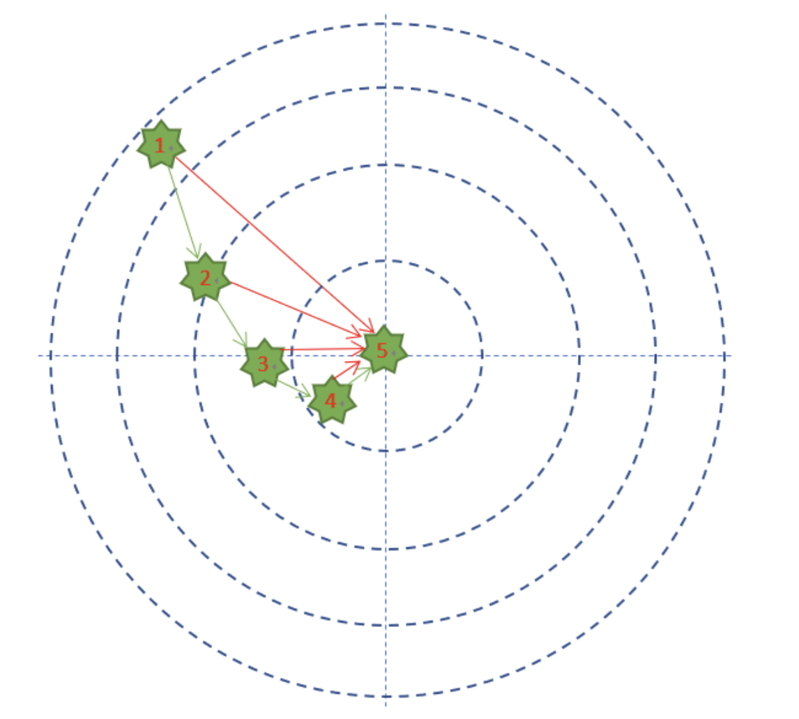

图2-2 打靶的弹着点记录

在有监督的学习中，需要衡量神经网络输出和所预期的输出之间的差异大小。这种误差函数需要能够反映出当前网络输出和实际结果之间一种量化之后的不一致程度，也就是说函数值越大，反映出模型预测的结果越不准确。

这个例子中，小明预期的目标是全部命中靶子的中心，最外圈是1分，之后越向靶子中心分数是2，3，4分，正中靶心可以得10分。

- 每次试枪弹着点和靶心之间的差距就叫做误差，可以用一个误差函数来表示，比如差距的绝对值，如图中的红色线。
- 一共试枪5次，就是迭代/训练了5次的过程 。
- 每次试枪后，把靶子拉回来看弹着点，然后调整下一次的射击角度的过程，叫做反向传播。注意，把靶子拉回来看和跑到靶子前面去看有本质的区别，后者容易有生命危险，因为还有别的射击者。一个不恰当的比喻是，在数学概念中，人跑到靶子前面去看，叫做正向微分；把靶子拉回来看，叫做反向微分。
- 每次调整角度的数值和方向，叫做梯度。比如向右侧调整1毫米，或者向左下方调整2毫米。如图中的绿色矢量线。

上图是每次单发点射，所以每次训练样本的个数是1。在实际的神经网络训练中，通常需要多个样本，做批量训练，以避免单个样本本身采样时带来的误差。在本例中，多个样本可以描述为连发射击，假设一次可以连打3发子弹，每次的离散程度都类似，如图2-3所示。
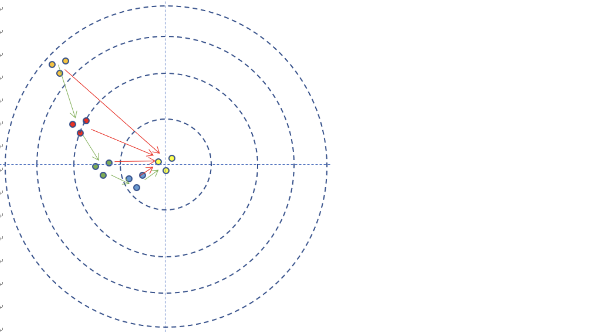
图2-3 连发弹着点记录

-  如果每次3发子弹连发，这3发子弹的弹着点和靶心之间的差距之和再除以3，叫做损失，可以用损失函数来表示。

那小明每次射击结果和目标之间的差距是多少呢？在这个例子里面，用得分来衡量的话，就是说小明得到的反馈结果从差9分，到差8分，到差2分，到差1分，到差0分，这就是用一种量化的结果来表示小明的射击结果和目标之间差距的方式。也就是误差函数的作用。因为是一次只有一个样本，所以这里采用的是误差函数的称呼。如果一次有多个样本，就要叫做损失函数了。

其实射击还不这么简单，如果是远距离狙击，还要考虑空气阻力和风速，在神经网络里，空气阻力和风速可以对应到隐藏层的概念上。

在这个例子中：

- 目的：打中靶心；
- 初始化：随便打一枪，能上靶就行，但是要记住当时的步枪的姿态；
- 前向计算：让子弹飞一会儿，击中靶子；
- 损失函数：环数，偏离角度；
- 反向传播：把靶子拉回来看；
- 梯度下降：根据本次的偏差，调整步枪的射击角度。

损失函数的描述是这样的：

1. 1环，偏左上45度；
2. 6环，偏左上15度；
3. 7环，偏左；
4. 8环，偏左下15度；
5. 10环。

这里的损失函数也有两个信息：

1. 距离；
2. 方向。

**所以，梯度，是个矢量！** 它应该即告诉我们方向，又告诉我们数值。

### 2.0.4 黑盒子的真正玩法

以上三个例子比较简单，容易理解，我们把黑盒子再请出来：黑盒子这件事真正的意义并不是猜测当输入是多少时输出会是4。它的实际意义是：我们要破解这个黑盒子！于是，我们会有如下破解流程：

1. 记录下所有输入值和输出值，如表2-1。

表2-1 样本数据表

|样本ID|输入(特征值)|输出(标签)|
|:---:|--|--|
|1|1|2.21|
|2|1.1|2.431|
|3|1.2|2.652|
|4|2|4.42|

2. 搭建一个神经网络，给出初始权重值，我们先假设这个黑盒子的逻辑是：$z=x + x^2$；
3. 输入1，根据 $z=x + x^2$ 得到输出为2，而实际的输出值是2.21，则误差值为 $2-2.21=-0.21$，小了；
4. 调整权重值，比如 $z=1.5x+x^2$，再输入1.1，得到的输出为2.86，实际输出为2.431，则误差值为 $2.86-2.431=0.429$，大了；
5. 调整权重值，比如 $z=1.2x+x^2$，再输入1.2……
6. 调整权重值，再输入2……
7. 所有样本遍历一遍，计算平均的损失函数值；
8. 依此类推，重复3，4，5，6过程，直到损失函数值小于一个指标，比如 $0.001$，我们就可以认为网络训练完毕，黑盒子“破解”了，实际是被复制了，因为神经网络并不能得到黑盒子里的真实函数体，而只是近似模拟。

从上面的过程可以看出，如果误差值是正数，我们就把权重降低一些；如果误差值为负数，则升高权重。

### 2.0.5 总结

简单总结一下反向传播与梯度下降的基本工作原理：

1. 初始化；
2. 正向计算；
3. 损失函数为我们提供了计算损失的方法；
4. 梯度下降是在损失函数基础上向着损失最小的点靠近而指引了网络权重调整的方向；
5. 反向传播把损失值反向传给神经网络的每一层，让每一层都根据损失值反向调整权重；
6. Go to 2，直到精度足够好（比如损失函数值小于 $0.001$）。

<!--Copyright © Microsoft Corporation. All rights reserved.
  适用于[License](https://github.com/Microsoft/ai-edu/blob/master/LICENSE.md)版权许可-->

## 2.1 线性反向传播

### 2.1.1 正向计算的实例

假设有一个函数：

$$z = x \cdot y \tag{1}$$

其中:

$$x = 2w + 3b \tag{2}$$

$$y = 2b + 1 \tag{3}$$

计算图如图2-4。

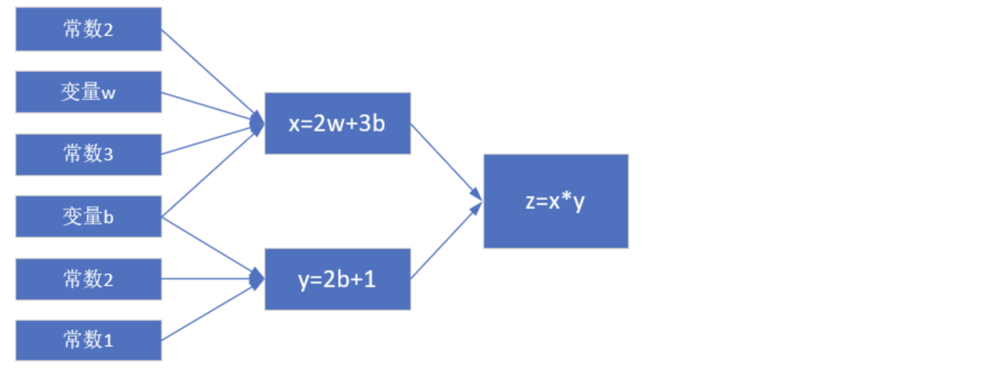

图2-4 简单线性计算的计算图

注意这里 $x,y,z$ 不是变量，只是中间计算结果；$w,b$ 才是变量。因为在后面要学习的神经网络中，要最终求解的目标是 $w$ 和 $b$ 的值，所以在这里先预热一下。

当 $w = 3, b = 4$ 时，会得到图2-5的结果。

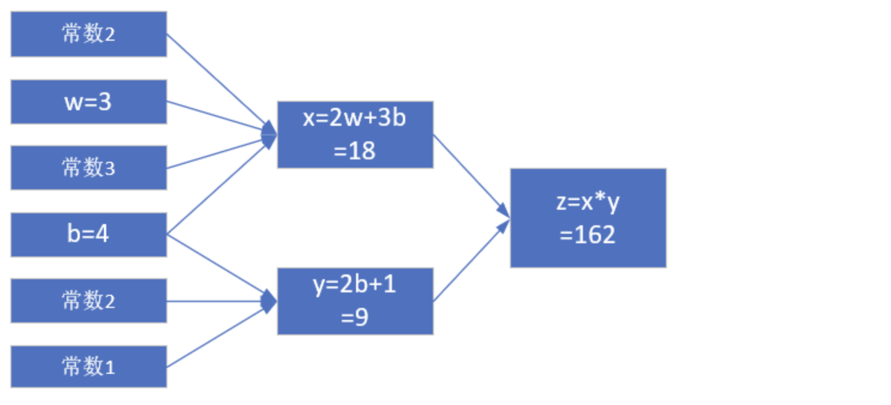

图2-5 计算结果

最终的 $z$ 值，受到了前面很多因素的影响：变量 $w$，变量 $b$，计算式 $x$，计算式 $y$。

### 2.1.2 反向传播求解 $w$

#### 求 $w$ 的偏导

目前 $z=162$，如果想让 $z$ 变小一些，比如目标是 $z=150$，$w$ 应该如何变化呢？为了简化问题，先只考虑改变 $w$ 的值，而令 $b$ 值固定为 $4$。

如果想解决这个问题，最笨的办法是可以在输入端一点一点的试，把 $w$ 变成 $3.5$ 试试，再变成 $3$ 试试......直到满意为止。现在我们将要学习一个更好的解决办法：反向传播。

从 $z$ 开始一层一层向回看，图中各节点关于变量 $w$ 的偏导计算结果如下：

因为 $z = x \cdot y$，其中 $x = 2w + 3b, y = 2b + 1$

所以：

$$
\frac{\partial{z}}{\partial{w}}=\frac{\partial{z}}{\partial{x}} \cdot \frac{\partial{x}}{\partial{w}}=y \cdot 2=18 \tag{4}
$$

其中：

$$
\frac{\partial{z}}{\partial{x}}=\frac{\partial{}}{\partial{x}}(x \cdot y)=y=9
$$

$$
\frac{\partial{x}}{\partial{w}}=\frac{\partial{}}{\partial{w}}(2w+3b)=2
$$

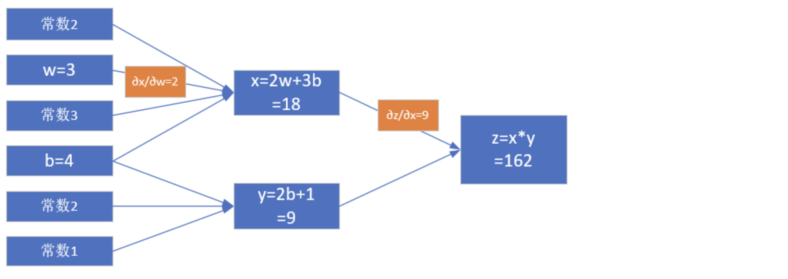


图2-6其实就是链式法则的具体表现，$z$ 的误差通过中间的 $x$ 传递到 $w$。如果不是用链式法则，而是直接用 $z$ 的表达式计算对 $w$ 的偏导数，会怎么样呢？我们来试验一下。

根据公式1、2、3，我们有：

$$
z=x \cdot y=(2w+3b)(2b+1)=4wb+2w+6b^2+3b \tag{5}
$$

对上式求 $w$ 的偏导：

$$
\frac{\partial z}{\partial w}=4b+2=4 \cdot 4 + 2=18 \tag{6}
$$

公式4和公式6的结果完全一致！所以，请大家相信链式法则的科学性。

#### 求 $w$ 的具体变化值

**公式4和公式6的含义是：当 $w$ 变化一点点时，$z$ 会产生 $w$ 的变化值18倍的变化**。记住我们的目标是让 $z=150$，目前在初始状态时是 $z=162$，所以，问题转化为：当需要 $z$ 从 $162$ 变到 $150$ 时，$w$ 需要变化多少？

既然：

$$
\Delta z = 18 \cdot \Delta w
$$

则：

$$
\Delta w = {\Delta z \over 18}=\frac{162-150}{18}= 0.6667
$$

所以：

$$
w = w - 0.6667=2.3333
$$

$$
x=2w+3b=16.6667
$$

$$
z=x \cdot y=16.6667 \times 9=150.0003
$$

我们一下子就成功地让 $z$ 值变成了 $150.0003$，与 $150$ 的目标非常地接近，这就是偏导数的威力所在。

#### 【课堂练习】推导 $z$ 对 $b$ 的偏导数，结果在下一小节中使用

### 2.1.3 反向传播求解 $b$

#### 求 $b$ 的偏导

这次我们令 $w$ 的值固定为 $3$，变化 $b$ 的值，目标还是让 $z=150$。同上一小节一样，先求 $b$ 的偏导数。

注意，在上一小节中，求 $w$ 的导数只经过了一条路：从 $z$ 到 $x$ 到 $w$。但是求 $b$ 的导数时要经过两条路，如图2-7所示：

1. 从 $z$ 到 $x$ 到 $b$；
2. 从 $z$ 到 $y$ 到 $b$。

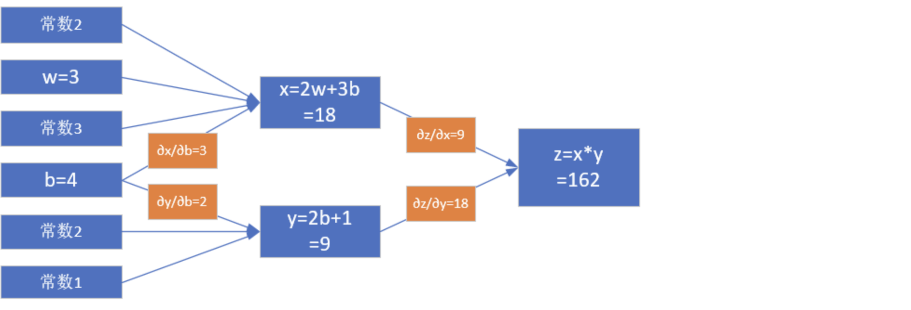


从复合导数公式来看，这两者应该是相加的关系，所以有：

$$
\frac{\partial{z}}{\partial{b}}=\frac{\partial{z}}{\partial{x}} \cdot \frac{\partial{x}}{\partial{b}}+\frac{\partial{z}}{\partial{y}}\cdot\frac{\partial{y}}{\partial{b}}=y \cdot 3+x \cdot 2=63 \tag{7}
$$

其中：

$$
\frac{\partial{z}}{\partial{x}}=\frac{\partial{}}{\partial{x}}(x \cdot y)=y=9
$$

$$
\frac{\partial{z}}{\partial{y}}=\frac{\partial{}}{\partial{y}}(x \cdot y)=x=18
$$

$$
\frac{\partial{x}}{\partial{b}}=\frac{\partial{}}{\partial{b}}(2w+3b)=3
$$

$$
\frac{\partial{y}}{\partial{b}}=\frac{\partial{}}{\partial{b}}(2b+1)=2
$$

我们不妨再验证一下链式求导的正确性。把公式5再拿过来：

$$
z=x \cdot y=(2w+3b)(2b+1)=4wb+2w+6b^2+3b \tag{5}
$$

对上式求b的偏导：

$$
\frac{\partial z}{\partial b}=4w+12b+3=12+48+3=63 \tag{8}
$$

结果和公式7的链式法则一样。

#### 求 $b$ 的具体变化值

公式7和公式8的含义是：当 $b$ 变化一点点时，$z$ 会发生 $b$ 的变化值 $63$ 倍的变化。记住我们的目标是让 $z=150$，目前在初始状态时是 $162$，所以，问题转化为：当我们需要 $z$ 从 $162$ 变到 $150$ 时，$b$ 需要变化多少？

既然：

$$
\Delta z = 63 \cdot \Delta b
$$

则：

$$
\Delta b = \frac{\Delta z}{63}=\frac{162-150}{63}=0.1905
$$

所以：
$$
b=b-0.1905=3.8095
$$

$$
x=2w+3b=17.4285
$$

$$
y=2b+1=8.619
$$

$$
z=x \cdot y=17.4285 \times 8.619=150.2162
$$

这个结果也是与 $150$ 很接近了，但是精度还不够。再迭代几次，直到误差不大于 `1e-4` 时，我们就可以结束迭代了，对于计算机来说，这些运算的执行速度很快。

#### 【课题练习】请自己尝试手动继续迭代两次，看看误差的精度可以达到多少？

这个问题用数学公式倒推求解一个二次方程，就能直接得到准确的b值吗？是的！但是我们是要说明机器学习的方法，机器并不会解二次方程，而且很多时候不是用二次方程就能解决实际问题的。而上例所示，是用机器所擅长的迭代计算的方法来不断逼近真实解，这就是机器学习的真谛！而且这种方法是普遍适用的。

### 2.1.4 同时求解 $w$ 和 $b$ 的变化值

这次我们要同时改变 $w$ 和 $b$，到达最终结果为 $z=150$ 的目的。

已知 $\Delta z=12$，我们不妨把这个误差的一半算在 $w$ 的账上，另外一半算在 $b$ 的账上：

$$
\Delta b=\frac{\Delta z / 2}{63} = \frac{12/2}{63}=0.095
$$

$$
\Delta w=\frac{\Delta z / 2}{18} = \frac{12/2}{18}=0.333
$$

- $w = w-\Delta w=3-0.333=2.667$
- $b = b - \Delta b=4-0.095=3.905$
- $x=2w+3b=2 \times 2.667+3 \times 3.905=17.049$
- $y=2b+1=2 \times 3.905+1=8.81$
- $z=x \times y=17.049 \times 8.81=150.2$

#### 【课堂练习】用Python代码实现以上双变量的反向传播计算过程

容易出现的问题：

1. 在检查 $\Delta z$ 时的值时，注意要用绝对值，因为有可能是个负数
2. 在计算 $\Delta b$ 和 $\Delta w$ 时，第一次时，它们对 $z$ 的贡献值分别是 $1/63$ 和 $1/18$，但是第二次时，由于 $b,w$ 值的变化，对 $z$ 的贡献值也会有微小变化，所以要重新计算。具体解释如下：

$$
\frac{\partial{z}}{\partial{b}}=\frac{\partial{z}}{\partial{x}} \cdot \frac{\partial{x}}{\partial{b}}+\frac{\partial{z}}{\partial{y}}\cdot\frac{\partial{y}}{\partial{b}}=y \cdot 3+x \cdot 2=3y+2x
$$

$$
\frac{\partial{z}}{\partial{w}}=\frac{\partial{z}}{\partial{x}} \cdot \frac{\partial{x}}{\partial{w}}+\frac{\partial{z}}{\partial{y}}\cdot\frac{\partial{y}}{\partial{w}}=y \cdot 2+x \cdot 0 = 2y
$$
所以，在每次迭代中，要重新计算下面两个值：
$$
\Delta b=\frac{\Delta z}{3y+2x}
$$

$$
\Delta w=\frac{\Delta z}{2y}
$$

以下是程序的运行结果。

没有在迭代中重新计算 $\Delta b$ 的贡献值：
```
single variable: b -----
w=3.000000,b=4.000000,z=162.000000,delta_z=12.000000
delta_b=0.190476
w=3.000000,b=3.809524,z=150.217687,delta_z=0.217687
delta_b=0.003455
w=3.000000,b=3.806068,z=150.007970,delta_z=0.007970
delta_b=0.000127
w=3.000000,b=3.805942,z=150.000294,delta_z=0.000294
delta_b=0.000005
w=3.000000,b=3.805937,z=150.000011,delta_z=0.000011
delta_b=0.000000
w=3.000000,b=3.805937,z=150.000000,delta_z=0.000000
done!
final b=3.805937
```
在每次迭代中都重新计算 $\Delta b$ 的贡献值：
```
single variable new: b -----
w=3.000000,b=4.000000,z=162.000000,delta_z=12.000000
factor_b=63.000000, delta_b=0.190476
w=3.000000,b=3.809524,z=150.217687,delta_z=0.217687
factor_b=60.714286, delta_b=0.003585
w=3.000000,b=3.805938,z=150.000077,delta_z=0.000077
factor_b=60.671261, delta_b=0.000001
w=3.000000,b=3.805937,z=150.000000,delta_z=0.000000
done!
final b=3.805937
```
从以上两个结果对比中，可以看到三点：

1. `factor_b`第一次是`63`，以后每次都会略微降低一些
2. 第二个函数迭代了3次就结束了，而第一个函数迭代了5次，效率不一样
3. 最后得到的结果是一样的，因为这个问题只有一个解

对于双变量的迭代，有同样的问题：

没有在迭代中重新计算 $\Delta b,\Delta w$ 的贡献值(`factor_b`和`factor_w`每次都保持`63`和`18`)：
```
double variable: w, b -----
w=3.000000,b=4.000000,z=162.000000,delta_z=12.000000
delta_b=0.095238, delta_w=0.333333
w=2.666667,b=3.904762,z=150.181406,delta_z=0.181406
delta_b=0.001440, delta_w=0.005039
w=2.661628,b=3.903322,z=150.005526,delta_z=0.005526
delta_b=0.000044, delta_w=0.000154
w=2.661474,b=3.903278,z=150.000170,delta_z=0.000170
delta_b=0.000001, delta_w=0.000005
w=2.661469,b=3.903277,z=150.000005,delta_z=0.000005
done!
final b=3.903277
final w=2.661469
```

在每次迭代中都重新计算 $\Delta b,\Delta w$ 的贡献值(`factor_b`和`factor_w`每次都变化)：
```
double variable new: w, b -----
w=3.000000,b=4.000000,z=162.000000,delta_z=12.000000
factor_b=63.000000, factor_w=18.000000, delta_b=0.095238, delta_w=0.333333
w=2.666667,b=3.904762,z=150.181406,delta_z=0.181406
factor_b=60.523810, factor_w=17.619048, delta_b=0.001499, delta_w=0.005148
w=2.661519,b=3.903263,z=150.000044,delta_z=0.000044
factor_b=60.485234, factor_w=17.613053, delta_b=0.000000, delta_w=0.000001
w=2.661517,b=3.903263,z=150.000000,delta_z=0.000000
done!
final b=3.903263
final w=2.661517
```
这个与第一个单变量迭代不同的地方是：这个问题可以有多个解，所以两种方式都可以得到各自的正确解，但是第二种方式效率高，而且满足梯度下降的概念。

### 参考资料

http://colah.github.io/posts/2015-08-Backprop/

<!--Copyright © Microsoft Corporation. All rights reserved.
  适用于[License](https://github.com/Microsoft/ai-edu/blob/master/LICENSE.md)版权许可-->

## 2.2 非线性反向传播

### 2.2.1 提出问题

在上面的线性例子中，我们可以发现，误差一次性地传递给了初始值 $w$ 和 $b$，即，只经过一步，直接修改 $w$ 和 $b$ 的值，就能做到误差校正。因为从它的计算图看，无论中间计算过程有多么复杂，它都是线性的，所以可以一次传到底。缺点是这种线性的组合最多只能解决线性问题，不能解决更复杂的问题。这个我们在神经网络基本原理中已经阐述过了，需要有激活函数连接两个线性单元。

下面我们看一个非线性的例子，如图2-8所示。

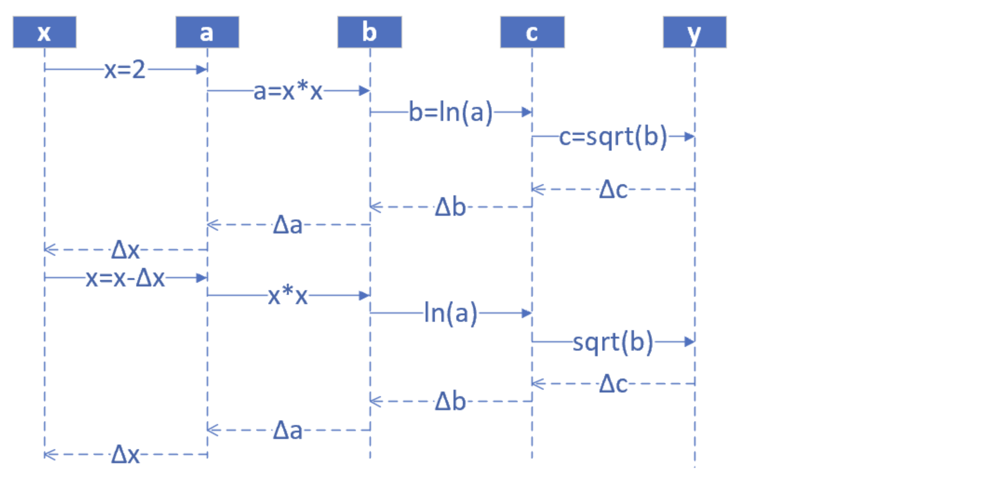

其中$1<x<=10,0<y<2.15$。假设有5个人分别代表 $x,a,b,c,y$：

#### 正向过程

1. 第1个人，输入层，随机输入第一个 $x$ 值，$x$ 的取值范围 $(1,10]$，假设第一个数是 $2$；
2. 第2个人，第一层网络计算，接收第1个人传入 $x$ 的值，计算：$a=x^2$；
3. 第3个人，第二层网络计算，接收第2个人传入 $a$ 的值，计算：$b=\ln (a)$；
4. 第4个人，第三层网络计算，接收第3个人传入 $b$ 的值，计算：$c=\sqrt{b}$；
5. 第5个人，输出层，接收第4个人传入 $c$ 的值

#### 反向过程

6. 第5个人，计算 $y$ 与 $c$ 的差值：$\Delta c = c - y$，传回给第4个人
7. 第4个人，接收第5个人传回$\Delta c$，计算 $\Delta b = \Delta c \cdot 2\sqrt{b}$
8. 第3个人，接收第4个人传回$\Delta b$，计算 $\Delta a = \Delta b \cdot a$
9. 第2个人，接收第3个人传回$\Delta a$，计算 $\Delta x = \frac{\Delta}{2x}$
10. 第1个人，接收第2个人传回$\Delta x$，更新 $x \leftarrow x - \Delta x$，回到第1步

提出问题：假设我们想最后得到 $c=2.13$ 的值，$x$ 应该是多少？（误差小于 $0.001$ 即可）

### 2.2.2 数学解析解

$$
c=\sqrt{b}=\sqrt{\ln(a)}=\sqrt{\ln(x^2)}=2.13
$$

$$
x = 9.6653
$$

### 2.2.3 梯度迭代解

$$
\frac{da}{dx}=\frac{d(x^2)}{dx}=2x=\frac{\Delta a}{\Delta x} \tag{1}
$$

$$
\frac{db}{da} =\frac{d(\ln{a})}{da} =\frac{1}{a} = \frac{\Delta b}{\Delta a} \tag{2}
$$

$$
\frac{dc}{db}=\frac{d(\sqrt{b})}{db}=\frac{1}{2\sqrt{b}}=\frac{\Delta c}{\Delta b} \tag{3}
$$

因此得到如下一组公式，可以把最后一层 $\Delta c$ 的误差一直反向传播给最前面的 $\Delta x$，从而更新 $x$ 值：

$$
\Delta c = c - y \tag{4}
$$

根据式3

$$
\Delta b = \Delta c \cdot 2\sqrt{b}
$$

根据式2

$$
\Delta a = \Delta b \cdot a
$$

根据式1

$$
\Delta x = \Delta a / 2x
$$

我们给定初始值 $x=2$，$\Delta x=0$，依次计算结果如表2-2。

表2-2 正向与反向的迭代计算

|方向|公式|迭代1|迭代2|迭代3|迭代4|迭代5|
|---|---|---|---|---|---|---|
|正向|$x=x-\Delta x$|2|4.243|7.344|9.295|9.665|
|正向|$a=x^2$|4|18.005|53.934|86.404|93.233|
|正向|$b=\ln(a)$|1.386|2.891|3.988|4.459|4.535|
|正向|$c=\sqrt{b}$|1.177|1.700|1.997|2.112|2.129|
||标签值y|2.13|2.13|2.13|2.13|2.13|
|反向|$\Delta c = c - y$|-0.953|-0.430|-0.133|-0.018||
|反向|$\Delta b = \Delta c \cdot 2\sqrt{b}$|-2.243|-1.462|-0.531|-0.078||
|反向|$\Delta a = \Delta b \cdot a$|-8.973|-26.317|-28.662|-6.698||
|反向|$\Delta x = \Delta a / 2x$|-2.243|-3.101|-1.951|-0.360||

表2-2，先看“迭代-1”列，从上到下是一个完整的正向+反向的过程，最后一行是 $-2.243$，回到“迭代-2”列的第一行，$2-(-2.243)=4.243$，然后继续向下。到第5轮时，正向计算得到的 $c=2.129$，非常接近 $2.13$ 了，迭代结束。

运行示例代码可以得到如下结果：

```
how to play: 1) input x, 2) calculate c, 3) input target number but not faraway from c
input x as initial number(1.2,10), you can try 1.3:
2
c=1.177410
input y as target number(0.5,2), you can try 1.8:
2.13
forward...
x=2.000000,a=4.000000,b=1.386294,c=1.177410
backward...
delta_c=-0.952590, delta_b=-2.243178, delta_a=-8.972712, delta_x=-2.243178
......
forward...
x=9.655706,a=93.232666,b=4.535098,c=2.129577
backward...
done!
```

为节省篇幅只列出了第一步和最后一步（第5步）的结果，第一步时`c=1.177410`，最后一步时`c=2.129577`，停止迭代。

<!--Copyright © Microsoft Corporation. All rights reserved.
  适用于[License](https://github.com/Microsoft/ai-edu/blob/master/LICENSE.md)版权许可-->

## 2.3 梯度下降

### 2.3.1 从自然现象中理解梯度下降

在大多数文章中，都以“一个人被困在山上，需要迅速下到谷底”来举例，这个人会“寻找当前所处位置最陡峭的地方向下走”。这个例子中忽略了安全因素，这个人不可能沿着最陡峭的方向走，要考虑坡度。

在自然界中，梯度下降的最好例子，就是泉水下山的过程：

1. 水受重力影响，会在当前位置，沿着最陡峭的方向流动，有时会形成瀑布（梯度下降）；
2. 水流下山的路径不是唯一的，在同一个地点，有可能有多个位置具有同样的陡峭程度，而造成了分流（可以得到多个解）；
3. 遇到坑洼地区，有可能形成湖泊，而终止下山过程（不能得到全局最优解，而是局部最优解）。

### 2.3.2 梯度下降的数学理解

梯度下降的数学公式：

$$\theta_{n+1} = \theta_{n} - \eta \cdot \nabla J(\theta) \tag{1}$$

其中：

- $\theta_{n+1}$：下一个值；
- $\theta_n$：当前值；
- $-$：减号，梯度的反向；
- $\eta$：学习率或步长，控制每一步走的距离，不要太快以免错过了最佳景点，不要太慢以免时间太长；
- $\nabla$：梯度，函数当前位置的最快上升点；
- $J(\theta)$：函数。

#### 梯度下降的三要素

1. 当前点；
2. 方向；
3. 步长。

#### 为什么说是“梯度下降”？

“梯度下降”包含了两层含义：

1. 梯度：函数当前位置的最快上升点；
2. 下降：与导数相反的方向，用数学语言描述就是那个减号。

亦即与上升相反的方向运动，就是下降。

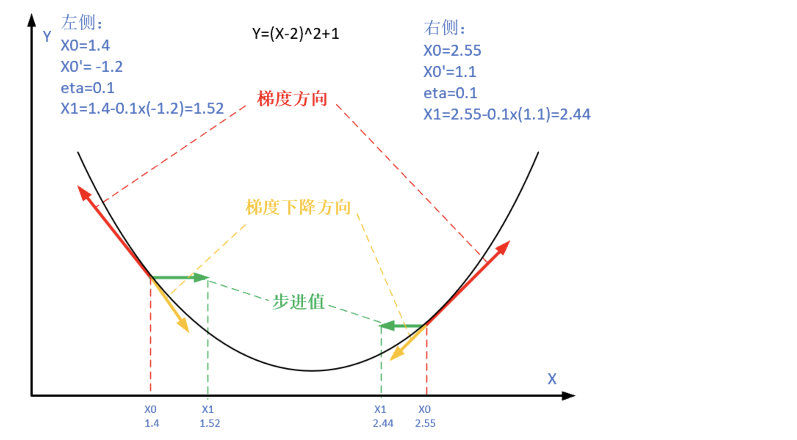


图2-9解释了在函数极值点的两侧做梯度下降的计算过程，梯度下降的目的就是使得x值向极值点逼近。

### 2.3.3 单变量函数的梯度下降

假设一个单变量函数：

$$J(x) = x ^2$$

我们的目的是找到该函数的最小值，于是计算其微分：

$$J'(x) = 2x$$

假设初始位置为：

$$x_0=1.2$$

假设学习率：

$$\eta = 0.3$$

根据公式(1)，迭代公式：

$$x_{n+1} = x_{n} - \eta \cdot \nabla J(x)= x_{n} - \eta \cdot 2x$$

假设终止条件为 $J(x)<0.01$，迭代过程是：
```
x=0.480000, y=0.230400
x=0.192000, y=0.036864
x=0.076800, y=0.005898
x=0.030720, y=0.000944
```

上面的过程如图2-10所示。

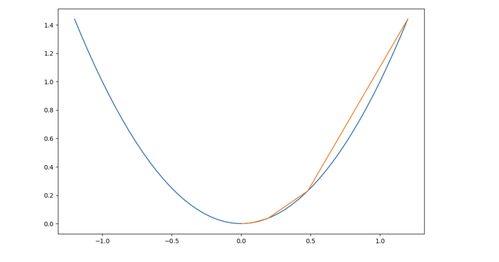

### 2.3.4 双变量的梯度下降

假设一个双变量函数：

$$J(x,y) = x^2 + \sin^2(y)$$

我们的目的是找到该函数的最小值，于是计算其微分：

$${\partial{J(x,y)} \over \partial{x}} = 2x$$
$${\partial{J(x,y)} \over \partial{y}} = 2 \sin y \cos y$$

假设初始位置为：

$$(x_0,y_0)=(3,1)$$

假设学习率：

$$\eta = 0.1$$

根据公式(1)，迭代过程是的计算公式：

$$
(x_{n+1},y_{n+1}) = (x_n,y_n) - \eta \cdot \nabla J(x,y)
$$

$$
 = (x_n,y_n) - \eta \cdot (2x,2 \cdot \sin y \cdot \cos y) \tag{1}
$$

根据公式(1)，假设终止条件为 $J(x,y)<0.01$，迭代过程如表2-3所示。

表2-3 双变量梯度下降的迭代过程

|迭代次数|x|y|J(x,y)|
|---|---|---|---|
|1|3|1|9.708073|
|2|2.4|0.909070|6.382415|
|...|...|...|...|
|15|0.105553|0.063481|0.015166|
|16|0.084442|0.050819|0.009711|

迭代16次后，$J(x,y)$ 的值为 $0.009711$，满足小于 $0.01$ 的条件，停止迭代。

上面的过程如表2-4所示，由于是双变量，所以需要用三维图来解释。请注意看两张图中间那条隐隐的黑色线，表示梯度下降的过程，从红色的高地一直沿着坡度向下走，直到蓝色的洼地。

表2-4 在三维空间内的梯度下降过程

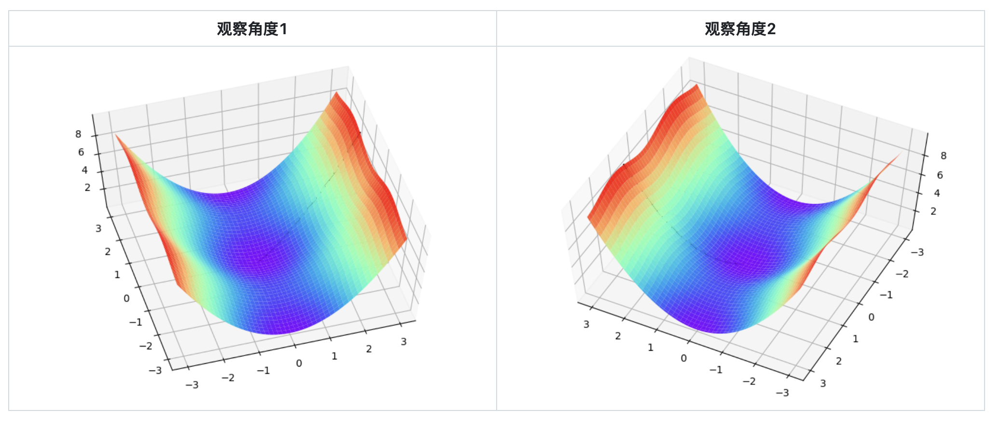

### 2.3.5 学习率η的选择

在公式表达时，学习率被表示为$\eta$。在代码里，我们把学习率定义为`learning_rate`，或者`eta`。针对上面的例子，试验不同的学习率对迭代情况的影响，如表2-5所示。

表2-5 不同学习率对迭代情况的影响

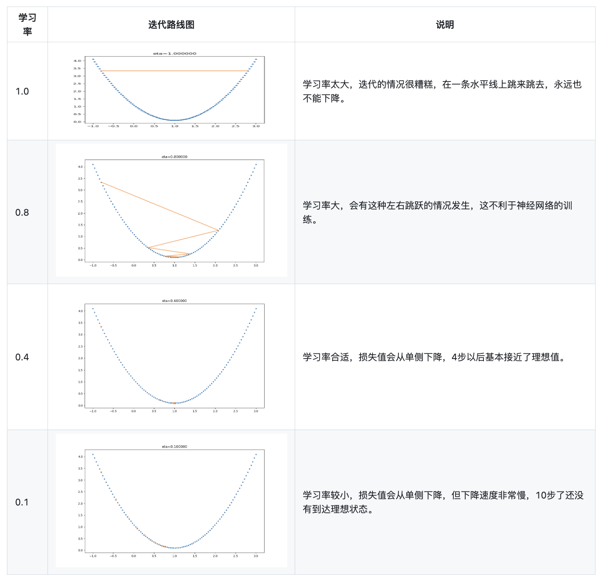
