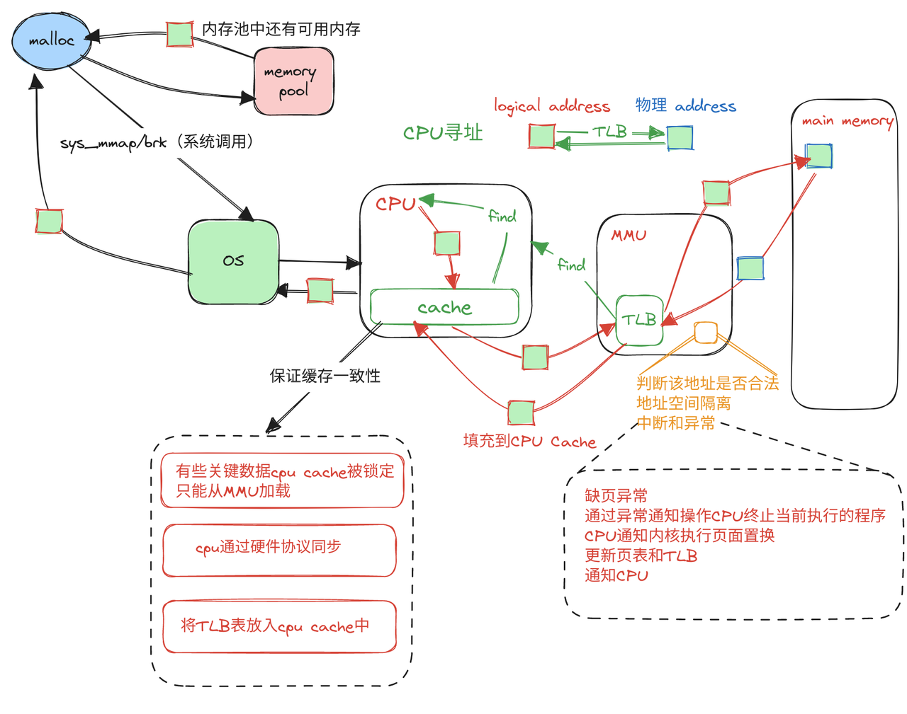

1. malloc函数用于在堆上动态分配内存,它会向操作系统请求一块未使用的内存,然后返回这块内存的地址。
2. 操作系统维护着可用物理内存的信息,知道哪些内存地址 当前未被使用。当收到malloc的请求时,它会从可用物理内存中选择一块未使用的内存,将其标记为已分配,并返回给应用程序。
3. 在32位系统中,malloc返回的地址是虚拟地址,需要经过MMU地址转换找到对应的物理地址。64位系统中,malloc的地址空间通常就直接对应物理地址空间。

    a. 在32位系统中,CPU可以寻址的虚拟地址空间比较小,一般为4GB左右。而物理内存可能会超过4GB。为了让进程可以访问超过4GB的物理内存,操作系统会使用虚拟内存技术,将虚拟地址映射到物理地址上。malloc返回的虚拟地址需要通过MMU(内存管理单元)翻译成物理地址,才能真正访问到内存。

    b. 而在64位系统中,虚拟地址空间巨大(16EB),远远大于当前的物理内存大小。所以操作系统可以选择把虚拟地址直接映射到物理地址上,这种称为平坦内存模型。在这种情况下,malloc返回的地址就是物理地址,不需要再做地址转换。应用程序把malloc返回的地址直接作为物理地址使用即可。

### 平坦内存模型(Flat Memory Model)
1. 在平坦内存模型下,进程的虚拟地址与物理地址是一一对应的。操作系统不会进行地址转换,进程使用的虚拟地址就是对应物理内存的物理地址。
2. 由于虚拟地址直接对应物理地址,不需要进行地址转换,所以省去了地址转换所带来的性能开销。
3. 程序直接使用虚拟地址访问物理内存,不需要区分逻辑地址和物理地址,编程模型简单。
4. 64位系统拥有极其大的虚拟地址空间(16EB),使得直接映射成为可能。虚拟地址空间大于目前的物理内存容量。
5. 由于省去了内存虚拟化,无法实现弹性调配物理页框,可能会出现较严重的内存碎片。
6. 很多64位系统不会选择完全平坦的模型,而是在一定范围内做映射,同时配合页表实现虚拟内存。综合利用了平坦模型与传统虚拟内存的优点。

### MMU(Memory Management Unit)
有些系统MMU集成在CPU中，有些系统是单独芯片实现，通过地址总线和CPU连接。（地址总线、数据总线、控制总线-->传递信号）
1. 地址转换 MMU负责将CPU产生的虚拟地址转换成物理地址。转换过程需要参考TLB,根据虚拟地址的高位找到对应的页表项,翻译出物理页号,与虚拟地址的低位组合成物理地址。
2. 页面置换 当访问的页面不在物理内存时,MMU会触发页面置换（*页面置换算法通常不是由MMU(内存管理单元)直接实现的,而是由操作系统内核的虚拟内存管理子系统来实现。页表和地址转换是由MMU硬件来完成,但确定哪些页面需要换出、加载,以及页面替换策略则由操作系统内核的虚拟内存管理机制决定。*）,将内存中的某一页换出,将需要访问的页换入物理内存。
3. 存取权限检查 MMU会检查每次地址转换后的物理内存访问权限,例如是否可读、可写、可执行,避免非法访问。
4. 缓存一致性 MMU会与CPU缓存协同工作,实现缓存一致性,保证内存访问正确。
5. 地址空间隔离 MMU为每个进程维护一个独立的地址空间,实现进程间的内存隔离。
6. 中断与异常 若地址非法或者缺页等异常,MMU会触发中断信号,通知CPU进行异常处理。
7. 硬件缓存 部分MMU集成了TLB等缓存结构,加速地址转换的速度。

### 为什么MMU可以解决内存碎片的问题？
1. MMU实现了虚拟地址到物理地址的映射,程序只需要一个连续的虚拟地址空间。操作系统可以将不连续的物理内存片段映射到该连续虚拟地址空间上。通过这种映射,即使物理内存分布不连续,程序视图也是一个连续空间,可以任意使用而不会出现碎片。操作系统会负责这些不连续物理页的映射和调度,对上层应用透明。
2. 当物理内存使用产生外部碎片时,虚拟存储技术可以进行碎片回收,将闲置的小块内存映射给其他程序使用。
3. 同时,虚拟内存可以将暂时不用的内存页换出到磁盘,腾出物理内存空间供其他程序使用,减少内存碎片。
4. 进而避免了严重的外部碎片,提高了物理内存的利用效率。

### 缓存一致性

一个计算系统通常包含多级缓存,任何两个存储层次之间都可能存在数据一致性的问题。

1. CPU缓存与硬盘缓存
2. 多核CPU之间
3. 各级系统缓存之间
    
    MMU与CPU缓存的一致性是通过以下几种方式实现的:
    a. 缓存一致性协议 CPU和MMU之间通过一定的硬件协议(如Intel的MESI协议)来维持缓存和主存的数据一致性。当缓存数据被修改时,会根据协议规则通知MMU将主存更新。

    b. 缓存锁定 针对一些关键数据,CPU缓存会被锁定,每次访问必须从MMU加载,而不是缓存中的拷贝。保证了这部分数据的一致性。

    c. 地址翻译表同步 地址翻译表如TLB也存放在CPU高速缓存中,MMU会同步更新CPU中的翻译表缓存,保证访问获取的是最新翻译关系。

    d. 缓存行注释 MMU可以向缓存中的缓存行添加标记信息,如是否可缓存、是否已修改等,方便缓存控制。
4. 分布式缓存系统
5. 存储设备之间
6. 客户端缓存

### malloc调用时什么时候用sys_mmap, 什么时候用brk？
在调用malloc时会产生系统调用，切换到内核态，然后执行系统调用
在malloc调用时,是否使用sys_mmap或brk分配内存,主要取决于请求的内存大小:
1. 对于较小的内存请求,malloc通常会使用brk系统调用去扩展程序的堆区。
2. 当请求较大内存页(一般超过128KB)时,malloc会使用mmap系统调用去映射匿名内存页。

mmap相比brk的优势在于:

- 可以指定地址对齐,提高效率
- 可以随时释放不连续的大内存块
- 避免堆区碎片