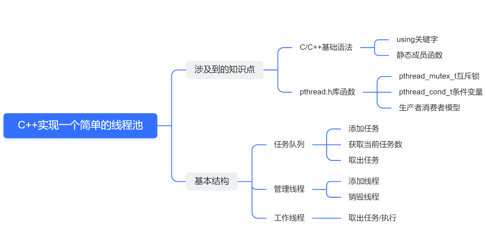

---
title: C++实现一个简单的线程池
date: 2022-09-15 07:33:02
categories: CPP
tags: [CPP]
---



## 代码
### 任务结构体
```cpp
//任务结构体
using  callback = void(*)(void*);
struct Task
{
    Task()=default;
    Task(callback function,void* arg):
    function(function),arg(arg){}
    //函数指针
    callback function;
    void* arg;
};
```
### 任务队列
```cpp
class TaskQueue{
public:
    TaskQueue();
    ~TaskQueue();
    //添加任务
    void addTask(Task& task);
    void addTask(callback f,void* arg);
    //取出任务
    Task takeTask();
    //获取当前任务的个数，内联函数不会进行压栈，通过代码替换实现
    inline int taskNumber(){
        return m_taskQ.size();
    }

private:
    pthread_mutex_t m_mutex;//添加互斥锁
    queue<Task> m_taskQ;
};
```
### 线程池
```cpp
//线程池
class ThreadPool
{
public:
    ThreadPool(int min,int max);
    ~ThreadPool();
    //给线程池添加任务
    void addTask(Task task);
    //获取线程池中工作的线程个数
    int getBusyNum();
    //获取线程池中活着的线程个数
    int getLiveNum();
private:
    //工作的线程任务函数
    //静态成员函数定义时就分配地址，普通成员函数只有实例化才有地址
    static void* worker(void* arg);
    //管理者线程任务函数
    static void* manager(void* arg);
    //单个线程退出
    void threadExit();
private:
    TaskQueue* taskQ;//任务队列
    pthread_t managerID;//管理者线程ID
    pthread_t* threadID;//工作线程ID
    int minNum;//最小线程数量
    int maxNum;//最大线程数量
    int busyNum;//忙的线程个数
    int liveNum;//存活的线程个数
    int exitNum;//要销毁的线程个数
    pthread_mutex_t mutexPool;//锁定整个线程池
    pthread_cond_t notEmpty;//任务队列是否为空
    static const int NUMBER = 2;//每次创建线程的数量
    bool shutdown;//是不是要销毁线程池，销毁为1，不销毁为0
};
```
### 实现
```cpp
#include "threadpool.h"

TaskQueue::TaskQueue(){
    //初始化互斥锁
    pthread_mutex_init(&m_mutex,NULL);
}
TaskQueue::~TaskQueue(){
    //销毁互斥锁
    pthread_mutex_destroy(&m_mutex);
}
void TaskQueue::addTask(Task& task){
    //访问任务队列之前先加锁
    pthread_mutex_lock(&m_mutex);
    m_taskQ.push(task);
    //访问结束解锁
    pthread_mutex_unlock(&m_mutex);
}
void TaskQueue::addTask(callback f,void* arg){
    //访问任务队列之前先加锁
    pthread_mutex_lock(&m_mutex);
    m_taskQ.push(Task(f,arg));
    //访问结束解锁
    pthread_mutex_unlock(&m_mutex);
}
Task TaskQueue::takeTask(){
    Task t;
    pthread_mutex_lock(&m_mutex);
    if(!m_taskQ.empty()){
        t = m_taskQ.front();
        m_taskQ.pop();
    }
    pthread_mutex_unlock(&m_mutex);
    return t;
}

ThreadPool::ThreadPool(int min,int max){
        //实例化任务队列
        taskQ = new TaskQueue;
    do{
        if(taskQ == nullptr){
            cout<<"creat tackqueue error..."<<endl;
            break;
        }
        threadID = new pthread_t[max];
        if(threadID == NULL){
            cout<<"creat threadpool error..."<<endl;
            break;
        }
        memset(threadID,0,sizeof(pthread_t) * max);
        minNum = min;
        maxNum = max;
        busyNum = 0;
        liveNum = min;
        exitNum = 0;
        //初始化互斥锁和条件变量
        if(pthread_mutex_init(&mutexPool,NULL) != 0 ||
           pthread_cond_init(&notEmpty,NULL) != 0){
            cout<<"mutex or condition init fail..."<<endl;
            break;
        }
        shutdown = false;

        //创建线程，参数：线程，线程的属性，线程要执行的函数，该函数传入的参数
        //成功返回0，失败返回非0值
        pthread_create(&managerID,NULL,manager,this);
        for(int i = 0;i < minNum;++i){
            pthread_create(&threadID[i],NULL,worker,this);
        }
    }while(0);
    
}
ThreadPool::~ThreadPool(){
    //释放资源
    shutdown = true;
    //回收管理者线程
    pthread_join(managerID,NULL);
    //唤醒阻塞的工作线程
    for(int i = 0;i < liveNum;++i){
        pthread_cond_signal(&notEmpty);
    }
    //销毁线程和进程
    if(threadID) delete[]threadID;
    if(taskQ) delete taskQ;
    //销毁互斥锁和条件变量
    pthread_mutex_destroy(&mutexPool);
    pthread_cond_destroy(&notEmpty);
}
//给线程池添加任务
void ThreadPool::addTask(Task task){
    //这里访问任务队列不需要再加锁，因为再任务队列的添加操作里已经加了锁
    //pthread_mutex_lock(&mutexPool);
    if(shutdown){
        pthread_mutex_unlock(&mutexPool);
        return;
    }
    //添加任务
    taskQ->addTask(task);
    //有任务了唤醒工作线程
    pthread_cond_signal(&notEmpty);
}
//获取线程池中工作的线程个数
int ThreadPool::getBusyNum(){
    pthread_mutex_lock(&mutexPool);
    //这里不能直接返回，否则会发生死锁
    int busyNum = this->busyNum;
    pthread_mutex_unlock(&mutexPool);
    return busyNum;
}

//获取线程池中活着的线程个数
int ThreadPool::getLiveNum(){
    pthread_mutex_lock(&mutexPool);
    int liveNum = this->liveNum;
    pthread_mutex_unlock(&mutexPool);
    return liveNum;
}

//工作的线程任务函数
//这里需要把pool传进来是因为这个函数是静态成员函数，无法访问非静态成员变量
void* ThreadPool::worker(void* arg){
    ThreadPool* pool = static_cast<ThreadPool*> (arg);
    while(true){
        //因为每一个线程都需要对这个线程池进行操作，所以这里要对线程池加锁
        pthread_mutex_lock(&pool->mutexPool);
        //当前任务队列是否为空，且线程池没有被关闭
        while(pool->taskQ->taskNumber() == 0 && !pool->shutdown){
            //阻塞工作线程
            pthread_cond_wait(&pool->notEmpty,&pool->mutexPool);
            //判断是否要销毁线程(该线程被唤醒之后)
            if(pool->exitNum > 0){
                pool->exitNum--;
                if(pool->liveNum > pool->minNum){
                    pool->liveNum--;
                    pthread_mutex_unlock(&pool->mutexPool);
                    pool->threadExit();
                }
            }
        }
        //判断线程池是否关闭了
        if(pool->shutdown){
            pthread_mutex_unlock(&pool->mutexPool);
            pool->threadExit();
        }

        //从任务队列中取出一个任务
        Task task = pool->taskQ->takeTask();
        //忙的线程数加一
        pool->busyNum++;
        //用完解锁
        pthread_mutex_unlock(&pool->mutexPool);
        cout<<"thread"<<pthread_self()<<"start working...\n";
        //执行任务
        task.function(task.arg);
        //delete task.arg;
        arg = nullptr;

        //任务执行完毕
        pthread_mutex_lock(&pool->mutexPool);
        pool->busyNum--;
        pthread_mutex_unlock(&pool->mutexPool);
    }
}
//管理者线程任务函数
void* ThreadPool::manager(void* arg){
    ThreadPool* pool = static_cast<ThreadPool*>(arg);
    while(!pool->shutdown){
        //每隔三秒检测一次
        sleep(3);
        //取出线程池中的任务数量和当前线程的数量
        pthread_mutex_lock(&pool->mutexPool);
        //任务数量
        int queueSize = pool->taskQ->taskNumber();
        int liveNum = pool->liveNum;
        //取出忙的线程数量
        int busyNum = pool->busyNum;
        pthread_mutex_unlock(&pool->mutexPool);
        //添加线程
        //任务的个数大于存活的线程数&&存活的线程数小于最大线程数
        if(queueSize > liveNum && liveNum < pool->maxNum){
            pthread_mutex_lock(&pool->mutexPool);
            int counter = 0;
            for(int i = 0;i < pool->maxNum &&
            i < pool->NUMBER && pool->liveNum < pool->maxNum;++i){
                if(pool->threadID[i] == 0){
                    pthread_create(&pool->threadID[i],NULL,worker,pool);
                    counter++;
                    pool->liveNum++;
                }
            }
            pthread_mutex_unlock(&pool->mutexPool);
        }
        //销毁线程
        //忙的线程*2小于存活的线程数&&存活的线程数大于最小线程数
        if(busyNum * 2 < liveNum && liveNum > pool->minNum){
            pthread_mutex_lock(&pool->mutexPool);
            pool->exitNum = pool->NUMBER;
            pthread_mutex_unlock(&pool->mutexPool);
            for(int i = 0;i < pool->NUMBER;++i){
                //唤醒线程，然后销毁,因为工作的线程没被阻塞，这里唤醒被阻塞的线程
                pthread_cond_signal(&pool->notEmpty);
            }
        }       
    }
}
//单个线程退出
void ThreadPool::threadExit(){
    //获取当前线程的ID
    ptrdiff_t tid = pthread_self();
    for(int i = 0;i < maxNum;++i){
        if(threadID[i] == tid){
            threadID[i] = 0;
            cout<<"threadExit() called,"<<tid<<"exiting...\n";
            break;
        }
    }
    pthread_exit(NULL);
}
```
### 测试文件
```cpp
#include"threadpool.h"

void taskFunc(void* arg){
    int num = *static_cast<int*>(arg);
    cout<<"thread"<<to_string(pthread_self())<<"working,number="<<num<<endl;
    sleep(1);
}

int main(){
    ThreadPool pool(3,10);
    for(int i = 0;i < 100;++i){
        int* num = new int(i + 100);
        pool.addTask(Task(taskFunc,num));
    }
    sleep(10);
    return 0;
}
```
