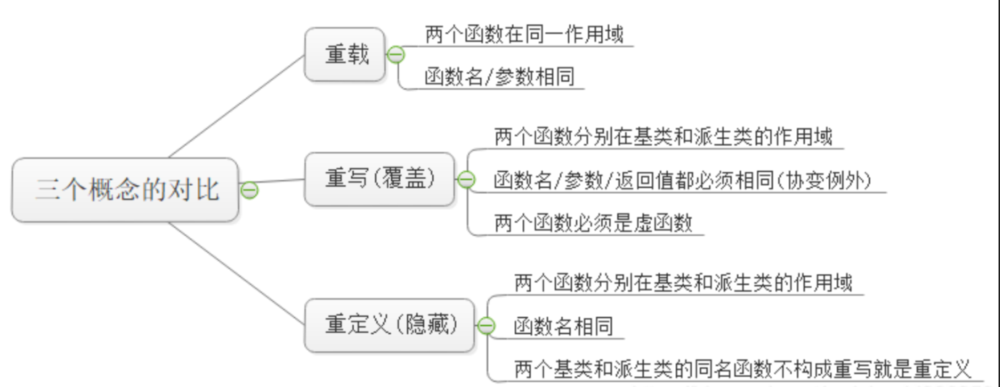
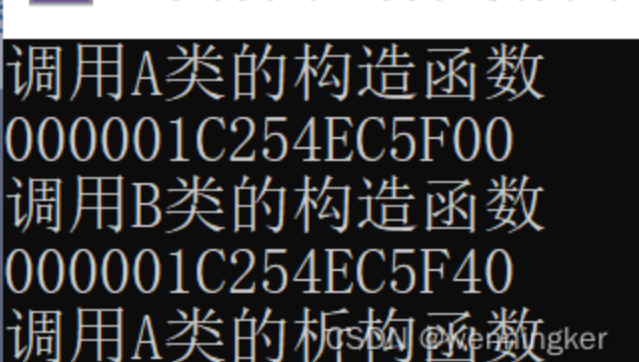
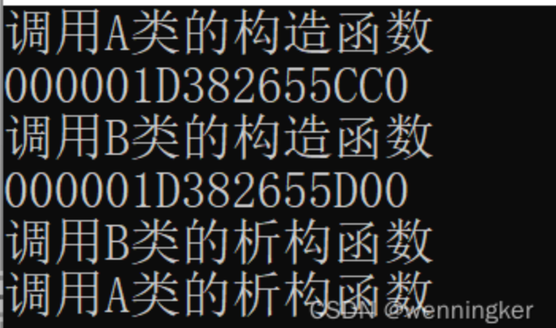

---
title: C++虚函数和虚函数表
date: 2022-08-26 07:33:02
categories: CPP
tags: [CPP]
---

### 多态
**静态多态**：静态多态是指在编译时实现的多态，比如函数重载，看似是调用同一个函数其实是在调用不同的。

*函数重载为什么不能通过返回值实现？*

因为函数重载的解析是在编译阶段进行的。编译器根据函数名和参数列表来确定要调用哪一个函数。

**动态多态**：动态多态是在运行中实现的，当一个父类对象的引用或者指针接收不同的对象(父类对象or子类对象)后，调用相同的函数会调用不同的函数。
#### 重载、重写、重定义

### 简介
**虚函数和纯虚函数的作用**
- 定义一个函数为虚函数，不代表函数为不被实现的函数。`virtual void foo() ;`
- 定义他为虚函数是为了允许用基类的指针来调用子类的这个函数。
- 定义一个函数为纯虚函数，才代表函数没有被实现。`virtual void foo() = 0;`
- 定义纯虚函数是为了实现一个接口，起到一个规范的作用，规范继承这个类的程序员必须实现这个函数。
### 代码示例
```cpp
class Base  
{  
public:  
    virtual void foo()  
    {  
        cout<<"A::foo() is called"<<endl;  
    }  
};  
class Son:public Base  
{  
public:  
    void foo()  
    {  
        cout<<"B::foo() is called"<<endl;  
    }  
};  
int main(void)  
{  
    Base *base = new Son();  
    base->foo();   // 在这里，base虽然是指向Base的指针，但是被调用的函数(foo)却是Son的!  
    return 0;  
}
```

### 对象的内存布局

#### 空类的大小为1

```cpp
class Base
{
public:
};
int main(void)
{
    cout << sizeof(Base) << endl; // cout 1
    return 0;
}
```

*空类的大小为什么要为1？*

是为了确保每一个实例都有一个唯一的地址，如果大小为0，有可能会导致几个类的地址一样。

#### 成员函数并不占用类的内存空间
```cpp
class Base
{
public:
    void func1() {}
};
int main(void)
{
    cout << sizeof(Base) << endl; // cout 1
    return 0;
}
```
#### 如果有虚函数，编译器会在类中添加一个虚函数指针
```cpp
class Base
{
public:
    void func1() {}
    virtual void v_func1(){}
};
int main(void)
{
    Base B; // 此时B中有一个成员__vptr，指向虚函数表
    cout << sizeof(Base) << endl; // cout 8, 这个大小就是虚函数指针vtpr的大小
    return 0;
}

class Base
{
public:
    void func1() {}
    virtual void v_func1(){}
    virtual void v_func2() {}
private:
    int val_; 
};
int main(void)
{
    Base b;
    cout << sizeof(int) << endl; // cout 4
    cout << sizeof(Base) << endl; // cout 16，这里涉及到内存对齐
    return 0;
}
```
C++编译系统中，数据和函数是分开存放的(函数放在代码区；数据主要放在栈区或堆区，静态/全局区以及文字常量区也有)，实例化不同对象时，只给数据分配空间，各个对象调用函数时都都跳转到(内联函数例外)找到函数在代码区的入口执行，可以节省拷贝多份代码的空间


在进行多重继承时，*子类对象会包含每个父类的成员变量和虚函数表指针*。如果每个父类都有虚函数，那么每个父类都会有一个虚函数表，子类对象会包含每个父类的虚函数表指针，因此子类对象会有多个虚函数表指针，每个指针指向相应的虚函数表。如果某个父类没有虚函数，那么子类对象就不会包含该父类的虚函数表指针，只会包含其他父类的虚函数表指针和成员变量。

### 虚函数指针最多有多少个？
- 属于自己的只有一个，全局共享
- 从父类那里继承来的，理论上可以有很多个

### 如何通过虚函数表查到到所要执行的虚函数？
1. 类中的每个包含虚函数的对象都有一个自己的虚函数表，这个虚函数表存储了该对象所有继承而来的虚函数地址，有虚函数指针去指向
2. 在虚函数表中通过索引的偏移量去找到该虚函数在表中的地址

### 析构函数和构造函数可以是虚函数吗？
**答案是构造函数不能是虚函数，析构函数可以是虚函数且推荐最好设置为虚函数。**
首先，我们已经知道虚函数的实现则是通过对象内存中的vptr来实现的。而构造函数是用来实例化一个对象的，通俗来讲就是为对象内存中的值做初始化操作。**那么在构造函数完成之前，vptr是没有值的，也就无法通过vptr找到作为虚函数的构造函数所在的代码区，所以构造函数只能作为普通函数存放在类所指定的代码区中。**
那么为什么析构函数推荐最好设置为虚函数呢？当我们delete()的时候，如果析构函数不是虚函数，那么调用的将会是基类base的析构函数。而当继承的时候，通常派生类会在基类的基础上定义自己的成员，此时我们当时是希望可以调用派生类的析构函数对新定义的成员进行析构。

```cpp
class A
{
public:
    A(int data) :data(data) {
        p = new int(data);
        cout << "调用A类的构造函数" << endl;
        cout << p << endl;
    }
    ~A() {
        cout << "调用A类的析构函数" << endl;
        delete p;
    }
private:
    int data;
    int* p;
};
class B :public A
{
public:
    //using A::A;//使用基类的构造函数
    B(int data) :A(data) {
        cout << "调用B类的构造函数" << endl;
        p = new int(data);
        cout << p << endl;
    }
    ~B() {
        cout << "调用B类的析构函数" << endl;
        delete p;
    }
private:
    int data;
    int* p;
};
int main(void)
{
    A* a = new B(10);
    delete a;
    return 0;
}
```
调用结果如下：



基类指针指向子类，调用基类的析构函数，导致内存泄漏。

改为：`virtual ~A()`



