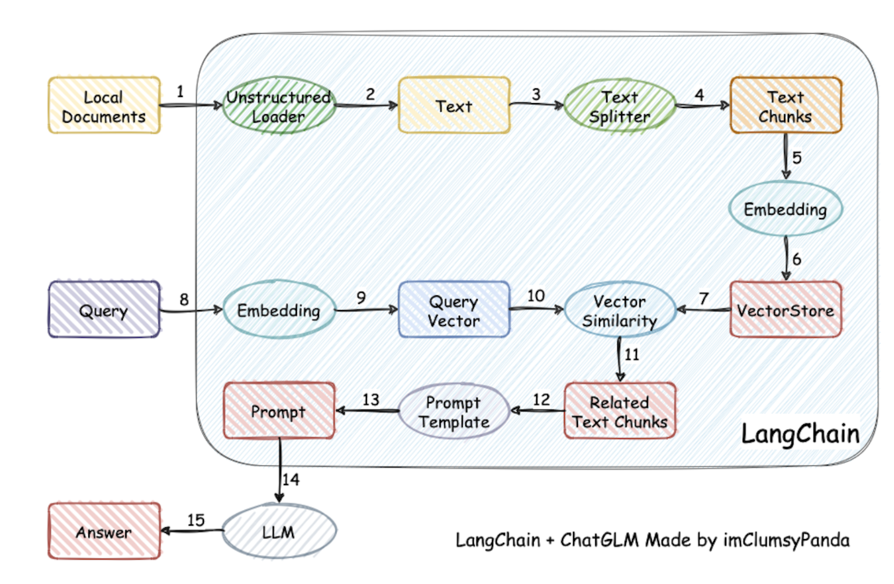
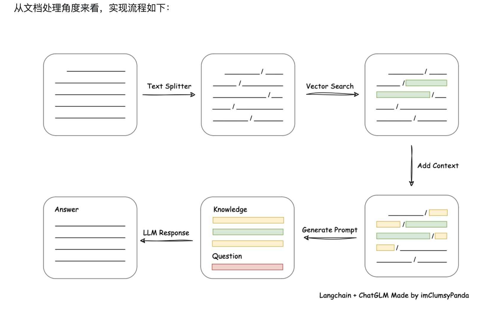

## 使用大模型做具体场景助手

使用开源工具来实现具体场景下的 AI 助手，流程可以简化如下：

1. Prompt 工程

	- 流程：设计并优化 prompt，让大模型生成符合需求的答案，进行 prompt 测试和调整。
	- 工具：可以使用 OpenAI API（如 GPT-3 开源替代品）结合 LangChain 或 LlamaIndex（前称 GPT Index）来管理和优化 prompt。

2. 构建知识库

	- 流程：收集和清洗数据，将信息分块后存入知识库，并生成索引以便高效检索。
	- 工具：
    	- Elasticsearch 或 FAISS：用于分块后的数据存储和快速检索。
    	- Haystack 或 LlamaIndex：可用于索引管理，便于与生成模型集成。

3. 检索增强生成（RAG）

	- 流程：通过检索模块先找到相关信息片段，再输入生成模型生成回答，增强内容准确性。
	- 工具：Haystack 或 LangChain，集成检索与生成，提供基于上下文的回答。

4. 大模型微调

	- 流程：将场景相关数据准备好后对大模型进行微调，使其适应具体领域或场景。
	- 工具：
    	- Hugging Face Transformers：用于加载和微调模型。
    	- Hugging Face Datasets：用于管理和预处理训练数据。

5. 模型量化

	- 流程：在部署前对模型进行量化，以减小模型体积并加快推理速度。
	- 工具：BitsAndBytes（4/8 位量化）、ONNX Runtime（支持量化优化）。

6. 部署

	- 流程：将微调和量化后的模型部署在服务器或云端。
	- 工具：
    	- FastAPI 或 Flask：用于搭建 API 服务。
    	- Docker：用于容器化部署，保证环境一致性。
    	- Hugging Face Inference（如使用推理服务器）或 ONNX Runtime（加速推理）。

简化流程示例

设计 prompt → 构建知识库 → RAG 检索 → 大模型微调 → 模型量化 → 部署

这些步骤结合开源工具能够实现高效的 AI 助手。

## ollama

### ollama简介

ollama用来部署和运行大型语言模型，它提供了一个简单的命令行工具，可以用来运行模型、查看模型列表、下载模型等。

```
设计 prompt → 构建知识库 → RAG 检索 → Ollama 微调 → Ollama 量化 → Ollama 部署
```

官网地址：[ollama](https://ollama.com/)

### 使用

运行一个模型，如果本地不存在该模型，会自动到仓库下载，仓库地址：
[ollama模型仓库](https://ollama.com/library)

```bash
ollama run llama3-8b-8192
```

一些指令：

```bash
# 查看模型列表
ollama list
# 查看当前运行的模型
ollama ps

# -h 查看帮助
serve       Start ollama
create      Create a model from a Modelfile
show        Show information for a model
run         Run a model
stop        Stop a running model
pull        Pull a model from a registry
push        Push a model to a registry
list        List models
ps          List running models
cp          Copy a model
rm          Remove a model
help        Help about any command
```

查看ollama是否正确启动：http://127.0.0.1:11434

## open-webui

open-webui提供了一个简单的web界面，可以用来查看模型列表、运行模型等。

仓库地址：[open-webui](https://github.com/open-webui/open-webui)

### 安装和使用

```bash
pip install open-webui
open-webui serve
```

## modelscope

官网地址：[modelscope](https://modelscope.ai/)

github地址：[modelscope](https://github.com/modelscope/modelscope/tree/master)

### modelscope简介

modelscope是一个 “模型即服务”(MaaS) 平台，旨在汇集来自 AI 社区的最先进的机器学习模型，并简化在实际应用中使用 AI 模型的流程。ModelScope 库使开发人员能够通过丰富的 API 设计执行推理、训练和评估，从而促进跨不同 AI 领域的最先进模型的统一体验。

ModelScope Library 为模型贡献者提供了必要的分层 API，以便将来自 CV、NLP、语音、多模态以及科学计算的模型集成到 ModelScope 生态系统中。所有这些不同模型的实现都以一种简单统一访问的方式进行封装，用户只需几行代码即可完成模型推理、微调和评估。同时，灵活的模块化设计使得在必要时也可以自定义模型训练推理过程中的不同组件。

### 安装和使用
在ModelScope Hub 中有很多可以训练的模型。

```bash
conda create -n modelscope python=3.10
conda activate modelscope
```

模型下载需要先配置好Git LFS。

> git lfs 是一个 Git 的扩展，它用来存储大文件。它的设计目标是让 Git 能够更好地管理大文件，而不是让 Git 成为一个文件存储系统。Git LFS 通过将大文件存储在远程服务器上，而不是存储在 Git 仓库中，来解决 Git 仓库过大的问题。

之后就可以下载用来训练的模型，和github上的代码一样，可以直接使用git clone。

训练好的模型（微调）在部署时，通常还需要量化，这样才能在较小的设备上运行。

## langchain和langchain-chatchat

langchain是一个用于构建自然语言处理（NLP）应用的工具包。它提供了一种简单的方法来构建NLP应用，无需编写复杂的代码。langchain的核心是一个称为“链”的概念，链是一系列处理步骤，每个步骤都接收输入并生成输出。链可以包含各种处理步骤，例如模型、解析器和提示。

这里有一个简单的教程:[langchain](https://www.langchain.com.cn/docs/tutorials/llm_chain/)，可以用来构建一个简单的LLM（Large Language Model）应用。

核心就是构建链，链可以包含各种处理步骤，例如模型、解析器和提示。

### langchain-chatchat

仓库地址：[langchain-chatchat](https://github.com/chatchat-space/Langchain-Chatchat?tab=readme-ov-files)

一种利用 langchain 思想实现的基于本地知识库的问答应用，目标期望建立一套对中文场景与开源模型支持友好、可离线运行的知识库问答解决方案。

**原理：**



在这个项目中，并不涉及模型的微调。模型微调参考：[llvm-微调大模型](https://kelinkong.github.io/2024/11/01/llvm-%E5%BE%AE%E8%B0%83%E5%A4%A7%E6%A8%A1%E5%9E%8B/)

## Dify

官网地址：[Dify](https://www.dify.ai/)

github地址：[Dify](https://github.com/langgenius/dify)

官方文档：[Dify文档](https://docs.dify.ai/)

Dify 是一款开源的大语言模型(LLM) 应用开发平台。它融合了后端即服务（Backend as Service）和 LLMOps 的理念，使开发者可以快速搭建生产级的生成式 AI 应用。即使你是非技术人员，也能参与到 AI 应用的定义和数据运营过程中。

由于 Dify 内置了构建 LLM 应用所需的关键技术栈，包括对数百个模型的支持、直观的 Prompt 编排界面、高质量的 RAG 引擎、稳健的 Agent 框架、灵活的流程编排，并同时提供了一套易用的界面和 API。这为开发者节省了许多重复造轮子的时间，使其可以专注在创新和业务需求上。

dify支持ollama，可以直接使用本地部署的模型。

## Groqcloud

官网地址：[Groqcloud](https://console.groq.com/playground)

GroqCloud 是由 Groq 公司提供的云服务，专注于快速 AI 推理。它利用 Groq 的语言处理单元（LPU）硬件和相关软件，推理速度很快，而且API便宜。