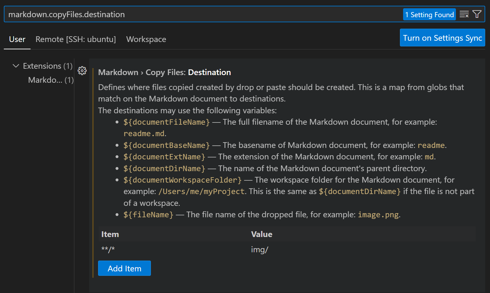
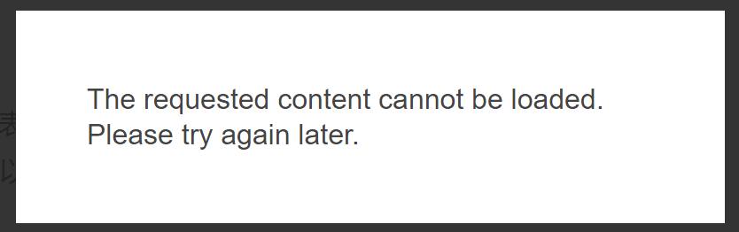
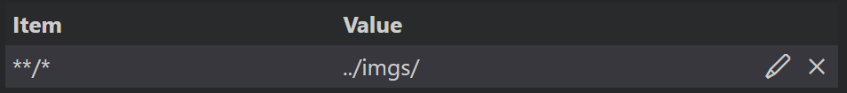

## 安装nodejs
1. 从官网下载安装
2. 使用nvm
```
nvm install node # 安装最新版本
nvm use node # 使用最新版本
```
3.  使用 curl 方式安装最新版本
```
curl -sL https://deb.nodesource.com/setup_current.x | sudo -E bash -
sudo apt-get install -y nodejs
```
## 设置hexo
1. 安装
`npm install -g hexo-cli`
2. 初始化
`hexo init <folder>`

## 设置Github
1. 创建一个同名仓库。例如我的GitHub名字是kelinkong，新建一个仓库`kelinkong.github.io`
2. 将地址设置到delpoy

    地址格式: `git@github.com:username/username.github.io.git`

    默认分支: `main`
3. 部署之前需要安装`npm install hexo-deployer-git --save`
```
deploy:
type: git
repository: git@github.com:kelinkong/kelinkong.github.io.git
branch: main
```
## 更换主题
我这里使用的是maupassant主题。地址:https://github.com/tufu9441/maupassant-hexo

设置步骤：

```
git clone https://github.com/tufu9441/maupassant-hexo.git themes/maupassant
npm install hexo-renderer-pug --save
npm install hexo-renderer-sass-next --save
```

在项目的_config.yaml设置中，将themes改为maupassant


## 部署和预览

```
hexo c && hexo g
hexo s # 本地预览
hexo d # 发布到github
```

## hexo常用命令
```bash
hexo init <folder> #初始化文件夹

hexo new <title> #新建文章

hexo server (hexo s)  # 启动本地服务器,用于博客预览

hexo deploy (hexo d)  # 部署博客到GitHub等托管平台

hexo clean  # 清除缓存和已生成的静态文件

# 组合命令
hexo d -g #生成部署
hexo s -g #生成预览

hexo list <type>   # 查看文章列表

hexo new page categories # 新建分类

hexo new page tags # 新建tag
```
注意：每一个分类和tag都需要建立对应的新目录和index.md文件

**文章标识：**

```
title: 文章标题
date: 2020-01-01 12:00:00  
categories: 分类1  
tags: [标签1, 标签2]
```

## 针对maupassant主题

1. 修改logo：在主题的配置文件中，修改`avatar: /img/logo.jpg`
2. 如果需要识别Latex格式的公式，在文章index添加`mathjax: true  `

## tips

### 如何在vscode中快速粘贴图片到markdown文档？

参考连接: https://juejin.cn/post/7244809769794289721

打开`markdown.copyFiles.destination`设置，我这里是在`_posts`文件夹下新建了一个`img`文件夹专门用来存储图片。对应设置如下:

该配置是一个对象，key 使用 Glob 语法，表示匹配的 Markdown 文档；value 则表示所匹配的这些 Markdown 文档，它们的图片文件存放目录，可以使用一些简单的变量。

### 如何设置about me
`hexo new page about`

### 如何设置rss订阅

`npm install hexo-generator-feed --save`

### 图片无法显示
在vscode中预览是有图片的，生成和发布之后无法显示图片。


因为在源文件的 post 目录下新建了 img 子目录,然后在 markdown 中使用相对路径引用图片。

这在本地预览时可以正常显示,但是部署后会出错。

因为 Hexo 在生成时,会将 post 中的 markdown 和资源文件一起复制到 public 目录,相对位置不变。

但是 img 子目录不会自动复制过去。所以 public 中找不到 img 中的图片,导致无法显示。

**解决方法：** 将img重命名为imgs(因为会和主题的img文件夹命名冲突)，然后将文件夹移动到`source`目录下，而不是放在`_posts`目录下，注意粘贴的设置也需要修改为imgs。

