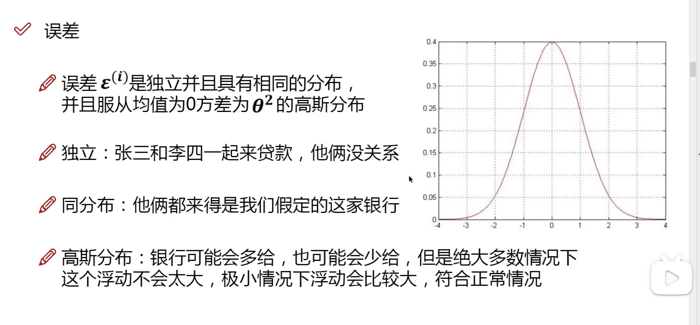

## 线性回归

**什么是一个线性回归问题？**

如果把线性回归模型看作一个函数，用最简单的话说，这个函数的作用就是预测。

线性回归模型的预测过程是这样的：给定一个输入特征向量，通过线性组合得到一个预测值。

举个例子：

假设有数据集：这里我们想知道工资、年龄和贷款额度之间的关系。

| 工资 | 年龄 | 贷款额度|
| ---- | ---- | ---- |
| 1000 | 25 | 1000 |
| 2000 | 30 | 2000 |
| 3000 | 35 | 3000 |

我们可以用线性回归模型来预测工资，假设我们的模型是这样的：
$y = w_1 \cdot x_1 + w_2 \cdot x_2$

其中，$y$ 是贷款额度，$x_1$ 是工资，$x_2$ 是年龄。

我们的目标是找到一个合适的 $w_1$ 和 $w_2$，使得我们的模型能够很好地预测工资。

这个函数就是一个线性函数，也就是线性回归模型。

$$
y = w_0 + w_1 \cdot x_1 + w_2 \cdot x_2 
  = \sum_{i=0}^{n} w_i \cdot x_i
$$

这里$w_0$是偏置项，用来调整模型的预测值。$x_0$是一个常数项，通常为1。

### 误差值

误差值是指预测值与真实值之间的差距。

- 误差与误差之间是独立的，不会相互影响。
- 误差的分布是正态分布，均值为0。

预测与误差：

$$
y^i = W^T \cdot x^i + \epsilon^i 
$$

其中，$y^i$ 是预测值，$W^T$ 是权重向量，$x^i$ 是输入特征向量，$\epsilon^i$ 是误差。

误差服从正态分布：

$$
\epsilon^i \sim N(0, \sigma^2) \\

p(\epsilon^i) = \frac{1}{\sqrt{2\pi\sigma^2}} \exp(-\frac{(\epsilon^i)^2}{2\sigma^2})
$$

将误差代入预测值：

$$
p(y^i|x^i;W) = \frac{1}{\sqrt{2\pi\sigma^2}} \exp(-\frac{(y^i - W^T \cdot x^i)^2}{2\sigma^2})
$$

$x^i;W$组合之后的概率密度函数，就是我们的模型。我们希望$x^i;W$组合之后与$y^i$越接近越好。所以希望最大化这个概率密度函数。

### 似然函数

似然函数为什么要使用连乘？因为前面说过，误差是独立的，所以我们可以将每个样本的概率密度函数连乘起来。

$$
L(W) = \prod_{i=1}^{m} p(y^i|x^i;W)= \prod_{i=1}^{m} \frac{1}{\sqrt{2\pi\sigma^2}} \exp(-\frac{(y^i - W^T \cdot x^i)^2}{2\sigma^2})
$$

对似然函数取对数，可以将连乘转换为连加：

$$
\log L(W) = \sum_{i=1}^{m} \log p(y^i|x^i;W)= \sum_{i=1}^{m} \log \frac{1}{\sqrt{2\pi\sigma^2}} \exp(-\frac{(y^i - W^T \cdot x^i)^2}{2\sigma^2})
$$

展开化简：

$$
\log L(W) = \frac{m}{2} \log(2\pi\sigma^2) - \frac{1}{2\sigma^2} \sum_{i=1}^{m} (y^i - W^T \cdot x^i)^2
$$

我们最终的目标是最大化似然函数，也就是最小化误差。前一项是常数，所以希望后一项越小越好。即：

$$
\min_W \frac{1}{2} \sum_{i=1}^{m} (y^i - W^T \cdot x^i)^2
$$

## 损失函数

**什么是损失函数？**

损失函数也叫目标函数，是用来衡量模型预测值与真实值之间的差距的函数。

上面那个例子，我们的目标是找到一个合适的 $w_1$ 和 $w_2$，使得我们的模型能够很好地预测工资。损失函数可以定义为：

$$
L(w) = \frac{1}{2m} \sum_{i=1}^{m} (y_i - \hat{y_i})^2
$$

使用目标值和预测值之间的平方误差作为损失函数，这个损失函数叫做均方误差（Mean Squared Error，MSE）。

其中，$m$ 是样本数量，$y_i$ 是真实值，$\hat{y_i}$ 是预测值。

对于机器学习的大部分任务，我们都是通过最小化损失函数来优化模型的参数。

如何求解损失函数？

$$
L(w) = \frac{1}{2m} \sum_{i=1}^{m} (W^T \cdot x^i - \hat{y_i})^2 = \frac{1}{2m} (X \cdot W - Y)^T \cdot (X \cdot W - Y)
$$

其中，$X$ 是输入特征矩阵，$Y$ 是真实值矩阵。

我们的目标是找到一个合适的 $W$，使得损失函数最小化。

因此，对损失函数求导，然后令导数为0，可以得到最优解。

$$
\frac{\partial L(W)}{\partial W} = \frac{1}{m} X^T \cdot (X \cdot W - Y) = 0
$$

解方程，得到最优解：
$$
W = (X^T \cdot X)^{-1} \cdot X^T \cdot Y
$$

但是，这个方法有一个问题，就是计算量太大。当数据量很大时，计算矩阵的逆是非常耗时的。而且，矩阵的逆不一定存在。

因此，我们通常使用梯度下降法来求解损失函数的最小值。

## 梯度下降法

**什么是梯度下降法？**

梯度下降法是一种常用的优化算法，用来求解损失函数的最小值。

梯度下降法的思想是：沿着梯度的反方向，不断迭代更新参数，直到损失函数的值收敛。

**目标函数**

$$
J(\theta_0, \theta_1) = \frac{1}{2m} \sum_{i=1}^{m} (h_\theta(x^i) - y^i)^2
$$

其中，$h_\theta(x^i) = \theta_0 + \theta_1 \cdot x^i$ 是模型的预测值。

**如何寻找合适的方向？**

梯度下降法的核心是求解目标函数的梯度。

分别对 $\theta_0$ 和 $\theta_1$ 求偏导数：

$$
\frac{\partial J(\theta_0, \theta_1)}{\partial \theta_0} = \frac{1}{m} \sum_{i=1}^{m} (y^i - h_\theta(x^i))
$$

使得梯度为0，得到最优解：注意，这里等式中的两个$\theta_j$表示两个不同的$\theta_j$，一个是当前的$\theta_j$，一个是更新后的$\theta_j$。

$$
\theta_j = \theta_j - \alpha \frac{1}{m} \sum_{i=1}^{m} (y^i - h_\theta(x^i))x^i_j
$$

其中，$\alpha$ 是学习率，用来控制参数更新的步长，$x^i_j$表示第$i$个样本的第$j$个特征。

如果将所有的参数更新写成矩阵形式，可以得到：

$$
\theta = \theta - \alpha \frac{1}{m} X^T \cdot (X \cdot \theta - Y)
$$

这就是梯度下降法中的批量梯度下降（Batch Gradient Descent）。但是，批量梯度下降的计算量很大，因为每次迭代都要计算所有样本的梯度。

### 随机梯度下降

随机梯度下降（Stochastic Gradient Descent，SGD）是梯度下降法的一种变种，它每次迭代只使用一个样本来更新参数。

$$
\theta = \theta - \alpha (h_\theta(x^i) - y^i) x^i
$$

其中，$x^i$ 是第$i$个样本的特征向量，$y^i$ 是第$i$个样本的真实值。

随机梯度下降的优点是计算速度快，但缺点是收敛速度慢，因为每次迭代的方向不一定是最优的。

### 小批量梯度下降

小批量梯度下降（Mini-batch Gradient Descent）是批量梯度下降和随机梯度下降的折中方案，每次迭代使用一小部分样本来更新参数。

$$
\theta = \theta - \alpha \frac{1}{m} \sum_{i=1}^{m} (h_\theta(x^i) - y^i) x^i
$$

其中，$m$ 是小批量的大小。batch size的选择对模型的训练速度有很大影响。当batch size较小时，模型的训练速度较慢；当batch size较大时，模型的训练速度较快。