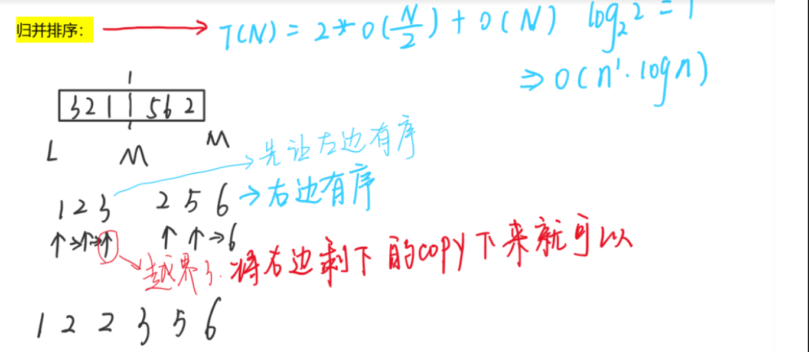
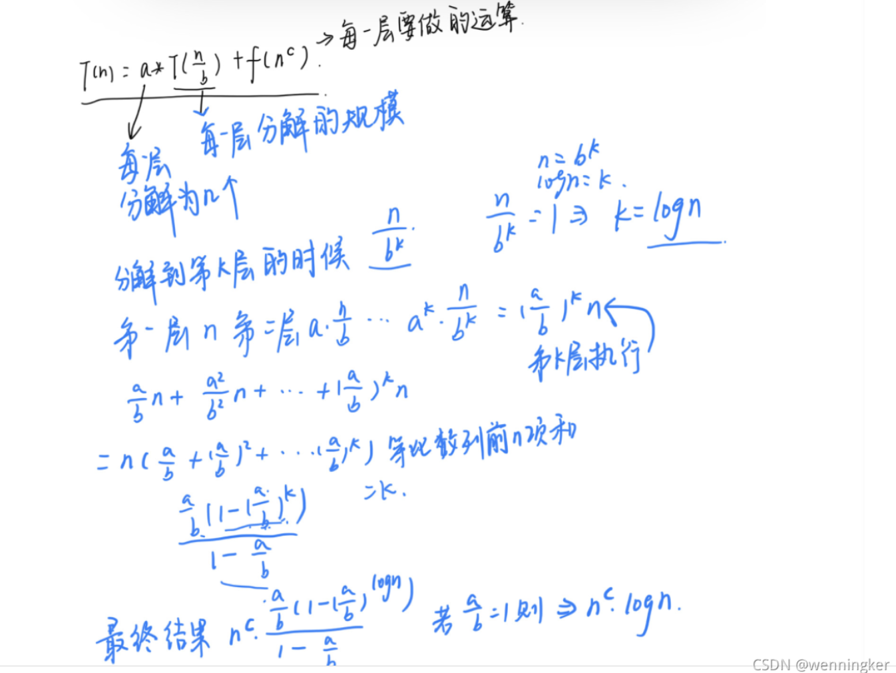
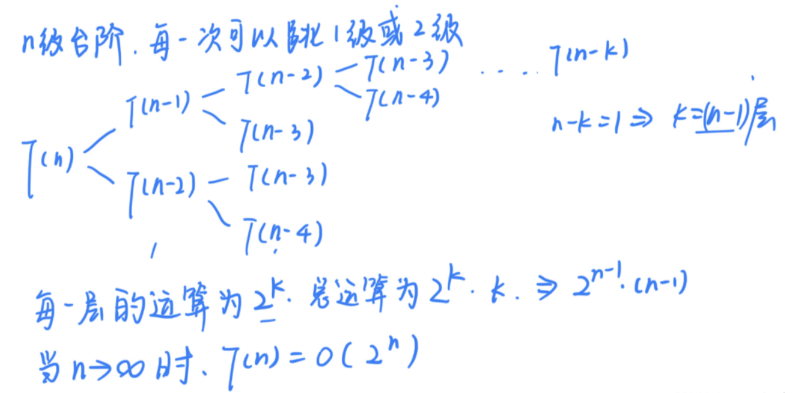

---
title: 递归问题的时间复杂度分析
date: 2021-10-05 07:33:02
categories: [Algorithm]
---

## 递归分析

**递归问题可分为以下三个步骤分析：**

1、递归函数功能

2、递归终止条件

3、递归关系式

```cpp
//n！
//1、递归函数功能
int f(int n)
{
	//递归终止条件
    if(n==1)
        return 1;
    //关系式f(n)=n*f(n-1)
    return n*f(n-1);
}

//一次可以跳上1级台阶，也可以跳上2级。求该跳上一个n级的台阶总共有多少种跳法。
int f(int n)
{
	//递归终止条件
    //这里如果写成n==1返回1，则当n==2的时候，会调用到f（0），而f（0）又会调用到f（-1）和f（-2）从而变成死循环
    if(n<=2)
        return n;
    //关系式f(n)=f(n-1)+f(n-2)
    //第一次选择跳一个台阶，后面有f（n-1）种跳法，选择跳2个台阶，后面有f（n-2）种跳法
    return f(n-1)+f(n-2);
}

```

**递归问题能找到递归关系式的，是否都能用动态规划的思想去解决？**

目前没遇到无法用动态规划去改写的问题。通常递归问题的时间复杂度都比较高。

## 递归的时间复杂度

master公式的使用：

`T(n)=a*T(n/b)+O(n^d)`

- ` log(b,a)>d->复杂度为O(n^log(b,a))`

- `log(b,a)=d->复杂度为O(n^d*logn)`
- `log(b,a)>d->复杂度为O(n^d)`

推导如下：




**n级台阶的问题时间复杂度分析**



该时间复杂度是一个指数复杂度。很多时候递归的时间复杂度都很高，所以可以用动态规划来改写。

```cpp
    int climbStairs(int n) {
        if(n<=2)
            return n;
        int m=0,p=1,k=2;
        for(int i=3;i<=n;i++)
        {
            m=p;
            p=k;
            k=m+p;
        }
        return k;
    }
//时间复杂度为O(n)
```

